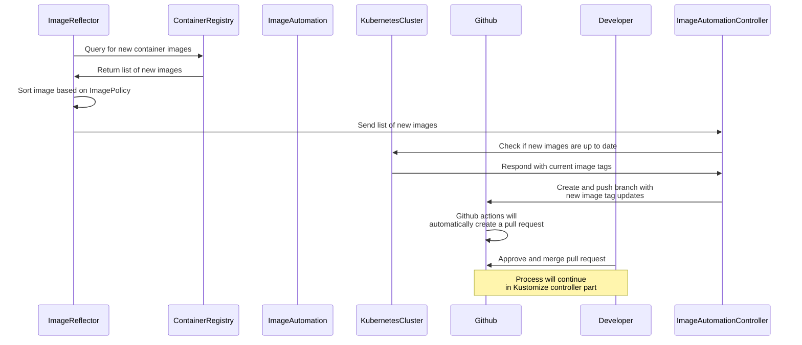
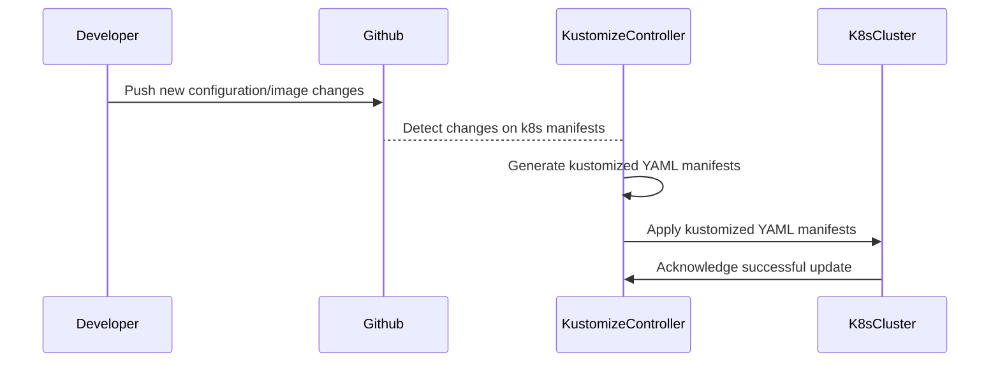

# Continuous Delivery

This document will explain how the Continous Delivery is set up and the technical details of its implementation.

## Overview

```mermaid
flowchart LR
    merge("Merge code\n changes to main")

    subgraph Github Actions
        build("Build & push\n container image")
    end

    subgraph Artifactory
        registry("Container Registry")
    end

    merge-->build
    build-->registry
    Artifactory-. detect new images.-imagec

    subgraph Reconciliation
        direction TB

        subgraph "Flux Image"
            imagec("Image Automation")
        end

        subgraph Github
            git("Github")
        end

        imagec-- Create Pull Requests -->Github

        subgraph "Flux Kustomize"
            direction BT
            kustomizec("Kustomize Controller")
        end

        subgraph Kubernetes
            k8s("Kubernetes cluster")
        end

        kustomizec-. Detect kustomize update .-Github
        kustomizec-- Apply changes -->k8s
    end

classDef Reconciliation fill:#000;
class Reconciliation Reconciliation
```



1. Developer merges code to the main branch
2. The GitHub Actions job is triggered to builds and pushes the container images to Artifactory
3. The new container images are stored in Artifactory
4. FluxCD detects the new images
5. FluxCD creates a pull request to update the container image in the Kubernetes manifest
6. Developer approve and merge the pull request
7. FluxCD detect changes to the Kubernetes manifest from Git source
8. FluxCD performs a rolling update of the application with the new container image

## FluxCD

The monorepo use a system called [FluxCD](https://fluxcd.io/) for the Continuous Delivery tool. FluxCD is a
[GitOps](https://www.gitops.tech/#what-is-gitops) tool that automates deployment and management of Kubernetes application using Git repositories. The entire application infrastructure and configuration includes application code, deployment manifests, and any configuration files are version controlled. Changes to application are made through Git commits, which are automatically propagated to the deployment environment by FluxCD.

FluxCD will do reconcilation process to ensures that the actual state of the Kubernetes cluster matches the desired state specified in Git repository. The reconcilation controller continously monitors the Git repository (in specified interval) for changes to the application configuration, and automatically applies any updates to the Kubernetes cluster. The reconciliation involves several steps:

1. Detect changes to the application config in Git repository, such as deployment manifest or container image
1. Generate manifests based on the updated application config. This includes creating new resources, 
updating existing resources or deleting resources that no longer needed
1. Applies the updated manifests to the Kubernetes cluster, which bring the actual state of the cluster 
in line with the desired state specificed in Git repository
1. Verify the changes have been successfully applied. If any error occur during reconciliatio, FluxCD rolls back 
the changes to the previous working state

### Flux Image Update Automation

Image automation controller is the component that enable automation of the deployment of container images to 
Kubernetes cluster based on the image available in a container registry. To enable this, teams need to define
policies for how container images are deployed to a Kubernetes cluster. These policies can be based on various 
criteria, such as the latest version of an image.

In Agora, by default we tag container image by commit date to ensure that 
the most recent image has the tag that comes last in alphabetical or numerical order.

---
Snippet of container push target 
```
city_oci_push(
    ...
    tag = "{DOCKER_TAG}",
)
```

[print-workspace-status.sh](https://github.com/wp-wcm/city/blob/41b160f6e8aca8e799228916c037fc0d8cccb334/scripts/print-workspace-status.sh#L19-L22)
```
DOCKER_TAG="${TAG_PREFIX}$(echo "$GIT_REF_NAME" | sed 's/[^a-zA-Z0-9\_\]/-/g')-$SHORT_SHA-$TIME"
```

Snippet of `ImagePolicy`
```yaml
kind: ImagePolicy
metadata:
  name: image-policy
  filterTags:
    pattern: '^main-[a-f0-9]+-(?P<ts>[0-9]+)$'
    extract: '$ts'
  policy:
    numerical:
      order: asc
```
---

The above code will produce a container image that looks like `main-334cfe55-1681459666`.

Once the `ImagePolicy` are configured, we can use it to make `ImageUpdateAutomation`.

---
```yaml
kind: Kustomization
namespace: namespace
resources:
images:
- name: image-name
  newTag: main-334cfe55-1681459666 # {"$imagepolicy": "namespace:image-policy:tag"}
```

Snippet of `ImageUpdateAutomation`
```yaml
kind: ImageUpdateAutomation
metadata:
  name: image-update-automation
spec:
  git:
    push:
      branch: __image/dev/project
  interval: 1m0s
  update:
    path: infra/k8s/dev/project
    strategy: Setters
```
---

Once a policy has been defined, Image Automation continuously monitors the specified container registry for updates 
to the container image. When a new image becomes available, Image Automation automatically create branch with updates
to the new container image to the source Git repository.



### Flux Kustomization Controller

Kustomize controller is the component that responsible for applying Kubernetes manifests that have been generated 
with [Kustomize](https://kustomize.io/). The controller continuously monitors the Git repository for changes, 
and when a change is detected, it will automatically regenerate the manifests using Kustomize and then apply the 
updated manifests to the cluster.

---
Snippet of Flux `Kustomization`

```yaml
apiVersion: kustomize.toolkit.fluxcd.io/v1beta2
kind: Kustomization
metadata:
  name: project
spec:
  interval: 1m0s
  path: ${manifest_root}/project
```
---


