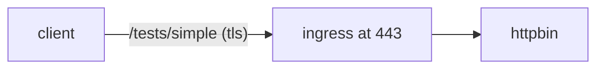
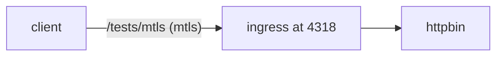
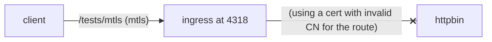

## Verify mTLS and Certificate Forwarding

httpbin is like an echo server, at 8080, it responds with the headers that the server gets.

This is summary of the tests

### Steps

0. Apply the resources in this directory [./tests.yaml](./tests.yaml).

1. Curl simple TLS path, and verify that XFCC doesn't have client certificate as expected.



```bash
curl 'https://iot.woven-city-api.toyota/tests/simple' 
Request Headers:
X-Forwarded-Proto: https
X-Envoy-External-Address: 103.175.111.222
X-Request-Id: 76d6e130-c20b-4ab1-8e68-c0076a437f13
X-B3-Traceid: 14816e95984b52e847f8da7c8b457a03
X-B3-Spanid: 4402250770d05270
User-Agent: curl/8.4.0
X-Forwarded-For: 103.175.111.222
X-B3-Parentspanid: 47f8da7c8b457a03
X-B3-Sampled: 0
Accept: */*
X-Envoy-Attempt-Count: 1
X-Forwarded-Client-Cert: By=spiffe://cluster.local/ns/agora-iot-prod/sa/default;Hash=a545bc02e7768d4de2eed1823ec645351324f57b697e4fc9ceedcbae2c70ff4a;Subject="";URI=spiffe://cluster.local/ns/agora-city-private-ingress-prod/sa/city-private-ingress
```

2. Provision a device with the below CN, and retrieve certificate.

```bash
iotactl add group hello
iotactl add device hello -g hello
iotactl provision hello -g hello -s <provisioning secret obtained when adding group>
```
By default `~/.iota/prod/test/hello/*` will have the cert and key created.

```bash
step certificate inspect ~/.iota/prod/test/hello/hello_crt.pem| grep "Subject: CN="
        Subject: CN=hello.hello.test.iot.woven-city-api.toyota
```

3. Use the certificate from #2, and call mtls path. The client certificate has been forwarded to the httpbin backend as seen in the response.




```bash
curl 'https://iot.woven-city-api.toyota:4318/tests/mtls'  --cert /Users/ajith.chandran/.iota/prod/test/hello/hello_crt.pem --key /Users/ajith.chandran/.iota/prod/test/hello/hello_key.pem 
Request Headers:
X-Forwarded-For: 103.175.111.222
X-Forwarded-Proto: https
X-Envoy-External-Address: 103.175.111.222
X-Request-Id: b48628a3-7153-475f-a3a5-cdbe6843d02a
X-Envoy-Attempt-Count: 1
X-B3-Traceid: 37ec416e63413a93bd5373f097048509
Accept: */*
User-Agent: curl/8.4.0
X-Forwarded-Client-Cert: Hash=e3f071f577c1c7129fc2b4fa38f03dcd9371fa24ec7e2f7bb8f51874541108d5;Cert="-----BEGIN%20CERTIFICATE-----%0AMIIFxzCCA6%2BgAwIBAgIUR5%2B4nbStIHuRKONmOaf0z1XOsEQwDQYJKoZIhvcNAQEL%0ABQAwWjEcMBoGA1UEChMTQ2l0eU9TIFByb2QgQ2x1c3RlcjETMBEGA1UECxMKSW9U%0AIERldmljZTElMCMGA1UEAxMcY2l0eW9zLXNwZWVkd2F5LXByb2QtZGV2aWNlczAe%0AFw0yNDA4MjEwMzE3NTlaFw0yNDA4MjgwMzE4MjlaMDUxMzAxBgNVBAMTKmhlbGxv%0ALmhlbGxvLnRlc3QuaW90LndvdmVuLWNpdHktYXBpLnRveW90YTCCAiIwDQYJKoZI%0AhvcNAQEBBQADggIPADCCAgoCggIBAL8Bgwrrcp8OHaiYMfc7wtFOGLNAcLoPBC3r%0AxPwVLDgdcDkSFJG%2B8e9Q64hqxcuMgS1gI78SjMyXM%2F%2FmjD7wJewRr6O0ykVSaGrh%0AYkoiVY3SzfokIjxL21PoJR37MmX5aztyQP%2FvCijs%2FZwUfzwnE0rgzzUoBW%2BZ1yAz%0AA3rtaBhXEYe6uTSN8ayEg8LbIgX56cw8mfQWK%2Buh9c61NtvikzRG3658%2FM5FGjH4%0AhkDmk3%2FtebO1oeYPBv3P4bv4MTP08n06iW%2FjyGGSaA%2B0s13LiBrrDFTLlAJf%2BNbn%0A%2B7%2Fx5hkH4X01tiDQNhPAZWlWuuVEzpabMv1q9sg4iR1BFZiRLg0%2BdXxn%2Bp4d4wus%0ArEOY6l47jrHw74HfGYhscGHHgrk0zpkmz9HI3zZQqbjMb%2B2ITHSf6HHJuNobUs25%0A4f88opxIfCoSyUGeS09S7CMB%2BXopKVE6ggqg3um%2Bzt6umRQxyF6d4uhMnltch4WR%0AyNb1TnBCwRCL9ifIMc0cSVAk0Zdg2AUhnkdJtFNt2v01zZUncSc4a%2FUX%2FH1YHDPZ%0AUyadQBAdAO8zW8Cy2c%2BTTgZvWiPqHPHqCQRmuNxRm18zVRoe0Esv044Kx3LPRMJG%0Aahw2OS2YgVmMSbyUgJF6wXlPIWUIFfGih1St049f3rHt%2Fy%2FKmllPvHQf7B2vd4rk%0AeXxtM4xxAgMBAAGjgakwgaYwDgYDVR0PAQH%2FBAQDAgOoMB0GA1UdJQQWMBQGCCsG%0AAQUFBwMBBggrBgEFBQcDAjAdBgNVHQ4EFgQU2auJdOk7WbtxFbpRtv8lACwfxp0w%0AHwYDVR0jBBgwFoAUThzDYvPh5Ja3lETmSX1bc50YaZ4wNQYDVR0RBC4wLIIqaGVs%0AbG8uaGVsbG8udGVzdC5pb3Qud292ZW4tY2l0eS1hcGkudG95b3RhMA0GCSqGSIb3%0ADQEBCwUAA4ICAQBjw9yClWRfY57H1mNLZnIkQJzIYNLEYx6xR%2Fhce9CHWnjQt8DL%0Aa3Y1Um7FO9ulkBf54KKP4GWptmsS0S3VrMYzXrWubFrIYeN1CaSS9Jtk%2FxOu7yXV%0A3h8qoa3q23%2FfBvxGme8h6G4032noULQ96mpjkHY3nVGEGVWGxYnby4Nr9N5KcWoT%0AAoEPvH5yY3uSfjSgejC%2FWNV0gwOWDWwRBAw3MAIuvwQkKoeFqb0et%2BunX2HzdO0E%0AR%2BqSMZoHOspELyRw%2F6aZnmHiew8%2Fw3OyvUchZfXFUKvP3p5hN4VsUsZM6QIYkJQ7%0AwTpqJ%2Fm7gptarLtx16tj9waBFeNdbqX3BWttCylSOVnClSL3kgZPs7AkIDXqV15u%0A0nGmm5PbVNPACos44HsAAh9DuM8bHUoX9vhTpbYkMFFYihscGRNjzWM06Ua6%2BixX%0ArWT1ddbSp5v4J%2B%2BcHidsUBoPVLXE8v3kpZHCcxQctxykW7Mv5si%2BkGkOT0BB0tkL%0AwFAaQYTDKlnGSiYGWF60uWJZXWun46U20%2FC0zUQrvoNDS%2BfKYkTJG1UYLZdhGHIG%0AdQSLDkUOu2SzcqxsdbcFKvVg2nJbXnIn2Qa3fbbe46uAf%2FjxAiaA5AqFDebbZENQ%0ALqicI6LrSSVbHqSbGBOPqCwWUV8nDxeiKtOCp7o8c2GKbpBinAGMGd2Ivw%3D%3D%0A-----END%20CERTIFICATE-----%0A";Subject="CN=hello.hello.test.iot.woven-city-api.toyota";URI=;DNS=hello.hello.test.iot.woven-city-api.toyota,By=spiffe://cluster.local/ns/agora-iot-prod/sa/default;Hash=a545bc02e7768d4de2eed1823ec645351324f57b697e4fc9ceedcbae2c70ff4a;Subject="";URI=spiffe://cluster.local/ns/agora-city-private-ingress-prod/sa/city-private-ingress
X-B3-Spanid: 2e9fe0af720b03fc
X-B3-Parentspanid: bd5373f097048509
X-B3-Sampled: 0
```

4. Provision another device with a **different CN** and retrieve certificate (same as #2). The traffic to the mtls path is blocked due to the combination of auth policy and/or the virtual service rule. The below test gives 403, whereas a similar test with cvm i observed 404.




```bash
step certificate inspect ~/.iota/prod/test/world/world_crt.pem| grep "Subject: CN="
        Subject: CN=world.world.test.alpha-iot.woven-city-api.toyota
```

```bash
curl 'https://iot.woven-city-api.toyota:4318/tests/mtls'  --cert /Users/ajith.chandran/.iota/prod/test/world/world_crt.pem --key /Users/ajith.chandran/.iota/prod/test/world/world_key.pem
RBAC: access denied%  
```
