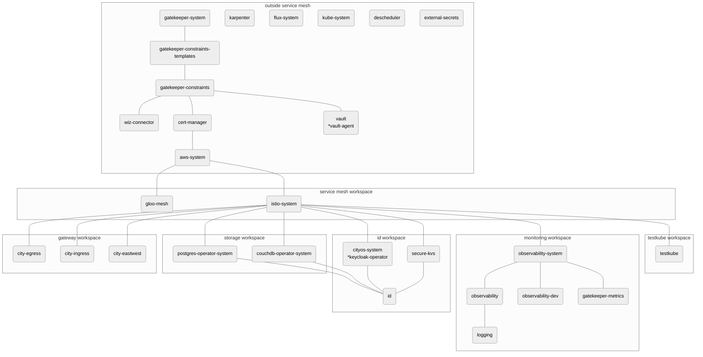

**Table of Contents**
<!-- vim-markdown-toc GFM -->

* [Accessing the LAB2 environment](#accessing-the-lab2-environment)
* [Folder Structures](#folder-structures)
* [Migrating your service to lab2](#migrating-your-service-to-lab2)
  * [Gloo Mesh](#gloo-mesh)
  * [IPv6](#ipv6)
* [Infra-managed Namespaces](#infra-managed-namespaces)
* [FAQs](#faqs)
  * [Which cluster I should deploy my services for onboarding?](#which-cluster-i-should-deploy-my-services-for-onboarding)
  * [Do I need to manage Gloo Mesh Workspace by myself?](#do-i-need-to-manage-gloo-mesh-workspace-by-myself)

<!-- vim-markdown-toc -->

# Onboarding to Lab2

## Accessing the LAB2 environment

To access the Lab2 environment, follow the instructions in the [Lab2 README.md].

For testing services locally with a Lab2-like setup, follow the instructions in
the [Local Environment README.md].

## Folder Structures
Previously, our folder structures in GIT looked like on the left side.
In order to address the need to include multiple clusters in a single
environment, we modified it to look like on the right side.

The key difference are:
  - The cluster root has been duplicated into the 3 clusters (`mgmt-east`,
    `worket1-east` and `worker1-west`)
  - rbac has been moved from cityos-system to kube-system.

<table>
<tr>
<th>old folder structure</th>
<th>new folder structure</th>
</tr>
<tr>
<td>
<pre>
infrastructure/k8s/<environment name>
├── bin                # utility scripts
├── ...                # namespace
├── cityos-system
│  ├── ...
│  └── rbac            # RBAC rules
├── ...                # namespace
├── flux-system
│  ├── ...
│  ├── kustomizations
│  │  ├── services     # Agora services
│  │  └── system       # infra-managed services
│  └── ...
├── flux-tenants       # external services
├── ...
</pre>
</td>
<td>
<pre>
infrastructure/k8s/environments/\<environment name\>/clusters
├── bin                   # utility scripts
├── mgmt-east             # cluster
│  ├── ...                # namespace
│  ├── flux-system
│  │  ├── ...
│  │  ├── kustomizations
│  │  │  ├── services     # Agora services
│  │  │  └── system       # infra-managed services
│  │  └── ...
│  ├── flux-tenants       # external services
│  ├── ...
│  ├── kube-system
│  │  └── rbac            # RBAC rules
│  └── ...
├── worker1-east
│  └── ...
└── worker1-west
   └── ...
</pre>
</td>
</tr>
</table>

Please be informed that we still encourage you to link your manifests from
`infrastructure/k8s/common` to the Lab2 cluster.
By doing so, you can avoid repeating the same code.

If you have specific configuration differences between the west and east
clusters, please use [Zebra] to generate configuration for the clusters or
include your differences as a part of Kustomization patches.

## Migrating your service to lab2

These are changes that may need to be considered or adjusted when migrating
your service to lab2:
- Gloo mesh
- IPv6

### Gloo Mesh

Gloo mesh introduces the concept of workspace, which is similar to Kubernetes
namespace. Workspace allows for fine-grained policies and isolation between
teams/services. In the future, when we enable `service isolation` globally,
each workspace needs to explicitly define which workspace it allows to talk to
in order to communicate.

The following resources will walk you through Gloo mesh concepts:
- [Gloo mesh workspace concept] **recommended**
- [Hands-on demo]
- [Unofficial documentation created by infra team]
- [Official documentation]

### IPv6

Our new environment using EKS is configured to be dualstack. It means that it
allows both IPv4 and IPv6 connections. However, internal Kubernetes networking
is IPv6 only. Thus your service may crash if it does not support IPv6.

You can read more [here](ipv6.md) on how to troubleshoot common IPv6 issues.

## Infra-managed Namespaces

Changelog:
- gloo-mesh has been added
  - this also adds city-eastwest to allow connection from worker1-east cluster to worker1-west cluster
- RBAC has been moved to be under kube-system directory
- toolings has been renamed to aws-system
- istio-workspace has been deprecated
- tigera-operator (Calico) has been deprecated

## FAQs

### Which cluster I should deploy my services for onboarding?
As of the first Lab2 release, there are 2 worker clusters. Your services should
be deployed into `worker1-east`, since `worker1-west` is not used for serving
customers primarily in production. The `worker1-west` cluster is aimed for high
availability (HA) and it's up to service teams to configure HA. To test HA,
[Gloo Mesh tutorial] would be helpful.

### Do I need to manage Gloo Mesh Workspace by myself?
No, a Gloo workspace will be created by the infra team.

<!-- Below are the links used in the document -->
[Gloo Mesh tutorial]:https://github.com/solo-io/solo-cop/tree/main/workshops/gloo-mesh-demo#lab-8---multi-cluster-routing-
[Gloo mesh workspace concept]:https://github.com/solo-io/solo-cop/tree/main/blogs/workspaces
[Hands-on demo]:https://github.com/solo-io/solo-cop/tree/main/workshops/gloo-mesh-demo
[Lab2 README.md]:../../../k8s/environments/lab2/README.md
[Local Environment README.md]:../../../k8s/environments/local/README.md
[Official documentation]:https://docs.solo.io/gloo-mesh-enterprise/latest/getting_started/
[Unofficial documentation created by infra team]:../gloo-mesh/Concepts.md
[Zebra]:https://developer.woven-city.toyota/docs/default/Component/zebra-service
