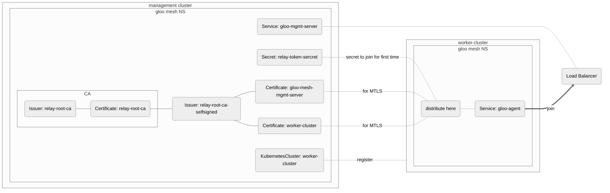
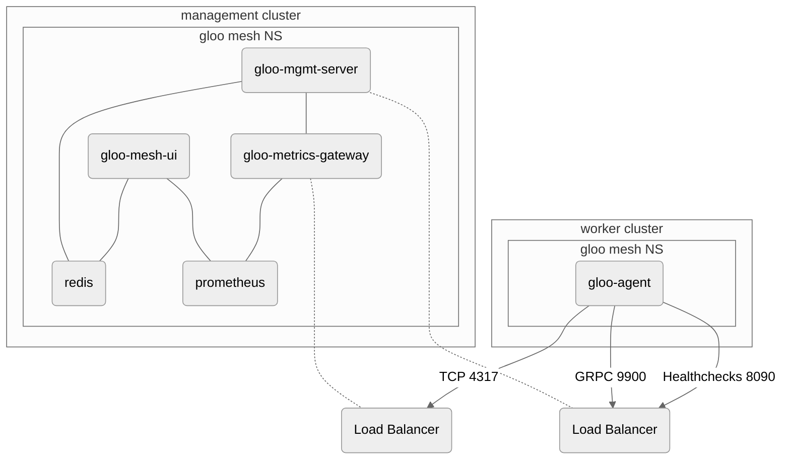
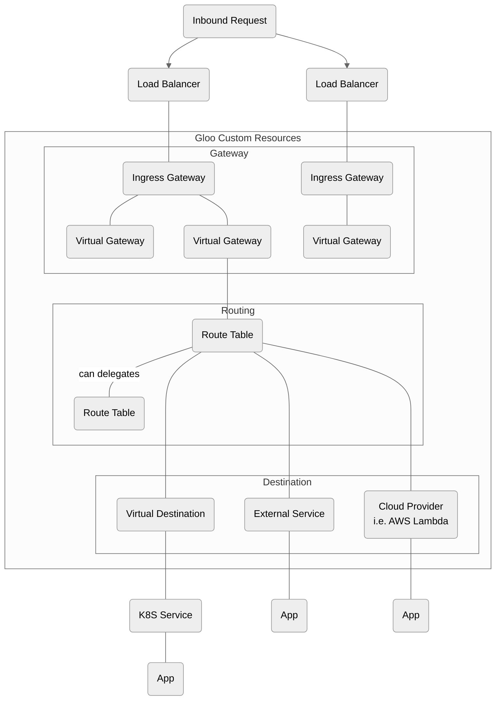
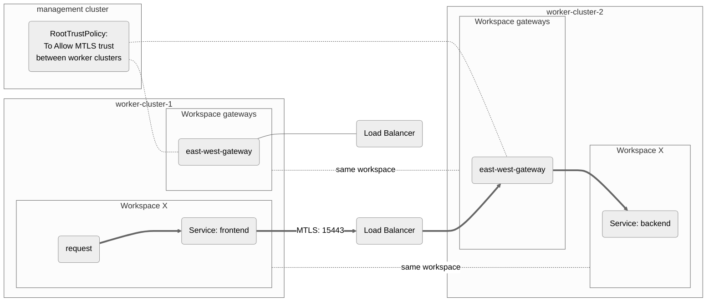

# Basic Concepts

<!-- vim-markdown-toc GFM -->

* [Bootstrapping clusters](#bootstrapping-clusters)
  * [Requirements](#requirements)
  * [Network architecture management-worker clusters](#network-architecture-management-worker-clusters)
* [Workspaces](#workspaces)
  * [Service isolation](#service-isolation)
  * [Import Export Behavior](#import-export-behavior)
* [Traffic Routing](#traffic-routing)
  * [North-south Routing](#north-south-routing)
  * [East-west Routing](#east-west-routing)
* [Gloo Mesh Behind The Scenes](#gloo-mesh-behind-the-scenes)

<!-- vim-markdown-toc -->

## Bootstrapping clusters

### Requirements

This is a **simplified overview** of bootstrapping clusters using cert-manager.

### Network architecture management-worker clusters

## Workspaces

- Workspace is a logical grouping of namespaces across multiple clusters, providing more flexible grouping than a namespace.
  - A workspace can be mapped to multiple namespaces, but a namespace can only belong to one workspace.
- There are two custom resources involved: [Workspace](https://docs.solo.io/gloo-mesh-enterprise/main/reference/api/workspace/) and [WorkspaceSettings](https://docs.solo.io/gloo-mesh-enterprise/main/reference/api/workspace_settings/).
  - Workspace should be deployed in the gloo-mesh namespace in the management cluster.
  - WorkspaceSettings should be deployed in one of the namespaces it selects.
    - The namespace where WorkspaceSettings is being deployed is called **root config namespace**.
    - **Global WorkspaceSettings** can be set by creating a resource in the gloo-mesh namespace of the management cluster named `global`.

As shown in the image, workspace does not necessarily have to share the same name as a namespace. It can include multiple namespaces that span accross selected clusters.

### Service isolation

- Service isolation can be enabled in WorkspaceSettings.
- Service isolation restricts workspace visibility of all of [these resources](https://docs.solo.io/gloo-mesh-enterprise/main/reference/api/workspace_settings/#workspacesettingsspec-workspaceobjectselector-typedobjectselector-objectkind).
  - Behind the scenes, service isolation will create [Authorization Policy](https://istio.io/latest/docs/reference/config/security/authorization-policy/).
  - To trim sidecar config to the workspace, set `trimProxyConfig: true`. This creates [Sidecar](https://istio.io/latest/docs/reference/config/networking/sidecar/) resource in each namespace for the Workspace.
- Service isolation can be enhanced by [AccessPolicy](https://docs.solo.io/gloo-mesh-enterprise/main/reference/api/access_policy/), which is a wrapper that could generate PeerAuthentication and AuthorizationPolicy.

### Import Export Behavior

- At a high level overview, each workspaces that wants to share CR needs to explicitly define `importFrom` and `exportTo`, requiring **both workspaces to agree to the relationship**.

|    Resource Type    | Service Isolation On |      Service Isolation Off      |
|:-------------------:|:--------------------:|:-------------------------------:|
| ROUTE_TABLE         |  need import/export  |        need import/export       |
| SERVICE             |  need import/export  | **does not need import/export** |
| VIRTUAL_DESTINATION |  need import/export  |        need import/export       |
| EXTERNAL_SERVICE    |  need import/export  |        need import/export       |
| API_DOC             |  need import/export  |        need import/export       |
| GRAPHQL_*           |  need import/export  |        need import/export       |
| EXTERNAL_WORKLOAD   |  need import/export  |        need import/export       |

References:
- https://docs.solo.io/gloo-mesh-enterprise/main/concepts/multi-tenancy/
- https://www.solo.io/blog/workspaces-and-multi-tenancy/
- https://github.com/solo-io/solo-cop/tree/main/blogs/workspaces

## Traffic Routing

North-south routing and east-west routing are terms used to describe the direction of data traffic within a network.  
  
North-south routing refers to the traffic that flows between the internal and external networks.  
[The north-south section below](#north-south-routing) describes traffic specifically coming from north to south.  
  
On the other hand, east-west routing refers to the traffic that flows within the network, cluster to cluster traffic in this case.

### North-south Routing

- [VirtualGateway](https://docs.solo.io/gloo-mesh-enterprise/main/reference/api/virtual_gateway/)
  - VG should be attached to the ingress gateway. This means:
    - Port mapping must [matches](https://github.com/wp-wcm/city/blob/main/infrastructure/k8s/environments/lab2/clusters/mgmt-east/gloo-mesh/federation-demo/intramesh_route/virtualgateway-bookinfo.yaml#L14) the gateway.
    - The workspace where VG is deployed must have visibility to the Ingress Gateway Service.
  - When VG is successfully deployed, [Gateway](https://istio.io/latest/docs/reference/config/networking/gateway/) object will be created.
  - RouteTable must also be bound to this resource. This means:
    - Workspace where VG is deployed must have visibility to RT.
- [RouteTable](https://docs.solo.io/gloo-mesh-enterprise/main/reference/api/route_table/)
  - Define routing rules after VG.
  - VirtualService resource will be generated in selected clusters and will be visible only to defined workspace.
  - RT supports three types of routes: HTTP, TCP, and TLS.
- [Virtual Destination](https://docs.solo.io/gloo-mesh-enterprise/main/reference/api/virtual_destination/)
  - ServiceEntry and DestinationRule resources will be generated in selected clusters and will be visible only to defined workspace.
  - VD forwards request to one of the backing services **randomly**.
  - **If more than one service per cluster is selected, VD will be invalid and will not be translated**.
  - To forward to the local cluster service only, a FailoverPolicy and/or OutlierDetectionPolicy must be configured.
- [External Service](https://docs.solo.io/gloo-mesh-enterprise/main/reference/api/external_service/)
  - ServiceEntry resource will be generated in selected clusters and will be visible only to defined workspace.
  - IP addresses for ES can be resolved via DNS or provided statically using [ExternalEndpoint](https://docs.solo.io/gloo-mesh-enterprise/main/reference/api/external_endpoint/)

### East-west Routing

- Each east-west gateway exposes itself through LoadBalancer.
- In this example, before the frontend service reaches the LB, the sidecar looks for RT in the workspace, which then looks for VD.
- By default, each workspace will use the east-west gateway with label `"istio": "eastwestgateway"`, which is defined in WorkspaceSettings.
- As shown in the graph, **RootTrustPolicy** is necessary for work clusters to trust each other and establish MTLS in the east-west gateway.

## Gloo Mesh Behind The Scenes

Gloo Mesh mostly is a wrapper of Istio CR. Following table will show generated Istio resources behind the scenes:
| Gloo Resource Name              | Property                | Generated Istio Resources                      |
| -------------------------       | ------------------      | -------------------------------------------    |
| AccessPolicy                    |                         | AuthorizationPolicy PeerAuthentication      |
| ExternalService                 |                         | ServiceEntry                                   |
| GatewayLifecycleManager         |                         | IstioOperator                                  |
| IstioLifecycleManager           |                         | IstioOperator                                  |
| RouteTable                      |                         | VirtualService                                 |
| ProxyProtocolPolicy             |                         | EnvoyFilter                                    |
| VirtualDestination*1 |                         | DestinationRule ServiceEntry EnvoyFilter |
| VirtualGateway                  |                         | Gateway                                        |
| WorkspaceSettings               | serviceIsolation        | AuthorizationPolicy                            |
|                                 | trimProxyConfig         | Sidecar                                        |
|                                 | exportTo*2   |                                                |
|                                 | importFrom*3 |                                                |
|                                 | federation              | ServiceEntry EnvoyFilter                    |

- *1 EnvoyFilter is generated in eastwest gateway to allow request directed to configured host
- *2 Copy Istio resources from this workspace to other workspace
- *3 Copy Istio resources from other workspace to this workspace
