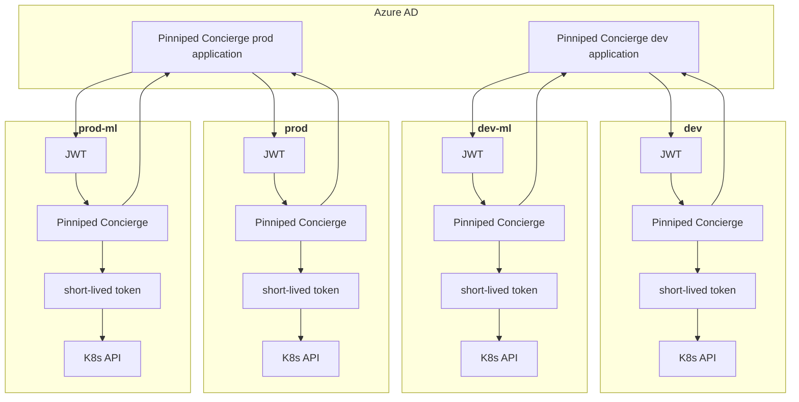
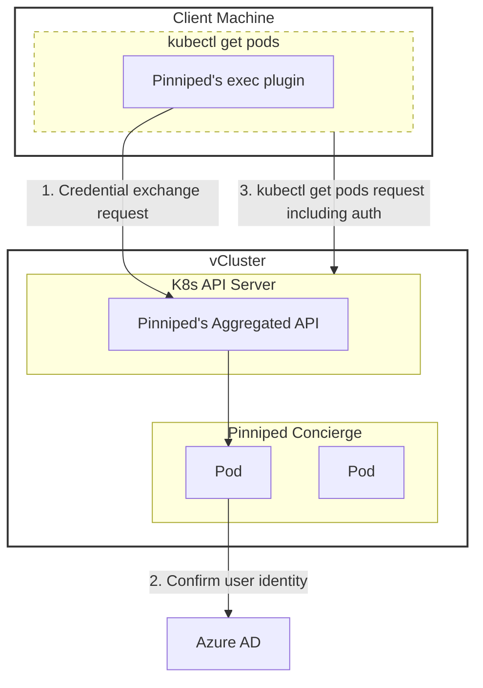

## Pinniped Concierge

[**Pinniped**](https://pinniped.dev/) is an open-source project that provides identity services for Kubernetes clusters.

**Pinniped Concierge** is a component of Pinniped that acts as an intermediary, facilitating authentication between a Kubernetes cluster and an external identity provider. In our case, Microsoft Entra ID (formerly Azure AD).

---

### Pinniped Concierge with JWT

The following is the authentication flow involving Pinniped Concierge:
1. **User authentication**: A user attempts to access the Kubernetes cluster using a kubectl command. The user is redirected to authenticate with Azure AD.

2. **Azure AD issues JWT**: Upon successful authentication, Azure AD issues a JWT. This JWT contains claims about the user's identity and the groups that they are a member of.

3. **Pinniped Concierge token exchange/credential issuance**: The user's JWT is received by Pinniped Concierge and it issues a short-lived credential that can be used to access the Kubernetes API server.

4. **Access Kubernetes**: The user can now use the short-lived token to interact with the Kubernetes API.



The diagram below shows the components involved in the login flow.



---

### Pinniped Concierge Installation/Configuration

Followed instructions [https://pinniped.dev/docs/howto/install-concierge/](https://pinniped.dev/docs/howto/install-concierge/) on how to install Pinniped Concierge.

Please note that `v0.30` was used.

To get Pinniped Concierge CustomResourceDefinitions:

```bash
curl -LO https://get.pinniped.dev/v0.30.0/install-pinniped-concierge-crds.yaml
```

As we are using Argo CD with Kustomize, we need to take out `namespace: pinniped-concierge` from all the manifest files that have this. We will then use [kubectl-slice](https://github.com/patrickdappollonio/kubectl-slice#installation) as kubectl-slice is a tool that allows you to split a single multi-YAML Kubernetes manifest into multiple manifest files. Perhaps doing this for Pinniped Concierge CustomResourceDefinitions isn't so important whereas it will definitely be needed for the Pinniped Concierge resources which we will explain shortly.

To get Pinniped Concierge resources:

```bash
curl -LO https://get.pinniped.dev/v0.30.0/install-pinniped-concierge-resources.yaml
```

As you can see from `install-pinniped-concierge-resources.yaml`, there are some manifest files that have `namespace: pinniped-concierge`, `namespace: kube-system` and `namespace: kube-public`.

We will need to take out `namespace: pinniped-concierge` from manifest files that have this because of Argo CD with Kustomize and the namespaces used will be `agora-pinniped-concierge-dev` or `agora-pinniped-concierge-prod` depending on the cluster.

However as `RoleBinding` or `ClusterRoleBinding` binds a role to subjects and references a namespace, we will need to leave these in. For example:

```yaml
kind: ClusterRoleBinding
apiVersion: rbac.authorization.k8s.io/v1
metadata:
  name: pinniped-concierge-aggregated-api-server
  labels:
    app: pinniped-concierge
subjects:
  - kind: ServiceAccount
    name: pinniped-concierge
    namespace: pinniped-concierge
roleRef:
  kind: ClusterRole
  name: pinniped-concierge-aggregated-api-server
  apiGroup: rbac.authorization.k8s.io
```

We will leave in `namespace: pinniped-concierge` for `RoleBinding` or `ClusterRoleBinding` objects and will later use Kustomize to patch it to `agora-pinniped-concierge-dev` or `agora-pinniped-concierge-prod` depending on the cluster. This is so that we can reuse the same YAML manifest files for multiple clusters as you can see in [/infra/k8s/agora-pinniped-concierge/speedway/common/pinniped-concierge-v0.30](https://github.com/wp-wcm/city/tree/main/infra/k8s/agora-pinniped-concierge/speedway/common/pinniped-concierge-v0.30).

Furthermore for the YAML manifest files that have `namespace: kube-system` and `namespace: kube-public`, we will need to move these to entirely different folders. The reason for this is because projects set up in Argo CD are per namespace. So Argo CD projects for namespaces `agora-pinniped-concierge-dev` and `agora-pinniped-concierge-prod` are only allowed to apply to these respective namespaces. It will not have the required permissions to apply to namespaces `namespace: kube-system` and `namespace: kube-public`. So unfortunately, we have to split these up and move to [kube-public](https://github.com/wp-wcm/city/tree/main/infra/k8s/kube-public) and [kube-system](https://github.com/wp-wcm/city/tree/main/infra/k8s/kube-system) folders.

---

### Microsoft Entra ID Applications

Entra ID is an identity and access management solution provided by Microsoft and formerly known as Azure AD.

To allow Pinniped Concierge to leverage Entra ID to manage authentication and access, we need to add an Entra ID application.

We currently have set up 2 Entra ID applications for Pinniped Concierge (1 for dev and 1 for prod).

https://github.com/wp-wcm/city/tree/main/infrastructure/terraform/environments/dev2/bootstrap/entra-id-app

and

https://github.com/wp-wcm/city/tree/main/infrastructure/terraform/environments/prod/bootstrap/entra-id-app

Once those have been set up, we configure Pinniped Concierge to point to these.

An important thing to note is the groups (set out [here](https://github.com/wp-wcm/city/blob/main/infrastructure/terraform/environments/dev2/bootstrap/aad/config.auto.tfvars.json)) that we will be using later to determine which teams will have access to what namespaces.

---

### Create a JWTAuthenticator

We next need to create a `JWTAuthenticator` as described in these instructions [https://pinniped.dev/docs/howto/concierge/configure-concierge-jwt/](https://pinniped.dev/docs/howto/concierge/configure-concierge-jwt/).

[jwt-authenticator-pinniped-concierge.yaml](https://github.com/wp-wcm/city/blob/main/infra/k8s/agora-pinniped-concierge/speedway/common/pinniped-concierge-v0.30/jwt-authenticator-pinniped-concierge.yaml)

```yaml
apiVersion: authentication.concierge.pinniped.dev/v1alpha1
kind: JWTAuthenticator
metadata:
  name: jwt-authenticator-pinniped-concierge
spec:
  # This should be the issuer URL that was declared in the FederationDomain.
  issuer: "https://login.microsoftonline.com/8c31bd04-5a9a-4aa1-8bfa-c1edfe26a6a0/v2.0"
  # Replace this with your own unique value.
  audience: client-id
  claims:
    username: email
    groups: groups
```

To find out what to fill in for `issuer`, go to `App registrations` in https://portal.azure.com/#view/Microsoft_AAD_IAM/ActiveDirectoryMenuBlade/~/RegisteredApps and then search for `pinniped-concierge` in `All Applications` tab. Please note that `pinniped-concierge-alpha` is for dev (was following a naming convention at the time hence `alpha`) and `pinniped-concierge-prod` is for prod.

Once you have found your application then -> `Overview` -> `Endpoints` -> then grab the value for `OpenID Connect metadata document`. The `issuer` will then be the URL without `/.well-known/openid-configuration`.

Then for `audience`, go back to -> `Overview` -> it will be the value for `Application (client) ID`.

We will also have to include `groups` claim in the `JWTAuthenticator` as we will need the groups IDs returned from Entra ID which we will use to grant access to specific namespaces.

---

### Generate a kubeconfig file

To be able to create Pinniped-generated kubeconfig files, you will need to have access to the 4 vCluster generated kubeconfig files (dev, dev-ml, prod and prod-ml vClusters).

```bash
pinniped get kubeconfig --kubeconfig /path/vcluster-generated-kubeconfig.yaml --oidc-client-id client-id --oidc-scopes openid,offline_access,email --oidc-listen-port port > pinniped-generated-kubeconfig.yaml
```

Note that the value for the `--oidc-client-id` flag must be our OIDC client’s ID which is the same value declared as `audience` in the `JWTAuthenticator` that we created earlier. For the value for `--oidc-listen-port`, it will be the port that you set for `redirect_uris` as part of creating an Entra ID application earlier.

[/infrastructure/terraform/environments/prod/bootstrap/entra-id-app/entra_id_app_registration.tf#L4](https://github.com/wp-wcm/city/blob/main/infrastructure/terraform/environments/prod/bootstrap/entra-id-app/entra_id_app_registration.tf#L4)

```yaml
  redirect_uris    = ["http://127.0.0.1:23456/callback"]
```

Pinniped-generated kubeconfig files are kept [here](https://github.com/wp-wcm/city/tree/main/infra/kubeconfig).

---

### RBAC

If we were to use the Pinniped-generated kubeconfig files without any further modifications to the clusters, after having successfully authenticated, you are placed into a default group named `system:authenticated`. This group is a part of Kubernetes' built-in user groups.

By default, the `system:authenticated` group does not have any specific permissions granted to it.

The specific permissions you receive depend on the RBAC roles and role bindings configured.

As we are using Azure AD for authentication, we can also use this for authorization too. After authenticating, we want the returned JWT token to include the object IDs of groups that the authenticated user is a member of. This approach enables us to manage the namespaces an authenticated user can access based on their membership in specific groups.

In order to include the object IDs of groups for the returned JWT token, we do this by including the below in the configuration for the Entra ID application.

[/infrastructure/terraform/modules/agora_entra_id_oidc/service_registrations.tf#L14-L28](https://github.com/wp-wcm/city/blob/main/infrastructure/terraform/modules/agora_entra_id_oidc/service_registrations.tf#L14-L28)

```yaml
  group_membership_claims = ["SecurityGroup"]

  optional_claims {
    access_token {
      name = "groups"
    }

    id_token {
      name = "groups"
    }

    saml2_token {
      name = "groups"
    }
  }
```

The `group_membership_claims = ["SecurityGroup"]` ensures that the tokens will include claims for the security groups to which the user belongs.

Once we have the object IDs of the groups, we can use these to manage the namespaces an authenticated user can access.

The `edit` `ClusterRole` is one of the default roles provided by Kubernetes. It grants write permissions to many core API group resources but does not include permissions to view or modify roles and bindings.

In Kubernetes, you can use a `RoleBinding` to assign a `ClusterRole`, in this case such as `edit`, to a user or a group within a specific namespace. This allows you to grant users the permissions defined in the `ClusterRole` for resources only within that namespace, rather than cluster-wide. So we can leverage the `edit` `ClusterRole` with a `RoleBinding` for a specific namespace.

We will use [rolebinding-edit.yaml](https://github.com/wp-wcm/city/blob/main/infra/k8s/common/rbac/rolebinding-edit.yaml) and change the group name in subjects depending on the object ID of the group in Azure AD.

```yaml
apiVersion: rbac.authorization.k8s.io/v1
kind: RoleBinding
metadata:
  name: edit-rolebinding
roleRef:
  kind: ClusterRole
  name: edit
  apiGroup: rbac.authorization.k8s.io
subjects:
- kind: Group
  name: 00000000-0000-0000-0000-000000000000
  apiGroup: rbac.authorization.k8s.io
```

By looking at an example pull request https://github.com/wp-wcm/city/pull/35733, you can see that we list [rolebinding-edit.yaml](https://github.com/wp-wcm/city/blob/main/infra/k8s/common/rbac/rolebinding-edit.yaml) in the Kustomize YAML manifest and then we patch group name in subjects to `ed1f4139-f66f-41bf-ba72-0f21e7ece92e` which is the `Object ID` of the [group](https://portal.azure.com/#view/Microsoft_AAD_IAM/GroupDetailsMenuBlade/~/Overview/groupId/ed1f4139-f66f-41bf-ba72-0f21e7ece92e/menuId/) for Woven SDG team. Perhaps patching the `Object ID` isn't the best approach but it saves us from having to copy [rolebinding-edit.yaml](https://github.com/wp-wcm/city/blob/main/infra/k8s/common/rbac/rolebinding-edit.yaml) into every team's namespace folder.

Please note that as the `edit` `ClusterRole` grants write permissions to only core API group resources, if a team have custom resources, we/they will need to add a role and binding for those custom resouces in their namespace folder. We can leverage these existing manifests https://github.com/wp-wcm/city/tree/main/infrastructure/k8s/common/cityos-system/rbac/base.

---

### Issues

When deploying Pinniped Concierge, a `CredentialIssuer` custom resource defines how Pinniped should expose its endpoints.

```yaml
apiVersion: config.concierge.pinniped.dev/v1alpha1
kind: CredentialIssuer
metadata:
  name: pinniped-concierge-config
  labels:
    app: pinniped-concierge
spec:
  impersonationProxy:
    mode: auto
    service:
      type: LoadBalancer
      annotations:
        service.beta.kubernetes.io/aws-load-balancer-connection-idle-timeout: "4000"
```

When the `CredentialIssuer` specifies a load balancer strategy, Pinniped will create a Kubernetes `Service` of type `LoadBalancer`.

If you create a `LoadBalancer` type `service`, then requests from the source `0.0.0.0/0` are allowed by default so will be open to the Internet. Thus having Pinniped Concierge installed on all of the vClusters without any changes will mean that they all will be accessible without the VPN which is not what we want. We want these to be restricted to the CIDR range of the VPN.

To restrict the source instead of `0.0.0.0/0`, we can use `loadBalancerSourceRanges`.

At the moment, there is an open issue [https://github.com/vmware-tanzu/pinniped/issues/1064](https://github.com/vmware-tanzu/pinniped/issues/1064).

So for the time being, the created `service/pinniped-concierge-impersonation-proxy-load-balancer` was manually edited to include `.spec.loadBalancerSourceRanges` with the CIDR range of the VPN.

```yaml
spec:
  loadBalancerSourceRanges:
  - 103.175.111.222/32
```
