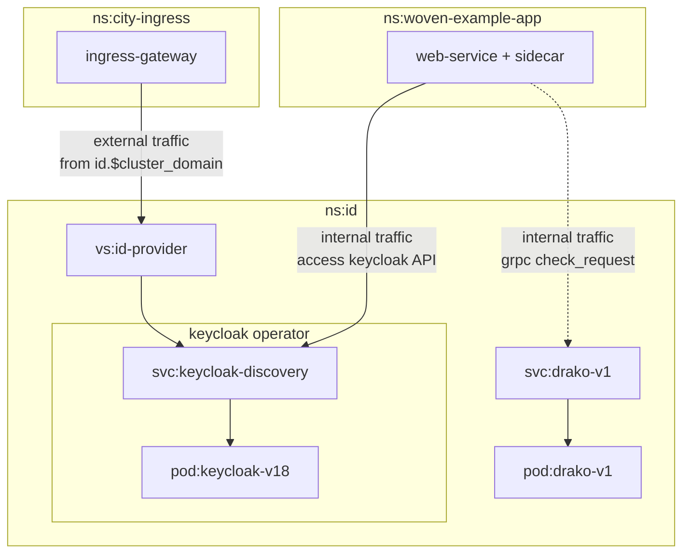
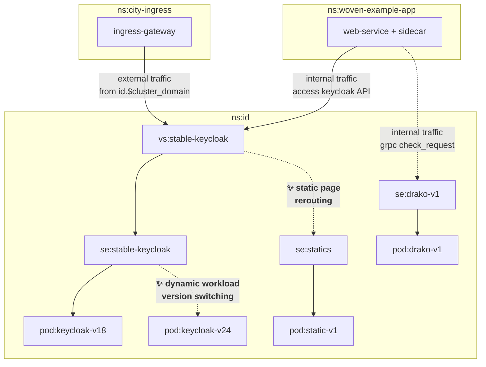

# Waypoint 🛣️
The Agora Identity traffic route package. 

## How does it work
Waypoint uses the `istio` DNS Proxy feature to route traffic from a custom hostname dedicated to `id` namespace services. The application from outside the `id` namespace would access `id` services by a special hostname instead of a typical kube service hostname.

## Why?
Because native Kube DNS lacks a routing feature, our stack needs to be able to route traffic from both external and internal into our `id` namespace consistently.

- Dynamic routing without any dependency manifest from components themself
- Support application version switching in runtime
- Redirect traffic to temporary destination, Eg. maintenance page
 
## Entrypoint list
|Name|Public URL|Internal URL|Kube service URL|
|---|---|---|---|
|Keycloak|`https://id.${cluster_domain}`|`https://id.${cluster_domain}`<br />`http://keycloak.stable.id.svce`|`http://keycloak.id.svc.cluster.local`|
|Drako|`N/A`|`drako.stable.id.svce:9001`|`drako-v1.id.svc.cluster.local:9001`|


## Routing diagram (Istio logically)
### Terminology
```
ns = Namespace
vs = Virtual Service
se = Service Entry
```
#### Before


#### After



## Configuration guide

### Dynamic workload version switching
Switch between application version will be place in the `ServiceEntry` layer. This allows us to able to rollout the new version of service quickly and if anything unexpected happen. We also able to switch back to the previous deployment easily.
- Go to `ServiceEntry` file of the service
- Modify workload selector
#### Example
```yaml
# .... the rest of ServiceEntry file
  workloadSelector:
    labels:
      app: keycloak
      --- majorVersion: v18
      +++ majorVersion: v24
```

### Static page rerouting
Routing is config by `VirtualService`. You could do this in `ServiceEntry` level but the resource path rewriting is not supported by `ServiceEntry` For instance: everything start with `/auth` should rewrite into `/maintenance`


- Go to the `VirtualService` file of the destination
- Reroute `http` request matcher to `statics.stable.id.svce`
- use `rewrite` to select a specific page from `statics`

#### Example
```yaml
    # ... the rest of VirtualService file
        http:
        - match:
            - uri:
                exact: /
            - uri:
                prefix: /auth
            rewrite: 
                uri: '/maintenance' # see `statics/nginx/nginx.conf` for more information
            route:
            - destination:
                host: statics.stable.id.svce
                port:
                number: 80
            weight: 100
```

# TODO
- [x] Dynamic workload version switching
- [x] Static page rerouting
- [ ] Custom Istio default error page

