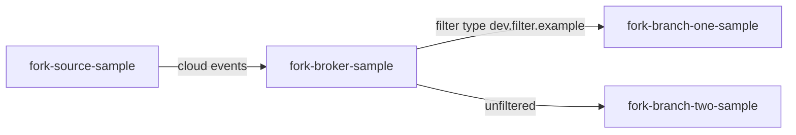

# Eventing fork example

## Description

This example displays how serverless eventing works.

There are a couple of moving parts here:

1. `fork-source-sample` - a serverless application (source) that will ingest http requests and forward them to `fork-broker-sample`.
2. `fork-broker-sample` - a broker that will ingest events from `fork-source-sample` and vend them to branch samples.
3. `fork-branch-one-sample` - a serverless application (sink) that will ingest filtered events of type `dev.filter.example` from the broker.
4. `fork-branch-two-sample` - a serverless application (sink) that will ingest unfiltered events from the broker.

## Running samples:

UI-enabled sample endpoints:
- LAB2: 
  - Source: https://fork-source-sample-serverless-lambda.agora-lab.w3n.io
  - Filtered sink (type: `dev.filter.example`): https://fork-branch-one-sample-serverless-lambda.agora-lab.w3n.io
  - Pass-through sink: https://fork-branch-two-sample-serverless-lambda.agora-lab.w3n.io
- DEV2:
  - Source: https://fork-source-sample-serverless-lambda.agora-dev.w3n.io
  - Filtered sink (type: `dev.filter.example`): https://fork-branch-one-sample-serverless-lambda.agora-dev.w3n.io
  - Pass-through sink: https://fork-branch-two-sample-serverless-lambda.agora-dev.w3n.io
- LAB:
  - Source: https://fork-source-sample-serverless-lambda.agora-lab.woven-planet.tech
  - Filtered sink (type: `dev.filter.example`): https://fork-branch-one-sample-serverless-lambda.agora-lab.woven-planet.tech
  - Pass-through sink: https://fork-branch-two-sample-serverless-lambda.agora-lab.woven-planet.tech
- DEV:
  - Source: https://fork-source-sample-serverless-lambda.cityos-dev.woven-planet.tech
  - Filtered sink (type: `dev.filter.example`): https://fork-branch-one-sample-serverless-lambda.cityos-dev.woven-planet.tech
  - Pass-through sink: https://fork-branch-two-sample-serverless-lambda.cityos-dev.woven-planet.tech

Behind links above you'll find [CloudEvents Player](https://knative.dev/docs/getting-started/first-source/#examining-the-cloudevents-player).
Use it to send events to `fork-broker-sample`.

## Flow visualisation:

