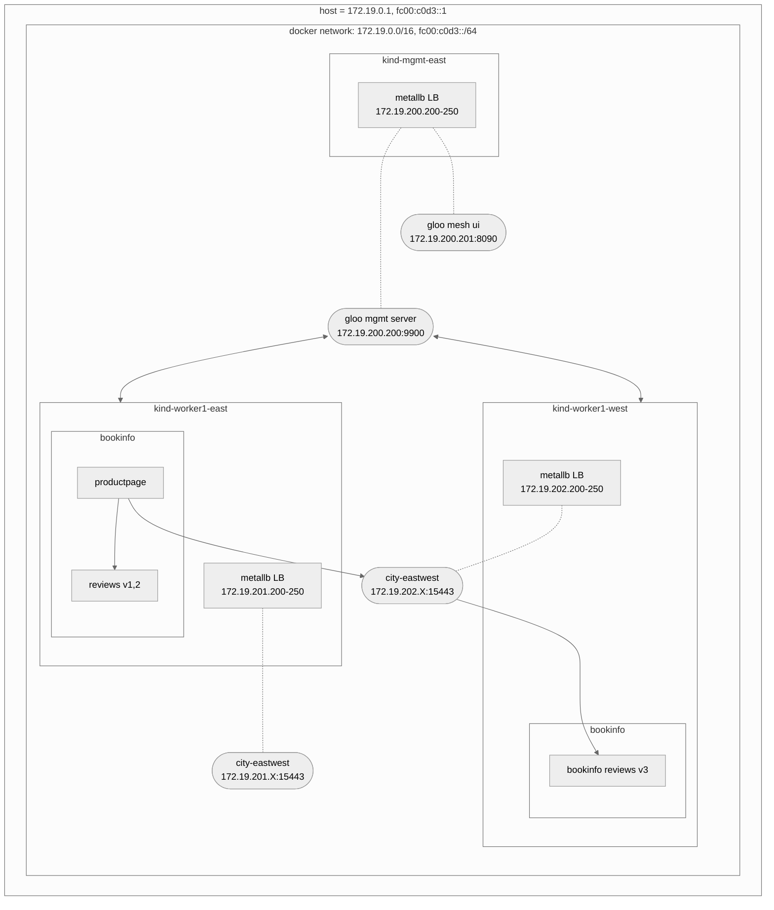

**Table of contents**
<!-- vim-markdown-toc GFM -->

* [Local v2 environment](#local-v2-environment)
  * [Architectures](#architectures)
    * [Preconfigured stuffs](#preconfigured-stuffs)
  * [Setting up](#setting-up)
    * [Prerequisites](#prerequisites)
    * [Running](#running)
    * [Teardown](#teardown)
  * [FAQs](#faqs)
    * [Failure when creating worker1-west](#failure-when-creating-worker1-west)
    * [Bootstrap script stucks at provisioning `kind-mgmt-east` cluster](#bootstrap-script-stucks-at-provisioning-kind-mgmt-east-cluster)

<!-- vim-markdown-toc -->

## Local v2 environment

### Architectures

This local environment consists of three clusters to simulate gloo mesh on lab2.

These clusters are configured to use dual stack networking with IPv4 as its primary address.
Note that pod and service IP in these clusters are not accessible from the host without port forwarding similar to legacy minikube.
As a proof, pod and service subnet in each clusters are the same and they cannot talk to each others.

Each clusters uses Cilium CNI for IPAM and Istio have been installed in worker clusters using IstioLifecycleManager with Istio CNI enabled.



#### Preconfigured stuffs

You can access gloo mesh UI by going to 172.19.200.201:8090.

For demonstration purposes, bookinfo and city-eastwest workspaces are installed.
As you can see from the graph, productpage from worker1-east can talk to reviews on worker1-west through city-eastwest load balancers.
These workspaces do not enable service isolation for simplicity, but can be configured to do so in workspaceSettings.
Note that there is no ingress setup, thus to access productpage, port forwarding is needed.

### Setting up

#### Prerequisites
- Instance with at least 16 GB of memory
- Docker
- [kind](https://kind.sigs.k8s.io/)
- Gloo mesh license key
  - This is shared in Lastpass under `Gloo Mesh License Keys` folder
- Update the target branch that you are currently using your development.
  - [mgmt-east](./clusters/mgmt-east/flux-system/sources/git-city.yaml)
  - [worker1-east](./clusters/worker1-east/flux-system/sources/git-city.yaml)
  - [worker1-west](./clusters/worker1-west/flux-system/sources/git-city.yaml)
- [Github Token](https://docs.github.com/en/authentication/keeping-your-account-and-data-secure/creating-a-personal-access-token)
- Please make sure that these subnets `172.19.0.1, fc00:c0d3::1` are not being used by docker networks other than `agora-local`
- [yq](https://github.com/mikefarah/yq)

#### Running

```bash
export GITHUB_USERNAME="your_username" # required
export GITHUB_TOKEN="your_token" # required

export GLOO_MESH_LICENSE="ABC" # required
export GLOO_GATEWAY_LICENSE="ABC" # optional

export K8S_VERSION="1.24" # optional
export NODE_NUM="2" # optional

bin/bootstrap
```

#### Teardown

```bash
bin/teardown
```

### FAQs

#### Bootstrap script stucks at provisioning `kind-mgmt-east` cluster

If it takes too long to create the `mgmt-east` like the below log, your Github token might be invalid, expired, or not authorized for `wp-wcm` org. Issue a new token or authorize it for `wp-wcm`.
Then, update your `GITHUB_TOKEN` env with the new token again before re-running the script.
```
networkpolicy.networking.k8s.io/allow-webhooks unchanged
gitrepository.source.toolkit.fluxcd.io/city created
Provisioning kind-mgmt-east.................................................................................................................................................................................................................................................................................................................................................................................................
```

If you have problems at this stage, the following commands will be useful to help find out what is going on:

```shell
kubectl get gitrepositories -n flux-system
kubectl get kustomizations -n flux-system
```

This first command in particular will indicate clearly if it is a problem with the GitHub token.

#### Istio is not deployed

The Flux Kustomization controller shows an error log like `ServiceEntry/istio-system/knative-serving-artifactory dry-run failed, error: no matches for kind "ServiceEntry" in version "networking.istio.io/v1beta1"`.
This may be caused by the license expiration.
Basically, with the valid license, IstioOperator should be deployed in `gm-iop-<revision>` ns (ex. `gm-iop-1-17-3`).
You can check the log of `gloo-mesh-mgmt-server` in `gloo-mesh` ns on the mgmt-east cluster.
Please update the license.
