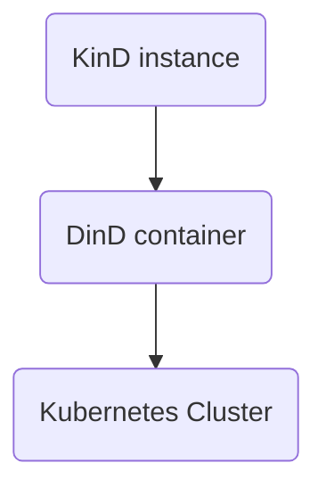
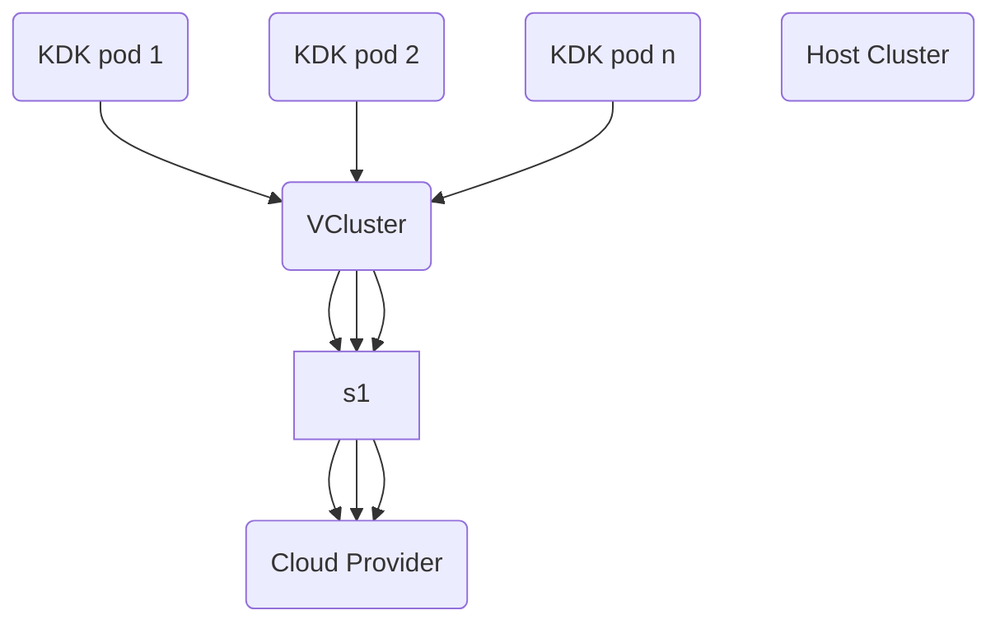

# Kubernetes in Docker in Kubernetes (KDK)

This project provides the ability to create a private kubernetes cluster within an existing kubernetes cluster.

The major components that enable this functionality are:

- DinD (Docker in Docker, <https://github.com/moby/moby/wiki/Docker-in-Docker>)
    A method to run a container within a container
- KinD (k8s in Docker, <https://kind.sigs.k8s.io>)
    A limited k8s that is able to run within a container

## Basic Picture



## Bigger Picture



## Contents:

- [Bazel project](BUILD) to build a container that runs KinD
- [Helm chart](../../infra/helm/KDK/) wraps the KinD container to allow multiple deployments


## Assumptions

1. Permission to read secrets from the namespace KDK has been installed to
1. Permission to port forward to the pod(s) deployed into the KDK namespace

## Detailed Steps

1. Add cluster(s) to values.yaml
```
$ cat values.yaml
[snip]
clusters:
  testing1:
    email: testing1@example.org
  testing2:
    email: testing2@example.org
[snip]
```

1. Deploy Helm chart
```
$ helm install kdk KDK -f values.yaml
[wait for deployment to complete]
```

1. Connect to deployed cluster using the wrapper script
```
$ ./scripts/kdk kdk-testing1
Setting up access to kdk-testing1
. writing kubeconfig for kdk-testing1
. tightening permissions for kubeconfig
. getting port number
. forwarding 16443
. waiting for port forward to complete
.. Forwarding from 127.0.0.1:16443 -> 16443
.. Forwarding from [::1]:16443 -> 16443
. launching sub-shell (when finished type exit to return)

To launch further shells run:

KUBECONFIG=/tmp/tmp.mAAcRKJ6rO/config $SHELL

** this is now using the KinD instance deployed from the Helm install further up **
$ kubectl get ns
.. Handling connection for 16443
NAME                 STATUS   AGE
default              Active   22s
kube-node-lease      Active   22s
kube-public          Active   22s
kube-system          Active   22s
local-path-storage   Active   18s
$
```

## DOCKER\_HOST

If ```RETAIN_DOCKER_HOST``` is set to a non-empty value ```DOCKER_HOST``` is not unset - this is not currently exposed as an option in the Helm template.  If ```DOCKER_HOST``` is set the containers will be created on the host ```DOCKER_HOST``` points at.

## Potential Problems

1. Unable to connect to newly deployed cluster
   - check the Helm deployment was successful and the pods have successfully deployed (```kubectl events```, ```kubectl logs $POD_NAME```, etc).
1. Pods cannot resolve domain names (eg cannot pull images)
   - see next issue
1. DNS resolution fails from within a deployed cluster (logs normally report ```msg="[resolver] failed to query external DNS server"```, ```write: operation not permitted```)
   - check for IP range conflicts between the cluster and its parent(s)
1. Port forwarding fails, via the ```kdk``` script
   - check the cluster being used (check you are not running in the subshell)
   - check permission to port forward is available
   - check if any existing port forward process are running and terminate if required
1. DNS name resolution fails, or gives confusing results
   - check dnsDomainName has been set, or not within the KDK node(s)
1. Once connected to newly deployed cluster, cannot connect back to original cluster
   - the subshell that is launched has KUBECONFIG set
     - temporarily override KUBECONFIG, or
     - exit the subshell
1. Something else
   - check the events for the namespace the KinD container is deployed to
   - check the logs for the KinD container (container started as part of the Helm deployment)
   - check the events inside the KinD cluster (the k8s cluster that was started from the above deployment)

## Packages

1. Docker DIND
   - https://hub.docker.com/_/docker/tags (but downloaded via Artifactory)
1. KinD
   - https://github.com/kubernetes-sigs/kind/releases
1. Kubectl:
   - https://kubernetes.io/releases/download/

## TODO (maybe?)

1. Remove the use of the kdk wrapper script
   - avoid having to obtain a secret to login
     - enable SSO
   - avoid having to port-forward to get access
     - expose KinD endpoints
       - via ingress
       - DNS
1. lots more
