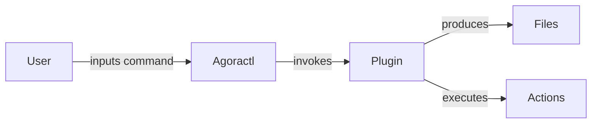

# How to Use Agoractl

## Pre-requisites

1. You **must** use the CLI from within the `City` monorepo. This is currently
   to enforce that best practices are applied to infrastructure generated

## How to run Agoractl

Agoractl is a CLI based tool, the tool can be invoked in one of two ways:

* Via Bazel
* Via Python

### Invocation via Bazel

Invocation via Bazel can be done via:

```shell
$ bazel run //ns/agoractl -- --help
usage: agoractl [-h] [-n] {openapi,plugin,postgres,service_manifests,vault,iota} ...

Agoractl Commander: Create Agora Infra via CLI

positional arguments:
  {openapi,plugin,postgres,service_manifests,vault,iota}

options:
  -h, --help            show this help message and exit
  -n, --no-git          don't add generated files to git
```

### Invocation via Python

Please note that while running Agoractl like this works, it's not *really* the official way to run Agoractl. Running
via Bazel (at least from inside the monorepo) is the only way supported by the DevRel team. Yes, we know Bazel is
sometimes problematic, but it's our official build tool.

Just execute the \<repo\>/ns/agoractl/agoractl.py file:

```shell
$ ./agoractl.py --help

usage: __main__.py [-h] [-n] {openapi,plugin,postgres,service_manifests,vault,iota} ...

[... Same output as above]
```

If this doesn't work for you, please don't fix Agoractl yourself - come to DevRel and ask us and we will try and support
your use case. There are sometimes requirements that are not immediately visible.

### Executing as a web app

Agoractl can also be executed as a web app using Python's "Flask" package. This version of Agoractl is known as "ZAML",
which stands for "Zero YAML", meaning that you can create deployments without ever editing or even seeing the YAML files
that are used to create the deployment. To run it in this way, use the following command:

```shell
$ flask --app zaml/__main__.py run
 * Serving Flask app 'zaml/__main__.py'
 * Debug mode: off
WARNING: This is a development server. Do not use it in a production deployment. Use a production WSGI server instead.
 * Running on http://127.0.0.1:5000
Press CTRL+C to quit
```

You can now start a web browser and connect to [http://127.0.0.1:5000](http://127.0.0.1:5000). A page will be displayed
that shows all of the currently supported plugins and you can use the appropriate plugin's page to create your new
deployment, which will be created locally and pushed to GitHub as a PR. Note that running locally like this is
considered more of a "fun feature" and the more common use case for the web app will be to use an instance of the web
app running on Agora itself.

Note also that in order to use this feature, you will need to export your GitHub token in the "GITHUB_TOKEN" environment
variable, and you may have to enter an SSH password in the shell from which you executed ZAML, if you have one.

Also, as this method does not use Bazel to launch the application, you must install all package dependencies as
described below in the section about requirements.txt.

### Getting Help

It is possible to obtain overall help by running Agoractl as shown in the examples above. To get help specific to a
particular plugin, specify the desired plugin's name when requesting the help:

```shell
$ ./agoractl.py openapi --help

usage: agoractl openapi [-h] name namespace_name openapi_spec generator

A plugin that can create compilable and executable services, based on an OpenAPI specification given by the user.

[...]
```

Note that the position of certain flags (such as -h|--help and -n|--no-git) makes a difference. If the flag is specified
on the command line _before_ the plugin name, it is treated as a global flag. If it appears _after_ the plugin name, it
is treated as local to that plugin. So for instance, to prevent Agoractl from adding generated files to git, the -n or
--no-git argument must be passed _before_ the plugin name as it is a global argument that applies to all plugins.
Passing it after the plugin name will result in it being ignored.

#### Configure modules
Note: when running with python, you need to install python and all the required modules. The modules need to be listed
in three files: requirements.txt, pyproject.toml and py_requirements.in, in the root directory of the monorepo.

* Use the [requirements.txt](../requirements.txt) file to set up modules for local Agoractl execution.
  * pip3 install -r requirements.txt
  * or use the requirements.txt file when setting up python environment in VSCode. [ref](https://code.visualstudio.com/docs/python/environments?ref=signalblur.io#_using-the-create-environment-command)

* Use the [pyproject.toml](../pyproject.toml) file to set up modules for packaging Agoractl up into an installable package
that developers can install on their machines, for executing Agoractl without requiring a copy of the monorepo.

* Use the [py_requirements.in](../../../py_requirements.in) to set up modules for use by Bazel. See the Python
[documentation](../../../docs/development/python/README.md)
for more details.

#### Tip: Create alias for ease of use
Add alias like this to .bashrc or .zshrc file, depend on which shell you are using.
```
alias agoractl="bazel run //ns/agoractl"
```
And now you can run the command line like
```
agoractl --help
```

### How it works



Agoractl comprises several smaller modules called **plugins** that are
hooked into the main CLI tool, that the user can then invoke. Upon
invocation the plugin produces output in the form of files. Some common output
files are:

* Bazel BUILD files, to leverage the CI/CD Pipelines of Agora
* YAML Files, to provide a declaration of the infrastructure being requested OR,
  to provide values for declaring requested infrastructure

These files are produced as output that can then be acted upon inside the
monorepo. You are then free to use whatever git flow you prefer (whether the use
of `git` or an IDE with GitHub integration) to create a Pull Request of the
output.

In addition, some plugins might perform actions on behalf of the user such as:

* Perform linting and other clean up actions to ensure correct outputs
* Call APIs on behalf of the user to ensure uniform behavior the plugin needs
* Generate code based on API definitions

## What you can do with Agoractl

Agoractl's functionality is driven by plugins, so it is being extended all the time, as developers inside and outside
the Developer Relations team come up with ideas for new plugins. Plugins are documented in the plugin's directory and
also in the plugin itself. Therefore they will be listed here, but no further information will be given.

The list of plugins is as follows:

* [Create IoTA Tenants](./plugins/01_agoractl_iota.md)
* [Create Postgres Clusters](./plugins/03_agoractl_postgres.md)
* [Generate services from OpenAPI specifications](./plugins/04_agoractl_openapi.md)
* [Generate a plugin skeleton](./plugins/05_agoractl_plugin.md) - useful when you are creating a new plugin
* [Generate Kubernetes service manifests](./plugins/06_agoractl_service_manifests.md)
* [Generate Serverless manifests](./plugins/07_agoractl_serverless.md)
* [Generate Secure KVS manifests](./plugins/08_agoractl_securekvs.md)
* [Login to agoractl with Single Sign-On](./plugins/09_agoractl_sso.md)
