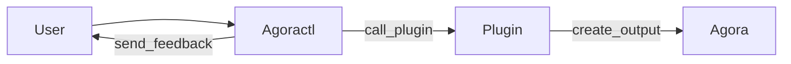

# Agoractl

This directory is home to the Agoractl and all of its various plugins

## Overview

Agoractl is a CLI tool to help automate various parts of Agora's infrastructure
for a user of the platform. Agoractl's goal is to help teams get various parts
of their application infra up on Agora in a way that is easy and requires
minimal knowledge of the underlying implementation. For example, an Agora user
might have a requirement to use Postgres; the key is to enable the use of this
without the user needing to understand how Postgres is being deployed for them.

Agoractl is *opinionated*; being in the position to know how Agora is set up,
Agoractl can leverage that knowledge to help teams who want to use Agora's
various services quickly by doing most of the hard stuff for them.

Agoractl works by making various plugins available to the end user. The user works
with Agoractl to generate various resources into Agora that will be used by the
user. Output from the plugins can be leveraged in a couple of ways, depending on
the desire of the user.

### Agoractl IS

* A tool meant to help generate Agora resources for service/application use
* A way to generate infrastructure resources inside or outside the city monorepo
  within Woven
* A means to help with creation and updating of infrastructure similar or
  inspired by AWS
* Built to work with Agora's tooling, including Bazel, Zebra, etc.

### Agoractl IS NOT

* A tool meant to help generate non-Agora resources for service/application use
* A way to generate infrastructure resources for repositories outside of Woven
* A fully managed solution similar to AWS
* Built to be an escape hatch to avoid or discourge use of Agora or its tooling

## Next Steps

* For information on how to use Agoractl refer to the [Manual](01_manual.md)
* For information on how to contribute to Agoractl, refer to
  our [Contribution Guidelines](02_contributing.md)
* For information on design choices and considerations made, please refer to the
  Agora Team's Technical
  Note [TN-315](https://docs.google.com/document/d/1NrlFVKOcTJgTDF6KXv_fqW3k9lkv03gP3Irogtlmr8U/edit)