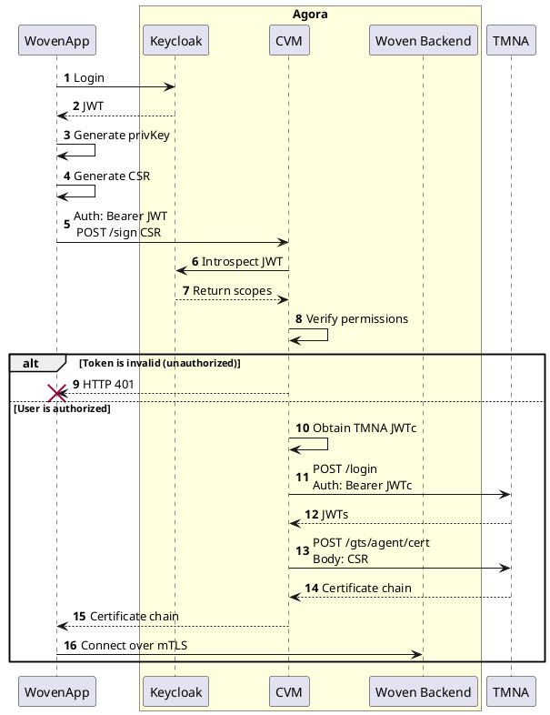

# Certificate Vending Machine
Certificate Vending Machine (CVM) is a service that can sign Certificate Signing Request(CSR) and return X.509 certificates that can be used as client certificates to perform mutual TLS with backend services deployed in Agora. Currently, CVM signs a CSR using [Vault PKI](https://www.hashicorp.com/products/vault/pki-with-vault). And the certificate issued can be used to perform mutual TLS with Woven App/passport backends. In the near future, CVM will integrate TMNA PKI.

## Sequence diagram
The sequence below shows the flow where Woven App retrieves the certificate from CVM and performs mutual TLS with the woven app backend.



## Technical Note
[TN-0187](https://docs.google.com/document/d/1UTr8HL3s6PkZ0RyYd4Ik1KYc7rpGjOAx6L_FICXkwa0/edit#heading=h.5qm13wuvtiz9)

## Supported Private Keys
CVM supports _any_ private key supported by Vault PKI as listed [here](https://developer.hashicorp.com/vault/api-docs/secret/pki#key_type-3).

## Sample code

### Go
Sample Golang code that generates Certificate Signing Request(CSR) invokes CVM to sign the CSR and performs mutual TLS with the Woven App backend is used for testing and is placed [here](https://github.com/wp-wcm/city/blob/main/ns/cvm/tests/testkube/cvm-test.go). The private key, the certificate signing request, and the certificate generated by the sample will be written to the local directory specified in its configuration. Readme for launching it localy can be found [here](https://github.com/wp-wcm/city/blob/main/ns/cvm/tests/testkube/README.md).

### Bash
Similar code in bash, which tests the complete flow, that is, retrieving JWT access token from IDP, generate a CSR signed by P-384, invoking CVM to sign the CSR and performing mTLS with Woven App backend, is here:

```bash
./generate_certificate.sh [dir to write output] [common name] [idp username] [idp password] [idp public client] [optional-cluster] [optinal-test-endpoint]
```

Available `cluster` variables: `dev` (default), `lab`, `lab2`.

Note: `common-name` matters, use CNs based on the cluster, for example:
- `mydevice.app.cityos-dev.woven` for `dev`.
- `mydevice.app.agora-lab.wph` for `lab`.

#### Example (lab context)

Prepare (get test credentials from lab):
```bash
CERT_USER=$(kubectl -n testkube get secret bob-credentials -o jsonpath='{.data.username}' | base64 -d)
CERT_PWD=$(kubectl -n testkube get secret bob-credentials -o jsonpath='{.data.password}' | base64 -d)
```

With test (defaults to http-bin endpoint):
```bash
./generate_certificate.sh /tmp/tests test.woven-app.httpbin.cvm.agora-lab.woven-planet.tech $CERT_USER $CERT_PWD admin-cli lab
```

Without test (produces certificates only):
```bash
./generate_certificate.sh /tmp/tests test.woven-app.httpbin.cvm.agora-lab.woven-planet.tech $CERT_USER $CERT_PWD admin-cli lab ""
```

Pre-requisites: [step](https://smallstep.com/docs/step-cli/installation), [jq](https://stedolan.github.io/jq/)

### Python
```
TARGET_DIR="/tmp/tests" \
COMMON_NAME="test.woven-app.httpbin.cvm.agora-lab.woven-planet.tech" \
IDP_USERNAME=$(kubectl -n testkube get secret bob-credentials -o jsonpath='{.data.username}' | base64 -d) \
IDP_PASSWORD=$(kubectl -n testkube get secret bob-credentials -o jsonpath='{.data.password}' | base64 -d) \
IDP_PUBLIC_CLIENT="admin-cli" \
CLUSTER="lab" \
python3 generate_certificate.py
```
