# Part 2: Setting up Database Caller

In this section we're going to set up our other serverless function: a database
caller. This function takes the initial request from outside (or from internal)
and then does the following:

* Add a record to a database of the order
* Send a message to Slack Caller

## Setting Up Our Database

Before we can set up the Database Caller, we need to set up a database to use.
Agoractl lets us do this easily with the use of its Postgres plugin:

```shell
$ bazel run //ns/agoractl -- postgres

...

Enter the name of the database: gas-n-go
Enter the namespace to deploy the database: gas-n-go
Enter the desired environment, for non-agora developers you should pick 'dev' [dev|lab|lab2]: 'dev'
Enter the desired location for the output. This should be relative to the 'city' repository root. Do not start with a '/': <DIR>
Generating Postgres Values YAML...

---
name: gas-n-go
storageClass: postgresql-sample-postgresql

Done! You can find your file at <DIR>/postgres-values.yaml

Generating your BUILD file...
Done! You can find your file at <DIR>/BUILD

Adding your files to the code generation...

Making sure your file is formatted...

Process completed. From here, you can create a PR on this repository to generate the Postgres
  * Please make sure that you are on a branch that is not 'main' when you make the commit
  * Please make sure to follow your progress at https://github.com/wp-wcm/city
```

We should have the following in our `<DIR>` (in our case `gas-n-go`):

```
gas-n-go
├── BUILD
├── kustomization.yaml
├── slack-caller
│   ├── BUILD
│   ├── additional-configuration.yaml
│   ├── kustomization.yaml
│   ├── z-image-source.yaml
│   ├── z-image-update-automation.yaml
│   └── z-slack-caller.yaml
└── postgres-values.yaml
```

Zebra will generate the files for use and allow us to have the following setup

```
gas-n-go
├── BUILD
├── _namespace.yaml
├── kustomization.yaml
├── out
│  └── gas-n-go
│      ├── kustomization.yaml
│      ├── postgrescluster-gas-n-go.yaml
│      ├── role-sidecar-instance-role.yaml
│      ├── role-sidecar-pgbackrest-role.yaml
│      ├── rolebinding-sidecar-instance.yaml
│      ├── rolebinding-sidecar-pgbackrest.yaml
│      ├── service-gas-n-go-headless.yaml
│      ├── serviceaccount-sidecar-instance.yaml
│      └── serviceaccount-sidecar-pgbackrest.yaml
├── slack-caller
│   ├── BUILD
│   ├── additional-configuration.yaml
│   ├── kustomization.yaml
│   ├── z-image-source.yaml
│   ├── z-image-update-automation.yaml
│   └── z-slack-caller.yaml
└── postgres-values.yaml
```

Notice under `out/gas-n-go` we now have a `postgrescluster-gas-n-go.yaml` file,
that, along with the other files, sets up
a [PostgresCluster](https://github.com/wp-wcm/city/tree/main/ns/postgres-operator/docs)
for our use.

We just need to add `out/gas-n-go` to our `kustomization.yaml`

```yaml
apiVersion: kustomize.config.k8s.io/v1beta1
kind: Kustomization
resources:
  - _namespace.yaml
  - externalsecret.yaml
  - serviceaccount.yaml
  - out/gas-n-go
  - slack-caller
```

## Setting Up Database Caller

We have code you can feel free to use located in the
following [directory](../database-caller). This code is part of Agora's CI and
an image is built that you can use already. You can see a sample deployment of
the
image [here](../../../../infrastructure/k8s/environments/lab2/clusters/worker1-east/gas-n-go/database-caller)

Like we did with the Slack Caller, we can use Agoractl to set up our serverless
deployment

```
$ ~/<DIR>/ bazel run //ns/agoractl -- serverless create service \
--name=database-caller \
--namespace=gas-n-go \
--application_at=/ns/demo/gas-n-go/database-caller \
--with_additional_configuration
```

Like with Slack Caller we should see something along the following:

```
...
INFO: Running command line: bazel-bin/ns/agoractl/agoractl serverless create service '--name=database-caller' '--namespace=gas-n-go' '--application_at=/ns/demo/gas-n-go/database-caller'
BUILD file at '<DIR>/database-caller' already exists, assuming it has :automation reference
Running command: kustomize edit add resource gas-n-go on <DIR>


2023/12/13 13:44:16 resource gas-n-go already in kustomization file


Running command: bazel run //:buildifier on <DIR>>

Running command: bazel run //:gazelle on <DIR>

Your service manifest files were written to: <DIR>/database-caller

What else?

- [OPTIONAL] Complete scaffolded files in <DIR>/database-caller (if using --with-additional-configuration).
- [OPTIONAL] Add //<DIR>/database-caller:files to your parent BAZEL filegroup (if your manifests reside in /infrastructure folder).
- [MANDATORY] Add <DIR>/database-caller to your parent kustomization.
- [MANDATORY] Commit, create a PR and ship it!
- [FOLLOW-UP] Once your service has been deployed you can get its status with:
  - Minimal: kubectl get -n <YOUR_NAMESPACE> kservice <YOUR_SERVICE_NAME>
  - Details: kubectl get -n <YOUR_NAMESPACE> kservice <YOUR_SERVICE_NAME> -o yaml
- [FOLLOW-UP] You can investigate revision failures using following commands:
  - List revisions: kubectl get -n <YOUR_NAMESPACE> revision
  - Get revision details: kubectl get -n <YOUR_NAMESPACE> revision <YOUR_REVISION_NAME> -o yaml

Process completed.
```

And also like with Slack Caller we should see something akin to what we got with
Slack Caller to set up our deployment:

```
gas-n-go
├── BUILD
├── _namespace.yaml
├── database-caller
│   ├── BUILD
│   ├── additional-configuration.yaml
│   ├── kustomization.yaml
│   ├── z-database-caller.yaml
│   ├── z-image-source.yaml
│   └── z-image-update-automation.yaml
├── kustomization.yaml
├── out
│   └── gas-n-go
│       ├── kustomization.yaml
│       ├── postgrescluster-gas-n-go.yaml
│       ├── role-sidecar-instance-role.yaml
│       ├── role-sidecar-pgbackrest-role.yaml
│       ├── rolebinding-sidecar-instance.yaml
│       ├── rolebinding-sidecar-pgbackrest.yaml
│       ├── service-gas-n-go-headless.yaml
│       ├── serviceaccount-sidecar-instance.yaml
│       └── serviceaccount-sidecar-pgbackrest.yaml
├── slack-caller
│   ├── BUILD
│   ├── additional-configuration.yaml
│   ├── kustomization.yaml
│   ├── z-image-source.yaml
│   ├── z-image-update-automation.yaml
│   └── z-slack-caller.yaml
└── postgres-values.yaml
```

Let's add the new directory to `kustomization.yaml`

```yaml
apiVersion: kustomize.config.k8s.io/v1beta1
kind: Kustomization
resources:
  - _namespace.yaml
  - externalsecret.yaml
  - serviceaccount.yaml
  - database-caller
  - out/gas-n-go
  - slack-caller
```

With this, our database and our new serverless deployment should be deployed to
the cluster automatically by Agora CD.

## Verifying Our Deployment

What does our deployment look like now?

```mermaid
flowchart LR
    httpsRequest--`curl database-caller.gas-n-go.agora-lab.w3n.io`-->ingress-gateway
    ingress-gateway-->activator-service
    activator--instantiates-->database-caller-service
    database-caller-deployment--`curl slack-caller.gas-n-go.svc.cluster.local`-->slack-caller-service-external
    database-caller-deployment-.redirect.->knative-local-gateway
    activator--instantiates-->slack-caller-service
    slack-caller-deployment -->slack-channel
    ServiceA--`curl database-caller.gas-n-go.svc.cluster.local`-->database-caller-service-external
    subgraph agora
        subgraph namespace: A
            ServiceA
        end
        subgraph namespace: ingress
            ingress-gateway
        end
        subgraph namespace: knative
            knative-local-gateway --> activator-service
            activator-service --> activator
        end
        subgraph namespace: gas-n-go
            database-caller-service
            database-caller-service-external-->database-caller-service
            database-caller-service-->database-caller-deployment
            slack-caller-service-external-->slack-caller-service
            slack-caller-service-->slack-caller-deployment
        end
    end
    subgraph slack
        slack-channel
    end

    classDef service fill:#326c00,stroke:#fff,stroke-width:1px,color:#fff;
    classDef k8s fill:#326ce5,stroke:#fff,stroke-width:1px,color:#fff;
    classDef ingress fill:#330033,stroke:#fff,stroke-width:1px,color:#fff;
    classDef cluster fill:#fff,stroke:#bbb,stroke-width:1px,color:#366ce5;
    class activator-service,slack-caller-service,slack-caller-service-external,database-caller-service,database-caller-service-external service;
    class activator,slack-caller-deployment,database-caller-deployment k8s;
    class ingress-gateway,knative-local-gateway ingress;
```



With the addition of the database caller, we have an additional 'loop' where the
flow is as follows

* A call is made to Database Caller, which is handled by either the ingress
  gateway or the internal Knative gateway
* Knative will substantiate an instance of our database caller per our
  deployment specification
* Database caller receives the traffic, which then calls Slack Caller
* The call to Slack Caller is redirected to the Knative gateway, which then
  tells Knative to make an instance of Slack Caller per its deployment
  sppecification
* Slack Caller receives the call from Database Caller, and then performs its own
  call to Slack
* Slack receives the message from Slack Caller

We can verify this via `kubectl` like we did before. First lets check the state
of our services:

```shell
$ kubectl -n gas-n-go get services.serving.knative.dev 

NAME              URL                                                       LATESTCREATED           LATESTREADY             READY   REASON
database-caller   http://database-caller-gas-n-go-lambda.agora-lab.w3n.io   database-caller-00009   database-caller-00009   True    
slack-caller      http://slack-caller-gas-n-go-lambda.agora-lab.w3n.io      slack-caller-00008      slack-caller-00008      True 
```

```shell
$ kubectl -n gas-n-go get services

NAME                            TYPE           CLUSTER-IP             EXTERNAL-IP                                               PORT(S)                                              AGE
database-caller                 ExternalName   <none>                 knative-local-gateway.knative-serving.svc.cluster.local   80/TCP                                               15d
database-caller-00007           ClusterIP      fd85:464b:2e72::288a   <none>                                                    80/TCP,443/TCP                                       45h
database-caller-00007-private   ClusterIP      fd85:464b:2e72::c4af   <none>                                                    80/TCP,443/TCP,9090/TCP,9091/TCP,8022/TCP,8012/TCP   45h
database-caller-00008           ClusterIP      fd85:464b:2e72::4ffa   <none>                                                    80/TCP,443/TCP                                       45h
database-caller-00008-private   ClusterIP      fd85:464b:2e72::f128   <none>                                                    80/TCP,443/TCP,9090/TCP,9091/TCP,8022/TCP,8012/TCP   45h
database-caller-00009           ClusterIP      fd85:464b:2e72::2c8f   <none>                                                    80/TCP,443/TCP                                       44h
database-caller-00009-private   ClusterIP      fd85:464b:2e72::ffe5   <none>                                                    80/TCP,443/TCP,9090/TCP,9091/TCP,8022/TCP,8012/TCP   44h
gas-n-go-ha                     ClusterIP      fd85:464b:2e72::76ec   <none>                                                    5432/TCP                                             23d
gas-n-go-ha-config              ClusterIP      None                   <none>                                                    <none>                                               23d
gas-n-go-headless               ClusterIP      None                   <none>                                                    5432/TCP,2022/TCP,8008/TCP,8432/TCP                  28d
gas-n-go-pods                   ClusterIP      None                   <none>                                                    <none>                                               23d
gas-n-go-primary                ClusterIP      None                   <none>                                                    5432/TCP                                             23d
gas-n-go-replicas               ClusterIP      fd85:464b:2e72::3798   <none>                                                    5432/TCP                                             23d
slack-caller                    ExternalName   <none>                 knative-local-gateway.knative-serving.svc.cluster.local   80/TCP                                               14d
slack-caller-00006              ClusterIP      fd85:464b:2e72::f080   <none>                                                    80/TCP,443/TCP                                       3d
slack-caller-00006-private      ClusterIP      fd85:464b:2e72::2c4f   <none>                                                    80/TCP,443/TCP,9090/TCP,9091/TCP,8022/TCP,8012/TCP   3d
slack-caller-00007              ClusterIP      fd85:464b:2e72::64c4   <none>                                                    80/TCP,443/TCP                                       2d20h
slack-caller-00007-private      ClusterIP      fd85:464b:2e72::3d54   <none>                                                    80/TCP,443/TCP,9090/TCP,9091/TCP,8022/TCP,8012/TCP   2d20h
slack-caller-00008              ClusterIP      fd85:464b:2e72::8faa   <none>                                                    80/TCP,443/TCP                                       45h
slack-caller-00008-private      ClusterIP      fd85:464b:2e72::ced2   <none>                                                    80/TCP,443/TCP,9090/TCP,9091/TCP,8022/TCP,8012/TCP   45h
```

Here we can see our full configuration of services including the Slack Caller,
the Database Caller, and the Postgres Cluster we deployed. Let's make a call to
the Database Caller.

First lets watch the pods, we'll see now there are some pods already for the
Postgres Cluster

```shell
$ kubectl get pods -n gas-n-go -w

NAME                                 READY   STATUS      RESTARTS   AGE
gas-n-go-instance1-7dc8-0            6/6     Running     0          41h
gas-n-go-instance1-nszn-0            6/6     Running     0          31h
gas-n-go-repo-host-0                 3/3     Running     0          23d
gas-n-go-repo1-full-28414200-v2tvw   0/3     Completed   0          23h
gas-n-go-repo1-incr-28415460-wmlmt   0/3     Completed   0          127m
gas-n-go-repo1-incr-28415520-mw6js   0/3     Completed   0          67m
gas-n-go-repo1-incr-28415580-zld4r   0/3     Completed   0          7m21s
```

Now in a new terminal let's send a `curl` to Database Caller

```shell
$ curl --location 'https://database-caller-gas-n-go-lambda.agora-lab.w3n.io/' \
--header 'Content-Type: application/json' \
--data '{
    "requestType": "NEW",    
    "quantity": 5
}'

{"ID":0,"CreatedAt":"2024-01-11T01:08:19.234295049Z","UpdatedAt":"2024-01-11T01:08:19.234295049Z","DeletedAt":null,"requestType":"NEW","quantity":5}
```

We see after a minute or so we get a response, let's see the pods

```shell
$ kubectl get pods -n gas-n-go -w

NAME                                 READY   STATUS      RESTARTS   AGE
gas-n-go-instance1-7dc8-0            6/6     Running     0          41h
gas-n-go-instance1-nszn-0            6/6     Running     0          31h
gas-n-go-repo-host-0                 3/3     Running     0          23d
gas-n-go-repo1-full-28414200-v2tvw   0/3     Completed   0          23h
gas-n-go-repo1-incr-28415460-wmlmt   0/3     Completed   0          127m
gas-n-go-repo1-incr-28415520-mw6js   0/3     Completed   0          67m
gas-n-go-repo1-incr-28415580-zld4r   0/3     Completed   0          7m21s
database-caller-00009-deployment-5877447bd5-xz7m2   0/3     Pending     0          0s
database-caller-00009-deployment-5877447bd5-xz7m2   0/3     Pending     0          0s
database-caller-00009-deployment-5877447bd5-xz7m2   0/3     Init:0/1    0          0s
database-caller-00009-deployment-5877447bd5-xz7m2   0/3     PodInitializing   0          3s
database-caller-00009-deployment-5877447bd5-xz7m2   1/3     Running           0          7s
database-caller-00009-deployment-5877447bd5-xz7m2   2/3     Running           0          8s
database-caller-00009-deployment-5877447bd5-xz7m2   3/3     Running           0          8s
slack-caller-00008-deployment-8648bdfd74-ns2fn      0/3     Pending           0          1s
slack-caller-00008-deployment-8648bdfd74-ns2fn      0/3     Pending           0          1s
slack-caller-00008-deployment-8648bdfd74-ns2fn      0/3     Init:0/1          0          1s
slack-caller-00008-deployment-8648bdfd74-ns2fn      0/3     PodInitializing   0          4s
slack-caller-00008-deployment-8648bdfd74-ns2fn      1/3     Running           0          8s
slack-caller-00008-deployment-8648bdfd74-ns2fn      2/3     Running           0          8s
slack-caller-00008-deployment-8648bdfd74-ns2fn      3/3     Running           0          9s

slack-caller-00008-deployment-8648bdfd74-ns2fn      3/3     Terminating       0          71s
database-caller-00009-deployment-5877447bd5-xz7m2   3/3     Terminating       0          80s
database-caller-00009-deployment-5877447bd5-xz7m2   2/3     Terminating       0          100s
slack-caller-00008-deployment-8648bdfd74-ns2fn      2/3     Terminating       0          101s
slack-caller-00008-deployment-8648bdfd74-ns2fn      0/3     Terminating       0          101s
slack-caller-00008-deployment-8648bdfd74-ns2fn      0/3     Terminating       0          102s
slack-caller-00008-deployment-8648bdfd74-ns2fn      0/3     Terminating       0          102s
database-caller-00009-deployment-5877447bd5-xz7m2   0/3     Terminating       0          110s
database-caller-00009-deployment-5877447bd5-xz7m2   0/3     Terminating       0          110s
database-caller-00009-deployment-5877447bd5-xz7m2   0/3     Terminating       0          110s
```

We can see that two pods start up: Database Caller and then Slack Caller. Once
the request is completed, we can see the pods terminate since there's no other
traffic

And finally, we can see in the Slack channel somthing like the following:

```
---- Gas 'N Go Order Report ----
An order to RECYCLE 5 batteries has come in from Queen
```

## Success!

With this we have finished our demo, and we have now a fully formed demo that has
one serverless function call another serverless function. With this we have done
the following:

* Created a KNative deployment with Agoractl
* Set up two deployments to talk to each other
* Learned how to call our serverless function in Agora
* Learned how Knative works with serverless functions
