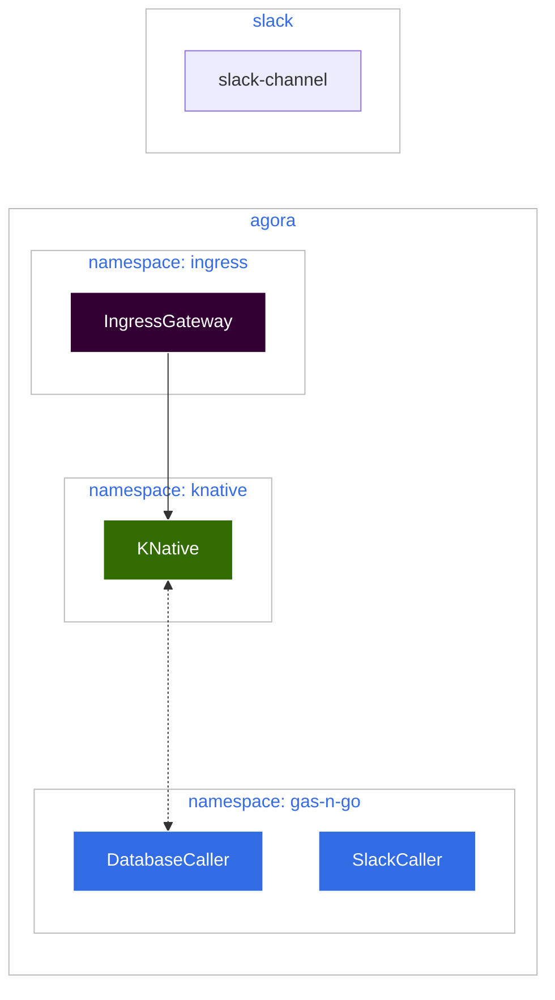

# Setting Up Our Environment

In this step we'll do a bit of setup for our environment for our serverless
functions to take advantage of

## Setting Up Our Workspace

This tutorial will assume that you're working on the new Pre-prod environment
and have a working workspace for deployment.

### Configuration Of Our Workspace

For our setup, we'll have the following workspaces to work with:



Here we have 3 workspaces in Agora, and our Slack which is outside Agora

* **ingress** is the main ingress gateway
* **knative-serving** is where KNative lives
* **gas-n-go** which is where our serverless functions will live

We need KNative to be able to talk to our functions, and also for our functions
to have the ability to talk to KNative (we'll go over that part later when we
set up our [database caller](database_setup.md))

To do this we can set up our **WorkspaceSettings** to allow this. We should
already have a WorkspaceSettings set up similar to this:

```yaml
# infrastructure/k8s/environments/lab2/clusters/mgmt-east/gas-n-go/workspacesettings.yaml
apiVersion: admin.gloo.solo.io/v2
kind: WorkspaceSettings
metadata:
  name: gas-n-go
  namespace: gas-n-go
spec:
  importFrom:
  - workspaces:
    - name: city-gateway
  exportTo:
  - workspaces:
    - name: city-gateway
  options:
    serviceIsolation:
      enabled: true
```

This is a good default for most workspaces, but we have a depedency on KNative,
so lets edit our file to allow traffic to flow both to and from the `knative`
workspace:

```yaml
# infrastructure/k8s/environments/lab2/clusters/mgmt-east/gas-n-go/workspacesettings.yaml
apiVersion: admin.gloo.solo.io/v2
kind: WorkspaceSettings
metadata:
  name: gas-n-go
  namespace: gas-n-go
spec:
  importFrom:
    - workspaces:
        - name: city-gateway
        - name: knative
  exportTo:
    - workspaces:
        - name: city-gateway
        - name: knative
  options:
    serviceIsolation:
      enabled: true
```

### Setting Up Resources For Workspace

Our serverless function for calling Slack requires the use of sensitive keys
related to the Slack Channel and our Slack App which we'll use to call it. To
help with this, we can take advantage of either [Vault](../../../vault/docs/README.md),
or another tool called [External Services](https://external-secrets.io/latest/).

First we need a **ServiceAccount**

```yaml
# infrastructure/k8s/environments/lab2/clusters/worker1-east/gas-n-go/serviceaccount.yaml
apiVersion: v1
kind: ServiceAccount
metadata:
  name: gas-n-go
  namespace: gas-n-go
---
apiVersion: rbac.authorization.k8s.io/v1
kind: ClusterRoleBinding
metadata:
  name: gas-n-go-auth-delegator
  namespace: gas-n-go
roleRef:
  apiGroup: rbac.authorization.k8s.io
  kind: ClusterRole
  name: system:auth-delegator
subjects:
  - kind: ServiceAccount
    name: gas-n-go
    namespace: gas-n-go
```

This sets up an SA to work with Vault. Now let's use either an ExternalSecret or
our VaultAgent

=== Using An ExternalSecret

    ### Using External Secret Operator
    
    The ExeternalSecret is a way to set up connection to Vault and then
    leverage use of Kubernetes Secrets.

    ```yaml
    #infrastructure/k8s/environments/lab2/clusters/worker1-east/gas-n-go/externalsecret.yaml
    apiVersion: external-secrets.io/v1beta1
    kind: SecretStore
    metadata:
      name: gas-n-go-vault-kv-config
      namespace: gas-n-go
    spec:
      provider:
        vault:
          server: https://dev.vault.tmc-stargate.com
          namespace: my-vault-namespace
          path: my-kv-engine
          version: v2
          auth:
            kubernetes:
              mountPath: my-k8s-auth-mount
              role: my-role
              serviceAccountRef:
                name: gas-n-go
    ---
    apiVersion: external-secrets.io/v1beta1
    kind: ExternalSecret
    metadata:
      name: gas-n-go-kv
      namespace: gas-n-go
    spec:
      secretStoreRef:
        kind: SecretStore
        name: gas-n-go-vault-kv-config
      target:
        name: gas-n-go-secrets
        creationPolicy: Owner
      data:
        - secretKey: channelId
          remoteRef:
            key: gas-n-go
            property: channel_id
        - secretKey: slackToken
          remoteRef:
            key: gas-n-go
            property: slack_access_token
    ```
    
    And we should make sure both files are added to our `kustomization.yaml` to
    allow Agora CD to deploy for us
    
    ```yaml
    # infrastructure/k8s/environments/lab2/clusters/worker1-east/gas-n-go/kustomization.yaml
    apiVersion: kustomize.config.k8s.io/v1beta1
    kind: Kustomization
    resources:
      - _namespace.yaml
      - externalsecret.yaml
      - serviceaccount.yaml
    ```

=== Using Vault Agent

    ### Using Vault Agent

    If you're using the Vault Agent, then no additonal configuration is needed
    at this time. We will go over how to set up the Vault Agent in the next
    steps

## Next Steps

With all of this we should be ready to start working on our first serverless
function. Let's start making our [Slack Caller](slack_setup.md)

## Further Reading

* Learn more about External Secrets [here](https://external-secrets.io/latest/)
* Learn more about Gloo Workspaces [here](https://github.com/solo-io/solo-cop/blob/main/blogs/workspaces/Intro.md)
* Learn more about Vault [here](../../../vault/docs/README.md)