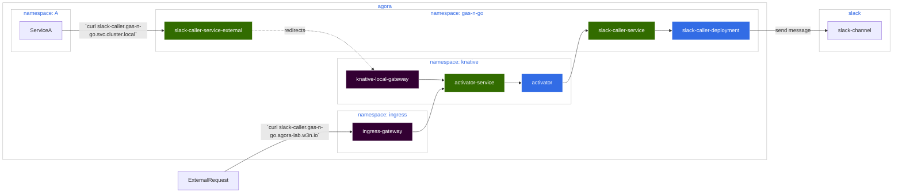

# Part 1: Setting Up Slack Caller

This section goes over creating one of the two services we'll be working with:
Slack Caller. Slack Caller is going to be our 'final' step where we have it send
a message to a given Slack channel.

## Setting Up Our Code

We have code you can feel free to use located in the
following [directory](../slack-caller). This code is part of Agora's CI and an
image is built that you can use already. You can see a sample deployment of the
image [here](../../../../infrastructure/k8s/environments/lab2/clusters/worker1-east/gas-n-go/slack-caller)

This code is
using [Slack's Go SDK](https://pkg.go.dev/github.com/slack-go/slack) and
primarily just sending a simple message to a given channel. The channel id and
tokens used by the service are configured by the deployment, which we'll go over
shortly

```go
func (s SlackHandler) sendToSlack(text string) error {
  client := slack.New(s.token)
  msg := slack.MsgOptionText(text, true)
  _, _, err := client.PostMessage(s.channelId, msg)
  if err != nil {
    log.Printf("[slack] error sending message: %v", err)
    return err
  }
  
  return nil
}
```

## Setting Up Our Deployment

Now that we have our code, let's deploy it. We can do this a few ways, but the
recommendation is to take advantage of **Agoractl**. Agoractl has a plugin to
help set up our Serverless Deployment for us by allowing us to set up a Service
Deployment.

We'll run this in the environment of our choice which we'll label `<DIR>` and go
from there

```
$ ~/<DIR>/ bazel run //ns/agoractl -- serverless create service \
--name=slack-caller \
--namespace=gas-n-go \
--application_at=/ns/demo/gas-n-go/slack-caller \
--with_additional_configuration
```

We'll get a lot of output here but Agoractl will take care of the work for us.
We should see something like this:

```
...
INFO: Running command line: bazel-bin/ns/agoractl/agoractl serverless create service '--name=slack-caller' '--namespace=gas-n-go' '--application_at=/ns/demo/gas-n-go/slack-caller'
BUILD file at '<DIR>/slack-caller' already exists, assuming it has :automation reference
Running command: kustomize edit add resource gas-n-go on <DIR>


2023/12/13 13:44:16 resource gas-n-go already in kustomization file


Running command: bazel run //:buildifier on <DIR>>

Running command: bazel run //:gazelle on <DIR>

Your service manifest files were written to: <DIR>/slack-caller

What else?

- [OPTIONAL] Complete scaffolded files in <DIR>/slack-caller (if using --with-additional-configuration).
- [OPTIONAL] Add //<DIR>/slack-caller:files to your parent BAZEL filegroup (if your manifests reside in /infrastructure folder).
- [MANDATORY] Add <DIR>/slack-caller to your parent kustomization.
- [MANDATORY] Commit, create a PR and ship it!
- [FOLLOW-UP] Once your service has been deployed you can get its status with:
  - Minimal: kubectl get -n <YOUR_NAMESPACE> kservice <YOUR_SERVICE_NAME>
  - Details: kubectl get -n <YOUR_NAMESPACE> kservice <YOUR_SERVICE_NAME> -o yaml
- [FOLLOW-UP] You can investigate revision failures using following commands:
  - List revisions: kubectl get -n <YOUR_NAMESPACE> revision
  - Get revision details: kubectl get -n <YOUR_NAMESPACE> revision <YOUR_REVISION_NAME> -o yaml

Process completed.
```

Let's take a look at what we have there now under `<DIR>/slack-caller`

```shell
$ cd <DIR> && tree slack-caller

slack-caller
├── BUILD
├── additional-configuration.yaml
├── kustomization.yaml
├── z-image-source.yaml
├── z-image-update-automation.yaml
└── z-slack-caller.yaml
```

We have our setup files for CD

* `kustomization.yaml` is the main Kustomization that Agora CD uses
* `z-image-source.yaml` is a setup for an ImagePolicy and ImageRepository that
  helps Agora CD register a repository to listen to
* `z-image-update-automation.yaml` sets up an ImageUpdateAutomation that helps
  Agora CD perform an automatic update to images whenever we choose to update
  our image via Agora CI

The other files set up our Serverless

* `z-slack-caller.yaml` is our
  Knative [Service](https://knative.dev/docs/serving/services/)
* `additional-configuration.yaml` is handling additional configuration that we
  will use for our deployment. For Slack Caller, we need to set a few variables,
  so let's go over how to set those up.

## Setting Up Our Deployment Configuration

Our Slack Caller can use one of two types of configuration depending on whether 
we decided to use ExternalSecrets or the Vault Agent.

=== If We Use External Secrets

    Our Slack Caller here uses either a [Kubernetes Secret](https://kubernetes.io/docs/concepts/configuration/secret/)
    that sets up the Slack Channel ID and the Slack Bot OAuth Token. There are
    numerous ways to set this up but this way is one straight-forward way to
    accomplish this.
    
    Agora can set up our deployment configuration for us, as well as maintain
    it and make sure that any additional changes are automatically applied to
    our deployment should we need to make changes. We do this through Zebra,
    which will read our `additional-configuration` YAML and then apply it to
    our `z-slack-caller` file.
    
    So lets set this up by adding the following. We have our secret set up in
    the prior step, so now we just need to add to the configuration file:
    
    ```yaml
    # additional-configuraion.yaml
    #@data/values
    #@overlay/match-child-defaults missing_ok=True
    ---
    templateServiceAccountName: "gas-n-go"
    templateEnvironmentVariables:
      - name: SLACK_TOKEN
        valueFrom:
          secretKeyRef:
            name: gas-n-go-secrets
            key: slackToken
      - name: CHANNEL_ID
        valueFrom:
          secretKeyRef:
            name: gas-n-go-secrets
            key: channelId
    ```

=== If We Use Vault Agent

    If we're using Vault, then we can use Zebra and have it apply our agent
    configuration. Zebra will automatically apply this to our deployment, and
    any changes we make get automatically added to our deployment

    So let's set this up by adding the following. Once we have our secrets
    stored in our Vault, we can set up access to them by adding to our
    deployment's configuration file:

    ```yaml
    # additional-configuration.yaml
    #@data/values
    #@overlay/match-child-defaults missing_ok=True
    ---
    templateAnnotations:
      vault.hashicorp.com/agent-inject-containers: "user-container"
      vault.hashicorp.com/agent-inject: "true"
      vault.hashicorp.com/agent-init-first: "true"
      vault.hashicorp.com/namespace: "my-vault-namespace"
      vault.hashicorp.com/role: "my-role"
      vault.hashicorp.com/auth-path: "auth/my-k8s-auth-mouht"
      vault.hashicorp.com/agent-inject-secret-slack-secret: "my-kv-engine"
      vault.hashicorp.com/agent-inject-template-slack-secret: |-
        {{ with secret "my-kv-engine" -}}
        export CHANNEL_ID="{{ .Data.data.channel_id }}"
        export SLACK_ACCESS_TOKEN="{{ .Data.data.slack_access_token }}"
        {{- end }}
    templateServiceAccountName: "gas-n-go"
    ```

The next thing to do will be to add the following to the `zebra_files.bzl` of
our deployment's environment (dev/pre-prod or wherever we pick, in our demo
we're using lab2)

```build
# infrastructure/k8s/environments/lab2/clusters/worker1-east/zebra_files.bzl
ZEBRA_FILES = [
    "//<DIR>/slack-caller:files",
    # Omitted
]
```

Finally, lets update our `kustomization.yaml` to help deploy the resources

```yaml
# infrastructure/k8s/environments/lab2/clusters/worker1-east/gas-n-go/kustomization.yaml
apiVersion: kustomize.config.k8s.io/v1beta1
kind: Kustomization
resources:
  - _namespace.yaml
  - externalsecret.yaml
  - serviceaccount.yaml
  - slack-caller
```

With this, we can set a PR, push to Agora's GitHub, and Zebra will read these
files, and any changes made to our configuration will automatically be handled
and reconciled by Zebra. Agora CD takes care of the rest and will reconcile the
deployment and push our application to the cluster

## Verifying Our Deployment

After our deployment is completed, what do we get?



What is set up by our deployment is a registered **revision** that Knative is
made aware of. When traffic comes either from internal or external requests,
Knative's gateway will intercept the request, match the destination with a
registered revision and then call an activator service. The activator will then
set up a deployment that uses a service that is deployed and exposed by Knative
for our deployment. This deployment is only done when our service is called: it
can scale according to traffic loads, and scale down when traffic is reduced,
allowing us to only need a Pod when we actually need our service to run.

We can check this via `kubectl` to see our Services

```shell
$ kubectl get services.serving.knative.dev -n gas-n-go

NAME              URL                                                       LATESTCREATED           LATESTREADY             READY   REASON
slack-caller      http://slack-caller-gas-n-go-lambda.agora-lab.w3n.io      slack-caller-00008      slack-caller-00008      True    
```

This is showing the URL that our service is registered to (internally) and what
is the latest and ready revision of our service. We can check also the
Kubernetes Service was deployed by Knative:

```shell
$ kubectl get services -n gas-n-go 

NAME                            TYPE           CLUSTER-IP             EXTERNAL-IP                                               PORT(S)                                              AGE                                      23d
slack-caller                    ExternalName   <none>                 knative-local-gateway.knative-serving.svc.cluster.local   80/TCP                                               14d
slack-caller-00006              ClusterIP      fd85:464b:2e72::f080   <none>                                                    80/TCP,443/TCP                                       2d5h
slack-caller-00006-private      ClusterIP      fd85:464b:2e72::2c4f   <none>                                                    80/TCP,443/TCP,9090/TCP,9091/TCP,8022/TCP,8012/TCP   2d5h
slack-caller-00007              ClusterIP      fd85:464b:2e72::64c4   <none>                                                    80/TCP,443/TCP                                       2d1h
slack-caller-00007-private      ClusterIP      fd85:464b:2e72::3d54   <none>                                                    80/TCP,443/TCP,9090/TCP,9091/TCP,8022/TCP,8012/TCP   2d1h
slack-caller-00008              ClusterIP      fd85:464b:2e72::8faa   <none>                                                    80/TCP,443/TCP                                       26h
slack-caller-00008-private      ClusterIP      fd85:464b:2e72::ced2   <none>                                                    80/TCP,443/TCP,9090/TCP,9091/TCP,8022/TCP,8012/TCP   26h
```

We can see that there's a service, `slack-caller` that is exposed with an
ExternalName for the local gateway for traffic that is internal to the cluster

!!! Note

    You might notice additional entires here, this is because Knative can be
    set to keep the last N revisions of our service, this is a feature for
    teams who want to keep different versions of their code around. Knative by
    default will keep the last 3 revisions of your service

But if you were to run a search on pods, you should see none

```shell
$ kubectl get pods -n gas-n-go
No resources found in gas-n-go namespace.
```

This is because nothing is using our caller yet. We can send a curl to see this
in action

First lets watch the namespace:

```shell
$ kubectl get pods -n gas-n-go -w
```

Next, in a new terminal send the `curl`

```shell
$ curl --location 'https://slack-caller-gas-n-go-lambda.agora-lab.w3n.io/' \        
--header 'Content-Type: application/json' \
--data '{
    "orderName": "Joey",
    "orderType": "New",    
    "quantity": 3
}'

{"status":"Message Sent"}
```

If you watch your pods, you'll see a pod be initialized, run, and then terminate
when the job is done

```shell
$ kubectl get pods -n gas-n-go -w

NAME                                 READY   STATUS      RESTARTS   AGE
...
slack-caller-00008-deployment-8648bdfd74-cf9qq   0/3     Pending     0          0s
slack-caller-00008-deployment-8648bdfd74-cf9qq   0/3     Pending     0          0s
slack-caller-00008-deployment-8648bdfd74-cf9qq   0/3     Init:0/1    0          0s
slack-caller-00008-deployment-8648bdfd74-cf9qq   0/3     Init:0/1    0          2s
slack-caller-00008-deployment-8648bdfd74-cf9qq   0/3     PodInitializing   0          3s
slack-caller-00008-deployment-8648bdfd74-cf9qq   1/3     Running           0          5s
slack-caller-00008-deployment-8648bdfd74-cf9qq   2/3     Running           0          5s
slack-caller-00008-deployment-8648bdfd74-cf9qq   3/3     Running           0          6s
slack-caller-00008-deployment-8648bdfd74-cf9qq   3/3     Terminating       0          67s
```

We sent traffic to Slack Caller, which Knative intercepted, then initialized a
Pod per the Knative Deployment specification, ran the code, and when it was
done, terminated the pod for us automatically.

## Next Steps

We've successfully added a serverless function to Agora! But right now it only
does one thing (and one thing well). In the next step, we're going to create
another serverless function that will call our slack caller and allow us to make
an MVP step-function setup

With this lets move on to [database caller](database_setup.md)