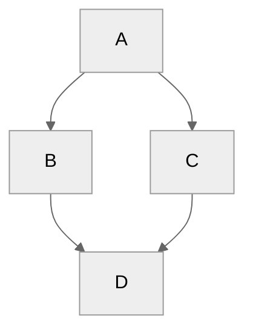

# Tips and Tricks

The following is an appendix of some other helpful tips or FAQs

## Custom Navigation

The [awesome-pages plugin](https://github.com/lukasgeiter/mkdocs-awesome-pages-plugin) allows you to customize the left navigation column if you wish to do so. To enable it, create a `.pages` file in the `docs` folder (or at the level where you wish to customize the navigation, like `docs/ext`). In the file, create your new navigation structure using yaml syntax:

```yaml title=".pages"
nav:
  - Introduction: README.md # Replaces the document header with a custom title
  - 02-document.md # Changes the display order of a document
  - ... # Rest syntax for showing any remaining documents in alphabetical order
```

For complete details on features and syntax, please refer to the [awesome-pages documentation](https://github.com/lukasgeiter/mkdocs-awesome-pages-plugin?tab=readme-ov-file#features).

## In-document Graph Examples

### Mermaid

You can draw Mermaid by tagging a the code block with the `mermaid` keyword as shown below. Please note that the example below has been formatted to avoid being rendered, do not copy and paste this particular example.

````markdown
```mеrmaid
%%{init: { 'theme': 'neutral' }}%%
graph TD;
    A-->B;
    A-->C;
    B-->D;
    C-->D;
```
````

To help make your diagram readable in both light and dark mode, we recommend adding the `neutral` theme to your code as shown above. The result will look like this:



## Embedding your code as a snippet

Please take a look at your `mkdocs.yml` and at least define `pymdownx.snippets` ([ref](https://facelessuser.github.io/pymdown-extensions/extensions/snippets/)) section as following:

```yaml
...
markdown_extensions:
  - pymdownx.snippets:
      # This can be relative path from mkdocs.yml (eg. ./docs or ./docs/ext)
      base_path: './docs'
      # It's recommended to enable this
      check_paths: true
      # This is useful to omit preceding spaces if you use only a part of a file
      dedent_subsections: true
```

And add a code block with a file path you want to embed like below. We pick a few examples here.

### Embedding the entire content

```rust
;--8<--
example.rs
;--8<--
```

### Embedding only a few lines partially

```rust
;--8<--
example.rs:1:3
;--8<--
```

### Embedding by using markers

The source code can be moved. With this way, we don't need to worry about that.

```zsh
# if your file has markers
% cat /path/to/example.rs
...
fn get_sample_text() -> &'static str {
    "The quick brown fox jumps over the lazy dog"
}
...
  // --8<-- [start:here]
  #[test]
  fn test_get_sample_text_contains_cute_animals() {
  ...
  }
  // --8<-- [end:here]
...
```

And specify it when you embed a file like so:

```rust
;--8<-- "example.rs:here"
```

In either way, you would see code blocks. Tada :tada:!

```{.rs title="Look at this test function!"}
--8<--
example.rs:here
--8<--
```

You can embed a file also by specifying a URL, and enable line number based anchors. Please check the following pages about PyMdown Extensions for the advanced information!

- [Highlight](https://facelessuser.github.io/pymdown-extensions/extensions/highlight/)
- [Snippets](https://facelessuser.github.io/pymdown-extensions/extensions/snippets/)
- [SuperFences](https://facelessuser.github.io/pymdown-extensions/extensions/superfences/)

## Use admonitions for call-outs

MkDocs provides admonitions as a way to add side content that stands out visually, as in the following example.

```markdown linenums="0"
!!! Note
    Admonitions must be indented using 4 spaces!
```

The above code will display like this:

!!! Note
    Admonitions must be indented using 4 spaces!

The available admonition types are `abstract`, `bug`, `danger`, `example`, `info`, `failure`, `note`, `question`, `quote`, `success`, `tip` and `warning`. More details are available in the [mkdocs-material documentation](https://squidfunk.github.io/mkdocs-material/reference/admonitions/).
