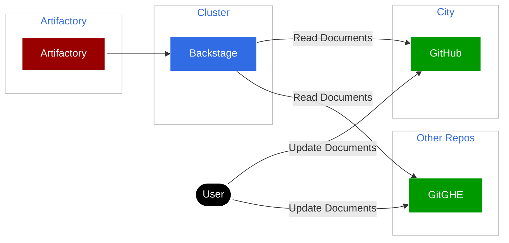

# Configuration of Backstage

## Overview

This document is meant to cover how [Backstage](https://backstage.io/) is
configured by the Agora team and how upkeep is handled.

## How Backstage Works

Backstage works in a few stages:

* Catalog files in the repository are parsed
* Backstage grabs these files and generates artifacts
* The generated artifacts are read by the Backstage 'backend' code
* The 'frontend' then is rendered and calls the backend API to fetch and render
  the fetched pages

## How Backstage is Built

Backstage is built primarily via a Dockerfile. Normally in Agora we would try to manage all of our service code via our Bazel pipelines but Backstage was proving to be too complex to fit into this flow: it would require essentially a 'reverse engineering' of the Backstage tooling that was proving at the time to be too much time for very little reward.

Currently, there is a GitHub Workflow: [Developer Portal Build](https://github.com/wp-wcm/city/blob/main/.github/workflows/dev_portal_gen_image.yaml). This workflow is used in lieu of being able to use our normal CI/CD pipelines, which are specialized for Bazel. The trade-off is that DevRel Team has a way to automate and generate images for when Backstage is updated, at the cost of not being able to use the scalable solution of the CI/CD runners that are maintained by Agora Build.

The workflow breaks down into two main sections. The purpose of this is to try and help with the performance of the workflow:

* Generate the Artifacts used by Backstage
  * This is done primarily via `yarn`
* Pull in additional plugins and then build the Node Image via the [Dockerfile](https://github.com/wp-wcm/city/blob/main/ns/developer/backstage/app/packages/backend/Dockerfile)

Currently, the artifacts and web server are included in the Docker image. Rendering of artifacts and any plugin settings are handled by the Docker image and written to memory inside the container; any crashes or resets would result in a loss of state. For now this is fine as all plugins are stateless, but should this change a database setup will be required.

## Set up of Backstage Infrastructure

Backstage is set up in a manner like the following diagram:

### Considerations and Trade-Offs

* Backstage is set up for multi-tenancy: Users with repos outside the main repo (GitHub.com) are able to still use the Developer Portal.
* Allows for Documentation as Code
  via [GitHub Discovery Tools](https://backstage.io/docs/integrations/github/locations)
* Backstage currently does not clean up prior versions of the documentation.
  * The workaround for this currently is the use of a CronJob that can clean the disc periodically. Backstage will grab a new version if it cannot find one on disc and there is no service downtime.
  * An issue is raised to see if the plugin can handle itself, see [15649](https://github.com/backstage/backstage/issues/15649)
* Backstage needs to have credential pairs for working with multiple repositories
  * This is likely to be handled if teams move to StarGate, and/or move to the monorepo
  * See **How Backstage Authenticates** for more

## How Backstage Authenticates

Backstage uses [Octokit](https://github.com/octokit/octokit.js) and a GitHub App to authenticate itself to repositories. To be more specific:

* A **GitHub App** is used to authenticate Backstage against GitHub and allow it to scrape the repositories.
* A **GitHub OAuth App** is used to provide access and authentication to GitHub for the purposes of providing credentials to GitHub when submitting a Pull Request on the user's behalf. This is primarily used by the Software Templates.

For each repository host (currently `github.com`, `github.tri-ad.tech`) there needs to be a set of credentials. In addition, for security purposes, a separate credential was made for each environment for Agora (`lab` has a different pair of credentials/apps than `dev`).

!!! Note
    As of April 12, 2023, the behavior of the new GH Apps and how they work with the old GitHub repositories (`github.tri-ad.tech`) is undefined and requires further investigation.

Both the GH App and GH OAuth App credentials are stored in Vault. Vault Agent injects the credentials to the pod environment which can be picked up by Backstage during startup and is configured into the app.

For more on Vault refer to the Vault Documentation under the Security Domain

### Current Owners of the GH App

| Credentials           | Environment | Owner        | In Use             | Used By              |
|-----------------------|-------------|--------------|--------------------|----------------------|
| City Developer Portal | Lab         | Agora CI/CD  | Yes                | City                 |
| City Developer Portal | Dev         | Agora CI/CD  | Yes                | City                 |
| GHE APP (Lab)         | None        | Agora DevRel | No, To Be Removed  | None                 |
| GHE APP (Dev)         | None        | Agora DevRel | No, To Be Removed  | None                 |
| GHE OAuth App (Lab)   | Lab         | Agora DevRel | Yes, To Be Removed | City, Woven Passport |
| GHE OAuth App (Dev)   | Dev         | Agora DevRel | Yes, To Be Removed | City, Woven Passport |

## How templates are registered

Currently, the templates shown in the Dev Portal (in the [Templates section](https://developer.woven-city.toyota/create)) are specifically referenced `spec.targets` in the `kind: Location` block in [ns/developer/catalog-info.yaml](https://github.com/wp-wcm/city/blob/main/ns/developer/catalog-info.yaml). If any template files are added, renamed, moved or removed, this config must be updated accordingly.

## How to build/update the image

Currently, the image for Backstage is handled by a Dockerfile. Refer to 'How Backstage if Built' for details. The runner is trigged by changes to code in `/ns/developer/backstage/app` or to the workflow itself. Pushes occur only on `main` merges.

### For Remote Cluster Environment (e.g. Lab / Dev)

[GitHub workflow: Developer Portal Build](https://github.com/wp-wcm/city/actions/workflows/dev_portal_gen_image.yaml) does the job.

### For Local Cluster Environment

For development in the Local Cluster (EC2 VM), follow the steps described here: <https://github.com/wp-wcm/city/blob/main/infrastructure/k8s/local/developer-portal/README.md>.
