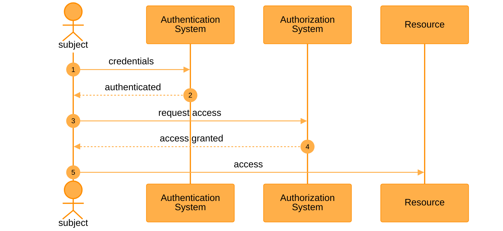
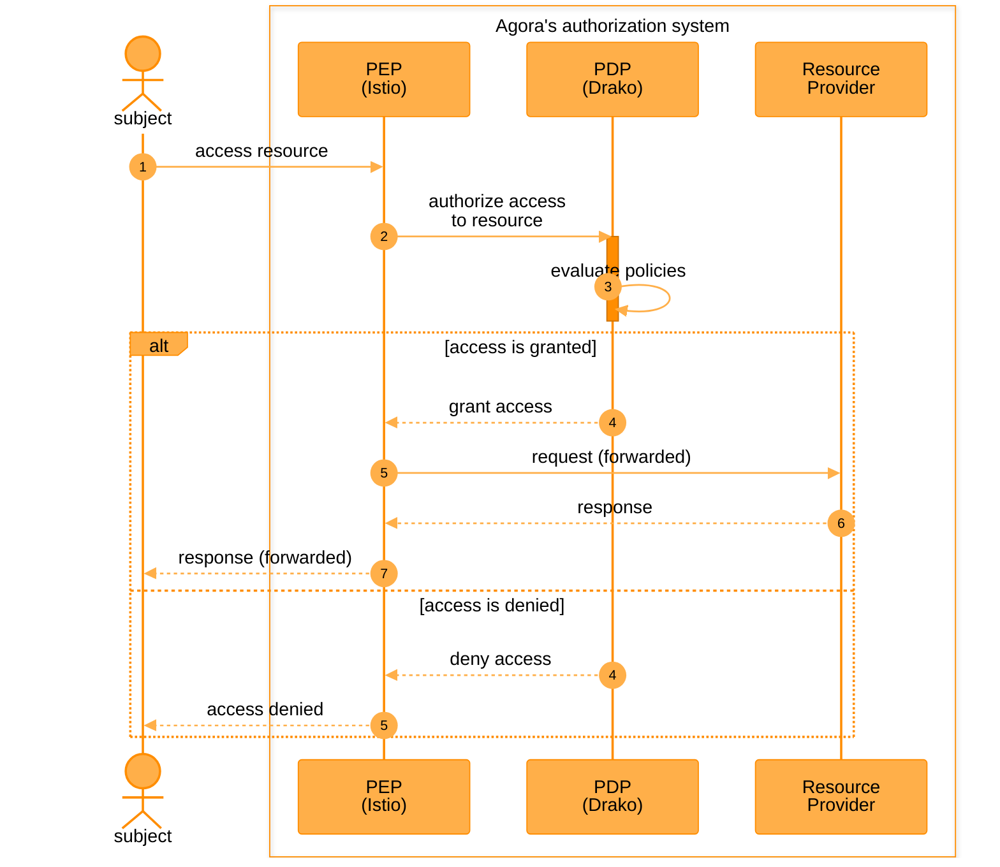
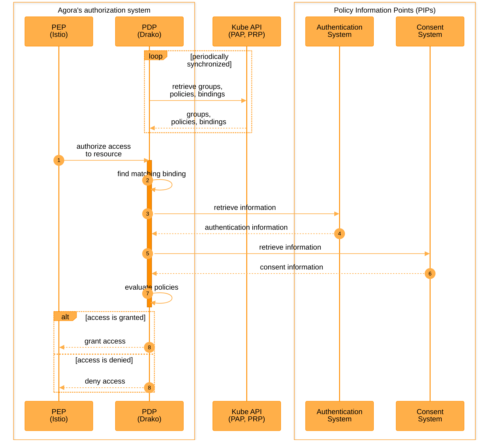

# Authorization

This document describes how the authorization system works in Agora, and how you can use it to authorize all requests to your services.

## What is authorization?

We are surrounded by authorization in our daily lives. For instance, a company employee entering an office building may be required to swipe their card at an entrance gate. Such gate can perform authentication by verifying that the card is valid and belongs to a registered company employee. After passing the gates, the company employee may be required to swipe the card again before being able to access certain floors or rooms. For example, access to the server room is only granted if the swiped card belongs to a member of the server administration team.

In our example, the company employee is the _subject_, the _resource_ is the server room and the _access_ is the action of entering the room.

In more general terms, a subject can be a person, a device, or even a software process that wants to access a resource. A resource can be data (e.g., files, databases), services (e.g., E-mail, APIs) or even physical locations (e.g., buildings, floors, rooms). An access is the action upon the resource (e.g., open, read, create, delete).

As we have seen, _authentication_ is the process of verifying that a subject is who they claim to be and _authorization_ is the process of verifying whether the same subject can access a given resource.

The following diagram shows a user authenticating and authorizing before accessing a resource:

Without an authorization system in place, any subject would be able to access any resource. In our initial example, any company employee would be able to enter the server room. That could be a major security issue.

When you are developing a service, besides developing features according to the requirements, you also need to spend time on developing the authorization system to control what subjects have access to what resources. By adopting Agora's authorization system, you will be able to focus on feature development and deliver to market faster.

## How does it work?

Looking at the sequence diagram above, you may be asking yourself a few questions: What would happen if the user tried to access the resource directly without authentication and authorization? Would it work? After all, there doesn't seem to be anything protecting the resource from direct access.

A common systematic approach to enforce access controls is to deploy a policy enforcement point (PEP). A PEP acts like a gatekeeper between the subject and the resource: it intercepts all requests to a resource and grants or denies access to it depending on a set of predefined policies.

Typically, a PEP does not maintain or evaluate the predefined policies all by itself. Another component known as the policy decision point (PDP) is involved. For every request intercepted by the PEP, the PEP calls the PDP with the details of the in-flight request and asks the latter to evaluate whether to grant or deny the request based on a set of predefined policies.

Agora's authorization system uses [Istio](https://istio.io/) as its PEP. Istio is a service mesh that handles service-to-service communication, and it is typically implemented as a set of lightweight network proxies deployed alongside service applications. When deployed on a Kubernetes cluster, each Istio-configured service pod configured will have an additional container for the proxy, such as [Envoy](https://www.envoyproxy.io/). This proxy manages traffic to and from other services in the cluster, including traffic entering and exiting the mesh, such as user requests from the internet. This traffic usually passes through an ingress controller or gateway first, which routes the requests to the appropriate service within the mesh.

Besides intercepting all incoming requests, Istio can use an external authorization service to control access to a service. In Agora, service developers can configure Istio to use [drako](#drako) as an authorization system and effectively serve as the PDP.

The following diagram helps put these concepts into perspective:

As a service mesh, Istio provides access to services that can provide resources (i.e., the "resource provider" in the diagram) instead of giving direct access to those resources. For instance, when a user browses a web page, Istio grants/denies access to the web service (the resource provider) that serves the web page as a resource.

### drako

drako is the PDP in Agora's authorization system. It decides whether access to a given resource should be granted or denied based on a set of predefined policies. drako defines the following concepts:

- **Group:** Collection of subject identifiers as recognized by the authentication system. A group can be used to identify subjects sharing common attributes such as access roles (e.g., "admin" group).
- **Policy:** Set of rules and conditions that determine whether to grant access to certain resources. This includes a variety of factors such as the identity of the subject, the type of resource, and the type of access requested.
- **Policy binding (or "binding" for short):** The assignment (hence "binding") of one or more policies to a resource. In drako, only one policy can be applied to a resource. For example, if a web service has resources requiring different access levels or roles (e.g., "public", "private", "admin"), the service developer will need to define at least one binding for each of them. When drako receives a request for authorization, it first checks which binding matches the request, and then uses the policies in that binding to evaluate whether access to the resource should be granted.

The data represented by each of these concepts has to be stored somewhere. Currently, drako uses [Kubernetes custom resources](https://kubernetes.io/docs/concepts/extend-kubernetes/api-extension/custom-resources/) (CRs) as a storage mechanism for group, policy and policy binding data. This allows service developers to use the Kubernetes API (either directly or indirectly via a tool like [kubectl](https://kubernetes.io/docs/reference/kubectl/)) to manage those resources. This also means that the Kubernetes API serves as both the policy administration point (PAP) and the policy retrieval point (PRP) in the authorization system:

- **Policy Administration Point (PAP):** Component that manages policy information. It allows service developers to create, update, and delete policy information. The PAP provides an interface for policy management and ensures that the policies are properly stored and maintained.
- **Policy Retrieval Point (PRP):** Component that retrieves policy information from one or more repositories. It provides the necessary policies to the PDP for evaluation.

drako may also need to ask other systems for additional information. For instance, it might ask the authentication system whether a given access token is valid alongside the corresponding user name for it, or asking a consent system if the currently logged-in user has given consent for their personal information. These external systems are defined as policy information points (PIPs):

- **Policy Information Point (PIP):** Component that provides additional information needed to make policy decisions. The PIP may fetch attribute values from various sources such as databases, lightweight directory access protocol (LDAP) directories, or external systems.

The following sequence diagram is a simplification of what happens during the policy evaluation for a given request:

### More information

To see a live demo of drako's capabilities, see [here](https://drive.google.com/file/d/1iCDi8W_s3Uaw4tRyazWBchAn4SmNz3mq/view?t=10034).

To learn more about common use cases for drako, see the following sections (TBA).
