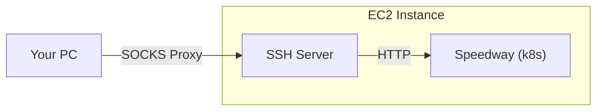

# Local Cluster Access

## Overview

In this section, we are going to make it possible to connect to services running
in your local Speedway environment:
- from your own PC via a browser that is previously configured to use a
  [SOCKS](https://en.wikipedia.org/wiki/SOCKS) proxy
- directly from your own EC2 instance

This is how it will look like in the end:



Please execute the steps in the order they are described in this document. The
steps assume you have already deployed a Speedway environment in your EC2 first.
If you haven't yet, please take a look on
[how to deploy](local_cluster_access.md) it.

### SOCKS Proxy

In this section we tell your PC to create an SSH tunnel that supports the SOCKS
protocol, so your browser can connect through it, and exit from the EC2
instance. The tunnel will remain active as long as the SSH connection is active.

Execute the following command from your PC, replacing `<ec2-host>` with the
hostname you specify in`~/.ssh/config` for your EC2 instance:

```shell
ssh -D 1080 <ec2-host>
```

> [!IMPORTANT]
> These instructions need to be done again every time `ssh` disconnects or
> exits.

> [!WARNING]
> Right after you execute the command, make sure that you don't encounter an error
> such as `bind [127.0.0.1]:1080: Address already in use`. If you do, then you
> either already have an SSH tunnel running (in which case you can ignore the
> error) or some other process in your PC is using the same port. If you're using
> VSCode, please make sure that `localhost:1080` is not being forwarded by it. If
> it is, please delete that setting.

> [!NOTE]
> This is similar to a regular `ssh`, so you can use it as normally for
> executing commands on your EC2 instance.
>
> Another thing to note is that it tells SSH to create a SOCKS proxy listening on
> `localhost:1080` which is something browsers can understand. This
> doesn't connect directly to the Speedway environment. It simply creates
> a tunnel between your PC and the EC2 instance where your environment is
> running. Using the browser, your PC will connect to the proxy (on localhost),
> but then SSH (on the EC2 instance side) will make a connection to the site (the
> one your browser requested) on your behalf. That is why (in the next steps) we
> need to teach the EC2 instance how to resolve the `woven-city.local` addresses
> (which is what we will use as the domain for the Speedway local environments).

### Browser Setup

In this section, we will tell our browser to use a [SOCKS proxy](#socks-proxy).

If you are using Google Chrome, you can use the
[SwitchyOmega plugin](https://chrome.google.com/webstore/detail/proxy-switchyomega/padekgcemlokbadohgkifijomclgjgif)
and import
[the sample settings file](/ns/id/keycloak/docs/int/configs/OmegaOptions_woven_local.bak).
If you are using Firefox, you can use the
[FoxyProxy Standard extension](https://addons.mozilla.org/en-US/firefox/addon/foxyproxy-standard/)
and import
[the sample settings file](/ns/id/docs/int/onboarding/speedway/proxy-settings/foxy-proxy.json).

> [!IMPORTANT]
> These instructions need to be done just once (unless your EC2 instance
> hostname changes).

### EC2 Instance Setup

In this section, we configure the EC2 instance to be able to connect to the
services in the Speedway environment running in it.

1. Get the IP address assigned to the Load Balancer of Istio's ingress gateway.
   Confirm the IP address with the following command.

   ```shell
   kubectl get svc -n istio-system istio-ingressgateway -o yaml | yq .status.loadBalancer.ingress.0.ip
   ```

2. Add DNS aliases for the Load Balancer IP address you obtain from the previous
   step in `/etc/hosts` file located in your EC2 instance:

   ```
   <LB IP address> id.woven-city.local
   <LB IP address> argocd.woven-city.local
   <LB IP address> echo-id-test.woven-city.local
   <LB IP address> chat-id-test.woven-city.local
   ```

3. From your EC2 instance, test that it is actually working:

   ```shell
   curl -ki https://id.woven-city.local
   ```

   If it is working, you should get a redirection (`301` status code):

   ```text
   HTTP/2 301
   location: https://id.woven-city.local/auth/realms/woven/account/
   date: Wed, 25 Sep 2024 13:17:11 GMT
   server: istio-envoy
   ```

> [!NOTE]
> You can add as many entries as you want.

> [!TIP]
> For a more dynamic setting, you could use [dnsmasq](https://en.wikipedia.org/wiki/Dnsmasq).
> For instance, if you're using [NetworkManager](https://networkmanager.dev)
> you could have a file such as `/etc/NetworkManager/dnsmasq.d/agora.conf` as
> follows, which will essentially tell your EC2 instance to resolve all domains
> ending in `woven-city.local`:
>
> ```
> address=/woven-city.local/<LB IP address>
> ```

> [!IMPORTANT]
> These instructions need to be done again if the IP address of the Load
> Balancer of Istio's ingress gateway changes. That may happen if you create a
> new cluster.

### Testing Connectivity

If you have followed all the previous steps, you should be able to use your
browser to access any of the [available services](#available-services) (e.g.
https://id.woven-city.local) 🎉

> [!IMPORTANT]
> Because we are using self-signed SSL certificates, you will need to tell the
> browser (or curl or whatever tools you are using) to ignore certificate checks.

## Available Services

Here are some links that you might want to check out:

| Application                           | Link                                                   |
|---------------------------------------|--------------------------------------------------------|
| Keycloak                              | https://id.woven-city.local                            |
| ArgoCD                                | https://argocd.woven-city.local                        |
| Drako Test App (Legacy AuthN)         | https://echo-id-test.woven-city.local/legacy           |
| Drako Test App (Oauth2 AuthN)         | https://echo-id-test.woven-city.local/oauth2           |
| Drako Test App (SingleUseToken AuthN) | https://echo-id-test.woven-city.local/single-use-token |
| Drako Test App (None AuthN)           | https://echo-id-test.woven-city.local/none             |
| Drako Chat Demo App                   | https://chat-id-test.woven-city.local                  |

## Available User Accounts

Some populated users that you can use to access each application:

| Application      | Username   | Password    |
|------------------|------------|-------------|
| ArgoCD           | admin      | Please run this command to get the password: `kubectl get secrets -n argocd argocd-initial-admin-secret -o yaml \| yq .data.password \| base64 -d` |
| Keycloak (admin) | admin      | admin12345! |
| Keycloak (user)  | bob        | bob12345!   | 
