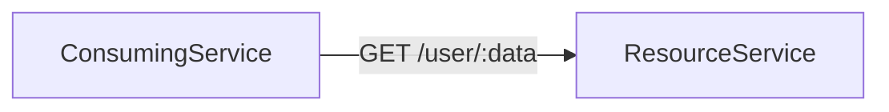

# DrakoPolicy

A `DrakoPolicy` configures specific authorizers and prepares them for binding to endpoints.

The overall format of this configuration is as follows:

```yaml
apiVersion: woven-city.global/v1alpha1
kind: DrakoPolicy
metadata:
  namespace: drako-test
  name: keycloak-or
spec:
  type: ${TYPE}
  ${TYPE}:
  # depending on type
```

Where `${TYPE}` is one of the supported types below:

* [**Consent**](#consent)
* [**Group**](#group)
* [**Keycloak**](#keycloak)
* [**AuthorizedParties**](#authorizedparties)
* [**Audience**](#audience)
* [**Source**](#source)
* [**AllowAll or DenyAll (static policies)**](#allowall-or-denyall-static-policies)
* [**Origin**](#origin)
* [**MappingComparison**](#mappingcomparison)
* [**ClientGroup**](#clientgroup)

## Policy types

### Consent

Consent policies integrate with the Consent service provided by the Data Privacy team. They grant access for specific services to the data attributes owned by a user.

When a service needs access to this information, it fetches the data from consent-integrated backend services such as BURR. To prevent database failures due to missing access permissions, you have to encapsulate your service using predefined rules based on existing consent. This is done using Consent policies, which enable you to map from request data (e.g., headers, path attributes, or query attributes) to useful information for the Consent service to determine if the service should have access to the data, making error handling a lot smoother.

* For more details about data mapping, see [here](./DrakoPolicyBinding.md#mapping).

Although the same access permissions are checked in the backend, this design enables you to maintain much cleaner, safer code, since no data would be exposed in case of failure.

#### Configurations

The following configurations are available in Consent policies:

* [**dataAttributes**](#dataattributespec)
* [**client**](#clientspec)
* [**dataSubject**](#datasubjectspec)

##### `DataAttributeSpec`

This configuration determines which data attributes are accessed based on the request data. Data attributes are written in screaming snake cases, e.g., `EMAIL_ADDRESS` and `PHONE_NUMBER`.

* **source:** `MappedValue` or `Static`.
* **value:** Key (string) of a mapped value if `MappedValue` source is selected; otherwise a static value (string).
  * Note that the mapped value extracts data from headers, path attributes, or query attributes depending on what is specified in the `DrakoPolicyBinding` [mapping](./DrakoPolicyBinding.md#mapping).
* **dictionary:** The keys in `dictionary` represent all possible values of a mapped value if `MappedValue` source is selected. This `dictionary` maps each possible value (string) to a list of strings containing the actual data attributes to be accessed.

##### `ClientSpec`

This enum indicates which service namespace or party should be considered when access is requested. The possible values are:

* **`Source`:** indicates that the consent granted on the origin service namespace (i.e., the namespace of the requesting service) should be checked.
* **`Destination` (default):** indicates that the consent granted on the destination service namespace (i.e., the namespace of the service that processes the request) should be checked.
* **`AuthorizedParty`:** indicates that the client ID of the authorized party (i.e., the party that called the identity provider (IdP) to generate the user's token) should be checked.

Consider the following use case: You are developing a database that essentially owns the stored data, but must provide access to it via API for a collection of services in a namespace that requires consent. In this case, you should use `client: Source`.

However, if you need to validate the client ID of the authorized party instead of the origin service namespace, use `client: AuthorizedParty`.

On the other hand, if you are providing a service that consumes data owned by other clients to be displayed on your own interface, even if you just want to process it within the backend, `client: Destination` is the most suitable option.

##### `DataSubjectSpec`

This configuration determines which user/subject ID should be considered when access is requested.

* **source:**
  * `JWT`: ID of the user making the request
  * `MappedValue`: user ID based on the key described in `value`
* **value:** If `MappedValue` is selected as the source, the `value` spec would describe a key (string) whose value can be retrieved from the existing [mapping](./DrakoPolicyBinding.md#mapping) formed from headers, path attributes, or query attributes depending on what is specified in `DrakoPolicyBinding`.

#### Use cases

Consider the following example:



As the names suggest, `ConsumingService` consumes data from `ResourceService` via `GET` requests. Here, `:data` can be one of the following types:

* `phone`
* `email`
* `profile` (a combination of both `phone` and `email`)

In Consent service, email and phone are represented by `EMAIL_ADDRESS` and `PHONE_NUMBER`, respectively. Collecting this information as is from the URL might hinder the user experience and make it difficult to implement support for `profile` data. We can prevent such issues using `MappedValue` in the `dataAttributes` of the consent policy.

##### Single custom resource (CR)

Let's say we want to check whether the user corresponding to `userId` has granted `ConsumingService` (or any other service calling `ResourceService`) access to this data. We can use the following consent policy:

```yaml
apiVersion: woven-city.global/v1alpha1
kind: DrakoPolicy
metadata:
  namespace: mynamespace
  name: consent
spec:
  type: Consent
  spec:
    consent:
      client: Source
      dataAttributes:
        - source: MappedValue
          value: data
          dictionary:
            email: [ EMAIL_ADDRESS ]
            phone: [ PHONE_NUMBER ]
            profile: [ EMAIL_ADDRESS, PHONE_NUMBER ]
      dataSubject:
        source: MappedValue
        value: userId
```

The above policy, combined with a [path mapping](DrakoPolicyBinding.md#mapping) configured as `/user/:data` and [header mapping](DrakoPolicyBinding.md#mapping) as `x-user-id: userId`, will produce the expected behavior.

To check what access permissions `ResourceService` has, set the client to `Destination`.

Alternatively, if you want to check the access permissions that the client ID of the authorized party has despite the service namespace, set the client to `AuthorizedParty`.

##### Multiple custom resources (CRs)

Since it is possible to combine multiple `DrakoPolicy` CRs in the same service using a decision strategy, you can also enforce all of them together. For example:

```yaml
---
apiVersion: woven-city.global/v1alpha1
kind: DrakoPolicy
metadata:
  namespace: mynamespace
  name: consent-source
spec:
  type: Consent
  spec:
    consent:
      client: Source
      dataAttributes:
        - source: MappedValue
          value: data
          dictionary:
            email: [ EMAIL_ADDRESS ]
            phone: [ PHONE_NUMBER ]
            profile: [ EMAIL_ADDRESS, PHONE_NUMBER ]
      dataSubject:
        source: MappedValue
        value: userId
---
apiVersion: woven-city.global/v1alpha1
kind: DrakoPolicy
metadata:
  namespace: mynamespace
  name: consent-destination
spec:
  type: Consent
  spec:
    consent:
      client: Destination
      dataAttributes:
        - source: MappedValue
          value: data
          dictionary:
            email: [ EMAIL_ADDRESS ]
            phone: [ PHONE_NUMBER ]
            profile: [ EMAIL_ADDRESS, PHONE_NUMBER ]
      dataSubject:
        source: MappedValue
        value: userId
---
apiVersion: woven-city.global/v1alpha1
kind: DrakoPolicy
metadata:
  namespace: mynamespace
  name: consent-authorized-party
spec:
  type: Consent
  spec:
    consent:
      client: AuthorizedParty
      dataAttributes:
        - source: MappedValue
          value: data
          dictionary:
            email: [ EMAIL_ADDRESS ]
            phone: [ PHONE_NUMBER ]
            profile: [ EMAIL_ADDRESS, PHONE_NUMBER ]
      dataSubject:
        source: MappedValue
        value: userId
---
apiVersion: woven-city.global/v1alpha1
kind: DrakoPolicyBinding
metadata:
  name: mybinding
  namespace: mynamespace
spec:
  authenticationMode: SingleUseToken
  policies:
    - consent-authorized-party
    - consent-destination
    - consent-source
  destinationServiceAccounts:
    - myserviceaccount
  decisionStrategy: consent-source && consent-destination && consent-authorized-party
  mapping:
    defaultValues:
      data: profile
    paths:
      - /user/:data?
    headers:
      x-user-id: userId
```

In the above example, the `consent-source`, `consent-destination`, and `consent-authorized-party` policies are enforced in a service that is expected to use single-use tokens between calls (i.e., `ConsumingService` must always request a fresh token before making a request).

This also defaults `/user/` to be the same as `/user/profile` and applies this policy binding to any workload (or pod) bound to `myserviceaccount`.

### Group

Group policies manage user permissions depending on if a user belongs to a group. To implement a group policy, first define the group using `DrakoGroup` and then create a `DrakoPolicy` for that group as described below. Note that each group policy can only be applied on one group.

#### DrakoGroup

```yaml
apiVersion: woven-city.global/v1alpha2
kind: DrakoGroup
metadata:
  name: <group-name>
  namespace: <namespace>
spec:
  userList:
    - userId: <user-1>
    #...
```

| Variable    | Type   | Description                             |
|-------------|--------|-----------------------------------------|
| group-name  | String | Name of the group                       |
| namespace   | String | Namespace in which the group is created |
| user-1, ... | String | Woven IDs (UUID) of the group members          |

#### DrakoPolicy for the group

```yaml
apiVersion: woven-city.global/v1alpha1
kind: DrakoPolicy
metadata:
  name: <policy-name>
  namespace: <namespace>
spec:
  type: Group
  spec:
    group:
      name: <group-name>
```

| Variable    | Type   | Description                              |
|-------------|--------|------------------------------------------|
| policy-name | String | Name of the policy                       |
| namespace   | String | Namespace where policy is created        |
| group-name  | String | Name of the DrakoGroup                   |

### Keycloak

The Keycloak policy authorizes users based on the Keycloak's [authorization services](https://www.keycloak.org/docs/latest/authorization_services/index.html), with some manual configuration.

The authorizer queries Keycloak for resources that can be mapped for this request based on the URL configured on the Keycloak side. This matching algorithm supports the following formats:

* **glob matches:** Following Unix shell matching standards; e.g., `glob: /some**/other/*`.
* **regular expressions:** e.g., `regex: /\d+`.
* **prefix:** Matches everything under a certain path, as in `/some/prefix/*`.
* **exact match:** `/some/path`

It also leverages the scope mapping from `DrakoPolicyBinding` to map request methods to specific scopes when matching against resources.

Once a list of resources has been identified, Drako consults Keycloak to identify the resource users that have access permissions. Based on the `decisionMode` configuration, it then selects one of the following:

* **decisionMode: OR** Request is approved if user has access to any resource (faster, Keycloak default).
* **decisionMode: AND** Request is approved only if user has access to every matching resource (slower, compatible with security token service (STS)).

#### Example configurations

```yaml
---
apiVersion: woven-city.global/v1alpha1
kind: DrakoPolicy
metadata:
  namespace: drako-test
  name: keycloak-or
spec:
  type: Keycloak
  spec:
    keycloak:
      decisionMode: OR
---
apiVersion: woven-city.global/v1alpha1
kind: DrakoPolicy
metadata:
  namespace: drako-test
  name: keycloak-and
spec:
  type: Keycloak
  spec:
    keycloak:
      decisionMode: AND
```

### AuthorizedParties

You can limit the clients that can access your service by specifying the `AuthorizedParties`, which must match the client ID of the calling party (on the service or client side). Extending the previous example, the following configuration ensures that only the client `my-new-android-app` can access this service:

```yaml
apiVersion: woven-city.global/v1alpha1
kind: DrakoPolicy
metadata:
  namespace: drako-test
  name: my-azp
spec:
  type: AuthorizedParties
  spec:
    authorizedParties:
      - my-new-android-app
```

!!! Note
    If `my-new-android-app` is configured as a public client and distributed publicly, this configuration can be exploited to allow access to other clients by simply using the same client ID during the login flow.

### Audience

You can limit the clients that can access your service by specifying the `Audience`, which must match the client ID of the receiving party (on the service or client side). Extending the previous example, the following configuration ensures that calling party exchanged their access token before calling the receiving service.

* IETF rfc8693 [OAuth 2.0 Token Exchange](https://datatracker.ietf.org/doc/html/rfc8693)
* Keycloak documentation [Using token exchange](https://www.keycloak.org/docs/latest/securing_apps/#_token-exchange)

```yaml
apiVersion: woven-city.global/v1alpha1
kind: DrakoPolicy
metadata:
  namespace: drako-test
  name: my-audience
spec:
  type: Audience
  spec:
    audience:
      - my-client-id
```

### Source

Source policies authorize requests based on the original source that sent the request. This is useful when you want to ensure that requests to your service come
from a specific source service or client.

#### Example configurations

```yaml
---
# allow access from trusted-namespace / trusted-service-account
apiVersion: woven-city.global/v1alpha1
kind: DrakoPolicy
metadata:
  name: trusted-source
  namespace: my-namespace
spec:
  type: Source
  spec:
    source:
      namespace: trusted-namespace
      serviceAccount: trusted-service-account
---
# a single policy that uses mappings to allow access from multiple namespaces
apiVersion: woven-city.global/v1alpha1
kind: DrakoPolicy
metadata:
  name: trusted-realm-sources
  namespace: my-namespace
spec:
  type: Source
  spec:
    source:
      namespace: trusted-{realm}-namespace
      serviceAccount: trusted-service-account
```

### AllowAll or DenyAll (static policies)

`AllowAll` and `DenyAll` perform the exact functions as their names suggest. They can be used to enforce login but not specific policy, and they can also be used for testing and getting used to Drako.

```yaml
---
apiVersion: woven-city.global/v1alpha1
kind: DrakoPolicy
metadata:
  namespace: drako-test
  name: allow
spec:
  type: AllowAll
---
apiVersion: woven-city.global/v1alpha1
kind: DrakoPolicy
metadata:
  namespace: drako-test
  name: deny
spec:
  type: DenyAll    
```

### Origin

Origin policies authorize a request based on the IP address of the client in the [X-Forwarded-For header](https://developer.mozilla.org/en-US/docs/Web/HTTP/Headers/X-Forwarded-For) of the request. This is useful for blocking all IP addresses from accessing your service  by default, except for the ones you explicitly allow. You can list the IP addresses that are allowed in the `allowed` field. Both IPv4 and IPv6 are supported.

By default, if you don't define and use an origin policy, requests will not be filtered based on the origin IP address.

```yaml
---
apiVersion: woven-city.global/v1alpha1
kind: DrakoPolicy
metadata:
  namespace: drako-test
  name: origin
spec:
  type: Origin
  spec:
    origin:
      allowed:
        - "192.168.0.1"
        - "10.1.17.138"
```

### MappingComparison

Mapping comparison policies authorize requests if their [mapped values](DrakoPolicyBinding.md#mapping) match the criteria defined in the policy. Mapped values are referenced using the `key` field and criteria are defined with the `type` field.

Currently the following criteria are supported:

* EqualsLoggedInUserId: compares the mapped value with the user id of the currently logged in user. Note that this type of policy cannot be used with authentication mode `None`. If the mapped value used for comparison cannot be extracted from the request, or the extracted value is empty, this policy will deny the request.

```yaml
apiVersion: woven-city.global/v1alpha1
kind: DrakoPolicy
metadata:
  name: userid
spec:
  type: MappingComparison
  spec:
    mappingComparison:
      key: userId
      type: EqualsLoggedInUserId
```

The policy above would be used in a binding as follows:

```yaml
apiVersion: woven-city.global/v1alpha1
kind: DrakoPolicyBinding
metadata:
  name: example-binding
spec:
  authenticationMode: Legacy
  destinationServiceAccounts:
  - my-service-account
  decisionStrategy: userid
  policies:
  - userid
  paths:
  - /user/*
  mapping:
    paths:
      - '/user/:userId'
```

### ClientGroup

A `ClientGroup` policy authorizes requests if at least one of the authenticated client identifiers is listed in the policy's `clientList` attribute. `clientList` is array of objects with the following format:

| Attribute   | Type   | Description |
|-------------|--------|------------ |
| type        | String | Type of the client identifier associated with the client authentication mode where the client identifier is extracted from (e.g., `SpiffeId`, `Oauth2ClientId`) |
| value       | String | Value of the client identifier (e.g., `spiffe://cluster.local/ns/my-namespace/sa/my-service-account` for `SpiffeId` or `my-app` for `Oauth2ClientId`) |

!!! Note
    If Drako can only authenticate the request using `None` out of all the client authentication modes (defined in the [`clientAuthenticationModes` attribute](DrakoPolicyBinding.md#clientauthenticationmodes) of `DrakoPolicyBinding`), no client identifier can be extracted from the request. Therefore, for this specific case, no matter what `ClientGroup` policy you have, that policy will never be able to authorize the request.

For example usage, take a look at this `DrakoPolicy`:

```yaml
apiVersion: woven-city.global/v1alpha1
kind: DrakoPolicy
metadata:
  name: client-group
spec:
  type: ClientGroup
  spec:
    clientGroup:
      clientList:
      - type: SpiffeId
        value: spiffe://cluster.local/ns/agora-id-test-local/sa/echo
      - type: SpiffeId
        value: spiffe://cluster.local/ns/agora-id-test-local/sa/chat
      - type: Oauth2ClientId
        value: agora-id-test-local
      - type: Oauth2ClientId
        value: agora-id-local
```

The above `DrakoPolicy` means that the authenticated client will be successfully authorized if _at least one of_ the below conditions are met:

* SPIFFE ID is equal to `spiffe://cluster.local/ns/agora-id-test-local/sa/echo`
* SPIFFE ID is equal to `spiffe://cluster.local/ns/agora-id-test-local/sa/chat`
* OAuth2 client identifier is equal to `agora-id-test-local`
* OAuth2 client identifier is equal to `agora-id-local`

!!! Note
    If the `clientAuthenticationModes` in the `DrakoPolicyBinding` contains only `SpiffeId`, but the `clientList` in the `DrakoPolicy` contains both `SpiffeId` and `Oauth2ClientId`, the matching will only be done against the SPIFFE IDs. If the `clientAuthenticationModes` in the `DrakoPolicyBinding` contains only `Oauth2ClientId` but the `clientList` in the `DrakoPolicy` contains both `SpiffeId` and `Oauth2ClientId`, the matching will only be done against the OAuth2 client identifiers. If both `SpiffeId` and `Oauth2ClientId` are defined in both `clientAuthenticationModes` and `clientList`, the authorization will be successful if _any_ of the SPIFFE IDs or OAuth2 client identifiers match.
