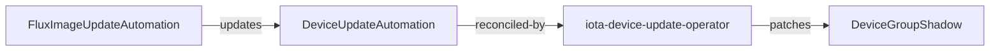

# iota-device-update-operator
IoTA device operator reconciles DeviceUpdateAutomation CR, 
upon the artifact list change, the operator will patch a respective device group shadow with an updated value.

Note: This project was scaffolded via [kubebuilder](https://book.kubebuilder.io/).

## Description


## CR example
```yaml
apiVersion: iota.woven-city.global/v1beta1
kind: DeviceUpdateAutomation
metadata:
  namespace: iot
  name: test-automation
spec:
  tenant: test
  artifacts:
    your-group-1: # group name.
      kind: image # artifact kind, only 'image' is supported as of now.
      link: foo:latest # artifact link.
    your-group-2:
      kind: image
      link: bar:latest
```

## Contributing
This project is built by bazel and deployed by Flux.

Before committing your changes run:
```sh
bazel run //:buildifier
bazel run //:gazelle
```

### How the project works
This project aims to follow the Kubernetes [Operator pattern](https://kubernetes.io/docs/concepts/extend-kubernetes/operator/).

It uses [Controllers](https://kubernetes.io/docs/concepts/architecture/controller/),
which provide a reconcile function responsible for synchronizing resources until the desired state is reached on the cluster.

### Modifying the API definitions
If you are editing the API definitions, generate the manifests such as CRs or CRDs using:

```sh
make generate
make manifests
```

Then copy the CRD to `infrastructure/k8s/common/iot/iota-device-update-operator-X.Y.Z`

**NOTE:** Run `make --help` for more information on all potential `make` targets

More information can be found via the [Kubebuilder Documentation](https://book.kubebuilder.io/introduction.html)
