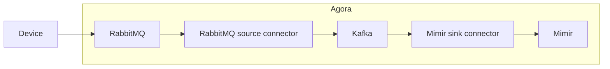

# iota-kafka-connector

This folder contains the Kafka Connectors used to move time series data from RabbitMQ to Mimir.

## Overview

The chart below shows how data flows from the device to Mimir.



## RabbitMQ Source Connector

This connector reads from the configured RabbitMQ queue and writes the messages to the configured Kafka topic.

Note that this connector only supports reading from a single virtual host (tenant), so we will need to run a separate copy of this connector for each virtual host.

The default configuration for this connector is generated by providing the tenant name to the environment's Zebra configuration file ([lab](https://github.com/wp-wcm/city/blob/main/infrastructure/k8s/lab/iot/metrics-config-values.yaml), [dev](https://github.com/wp-wcm/city/blob/main/infrastructure/k8s/dev/iot/metrics-config-values.yaml), [lab2](https://github.com/wp-wcm/city/blob/main/infrastructure/k8s/environments/lab2/clusters/worker1-east/iot/metrics-config-values.yaml)).

## Mimir Sink Connector

This connector reads from the configured Kafka topic and writes the messages to Mimir.

It is also responsible for converting messages from JSON to a format compatible with Mimir. See the [Developer Portal](https://developer.woven-city.toyota/docs/default/Component/iota-service/metrics/#metrics-mapping-configuration) documentation for examples of configuring the metrics mapping. The config is defined in `grafana-mimir-sink-connector.yaml` ([lab](https://github.com/wp-wcm/city/blob/main/infrastructure/k8s/lab/iot/kafka/grafana-mimir-sink-connector.yaml), [dev](https://github.com/wp-wcm/city/blob/main/infrastructure/k8s/dev/iot/kafka/grafana-mimir-sink-connector.yaml)).

Currently, there is only 1 Kafka topic that contains messages from all tenants, so we only run 1 instance of this connector.

## Local development

### Start minikube environment

Run the following script.

This script starts RabbitMQ, Kafka, Kafka Connect, the Kafka Connectors, and Mimir in a minikube cluster under the profile `tsdb-local`.
```sh
./setup_local_dev.sh
```

After the cluster finishes starting, forward the RabbitMQ port so that you can connect to it.
```sh
kubectl port-forward svc/rabbitmq 1883:1883 -n iot
```

Use an MQTT client of your choice to connect to RabbitMQ and send messages.

### Building and testing local changes
#### Initial setup
After minikube is running, run this command before building local images to point your Docker at minikube.
```
eval $(minikube docker-env)
```
Update your Kafka Connect image path in `local/kafka-connect.yaml` to point to the locally built image, and apply it.
```
ns/iot/iota-kafka-connector/docker:iota_kafka_connector
```
#### Building local changes
To build a Kafka Connect image with local changes, run:
```
bazel run //ns/iot/iota-kafka-connector/docker:iota_kafka_connector.load
```
Restart the `iot-kafka-connect-connect-0` pod to pick up the latest image.

## Build

To build the connectors and push the image to Artifactory, `cd` into the `docker` directory and run the `build_and_push.sh` script. The last line of the output will contain the new image tag:

```
Built and pushed new image: 678df615_1698049063
```

## Deploy

To deploy a specific image tag, update the `image` field in the `kafka-connect-values.yaml` file of the corresponding environment directory ([lab](https://github.com/wp-wcm/city/blob/bba030b3043ad6a925f82177a71d0d9158e115cd/infrastructure/k8s/lab/iot/kafka/kafka-connect-values.yaml#L10), [dev](https://github.com/wp-wcm/city/blob/bba030b3043ad6a925f82177a71d0d9158e115cd/infrastructure/k8s/dev/iot/kafka/kafka-connect-values.yaml#L10), [lab2](https://github.com/wp-wcm/city/blob/bba030b3043ad6a925f82177a71d0d9158e115cd/infrastructure/k8s/environments/lab2/clusters/worker1-east/iot/kafka/kafka-connect-values.yaml#L10)).

## End-to-end Test

Run the test in the desired environment using Bazel. The script needs authentication to run `iotactl` and `kubectl`. It should open your browser to authenticate as needed.

```sh
ENV=lab bazel run //ns/iot/iota-kafka-connector:tsdb_e2e
```
