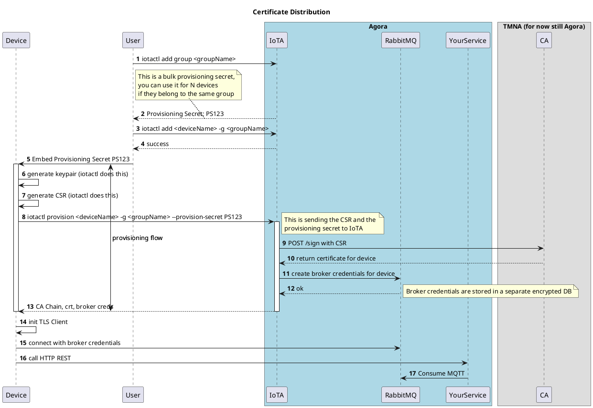

# Credentials Distributions

## Bulk Provisioning

During the bulk provisioning phase an operator will add a group to their tenant, receive a provisioning secret and N devices to that group. The provisioning secret will need to be embedded on the device encrypted storage (for example) and used at provisioning time together with a Certificate Signing Request (CSR) to obtain a certificate / broker credentials pair. 
Note: it's not mandatory to use the broker and its credentials although it's necessary to have any communication with the cluster via mTLS and therefore the CA Chain and the Certificate returned by IoTA will need to be used to set a TLS client on the device itself. This will require setting an ingress ad hoc to redirect the traffic on the desired service.

Below, a sequence diagram to show the whole flow:

