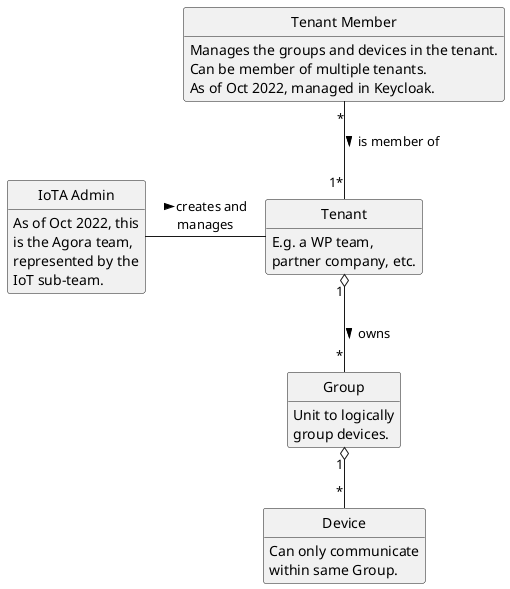

# Agora IoT Deep Dive

## Overview of IoT in Agora

Agora is Woven Planet's cloud-based platform that enables both Woven Planet and external developers to deploy services
that can be used in and by Woven City. Many of these services are entirely cloud based, or are designed to be used via
a web browser, but some will also interact with the real world. These real world interaction points - sometimes known
as _edge devices_ or _end points_ can be anything from a smart door to a delivery robot, and they have a need to
communicate with services inside Agora, and also with one another.

This network or mesh of devices is colloquially known as the _Internet of Things_ or IoT and in order for it to
interact with Agora, certain custom support is required. At the core of this custom support is a service known as
IoTA - the _Internet of Things Authority_.

## The role of IoTA in the IoT system

IoTA provides four main areas of support to IoT devices - registration, authentication, access control and telemetry.

### Registration

In an Internet full of hackers and threat actors, we clearly have to restrict who can access services within Agora. We
can't let just any device access the internals of Agora - devices need to be registered before use, so that we know
that they are safe and can trace their registration back to a known trusted user. Registration also allows monitoring
of device activity via device telemetry messages, visualisation of device location and removal of a device's rights to
access Agora if and when it performs an action that is not permitted.

### Authentication

For web browser-based services we can use the usual OAuth2 login mechanisms to authenticate a user, but IoT devices
are acting independently and (usually) don't have a human user operating them. Even if they did, many of these devices
don't have a keyboard or screen which that user can interact with anyway. We need another mechanism to
_authenticate_ those IoT devices.

The word "authenticate" in this context means to make a decision that a particular IoT device is trustworthy, and that
the device was created by and owned by either Woven Planet or a trusted partner of Woven Planet, and not by a hacker
trying to gain illicit access to Agora and its services.

It's important not to get the words "authenticate" and "authentication" confused with the words "authorise" and
"authorisation". _Authorisation_ has to do with granting a particular IoT device (or human user) access to a particular
resource inside of Agora. This is done *after* the IoT device has been proven to be what it claims to be, that is,
once it has proven that it is a device that is owned by Woven Planet or a Woven Planet partner - after it has been
_authenticated_.

IoTA only takes care of authentication, and authorisation is outside of its scope (at least for now). Hence it is
important to understand the difference between these terms.

### Access control

Once an IoT device is authenticated and its identity is proven, it can be granted access to Agora. Agora could be
thought of as a walled garden or a gated community, and thus to access it, one needs a gate and a key.

The gate in this case is what is known in Agora as an _ingress_ or _gateway_. The key is a certificate that can be used
for TLS (Transport Layer Security) communication with one or more services inside Agora, communicating via the ingress.
No certificate, no access. Due to the number of hackers and threat actors out there on the Internet, unencrypted access
to Agora is simply a very bad idea, for the same reason that unencrypted HTTP access to a service such as your bank is a
very bad idea. Thus, unencrypted access to Agora via the ingress is not permitted, and one must use TLS with an
appropriate certificate.

With that said, not just any old certificate can be used for accessing Agora. The certificate must have a chain of trust
leading back to Agora's CA (Certificate Authority). This is then considered to be proof that the IoT device that is
using the certificate is authenticated and trustworthy. Although certificates are usually public and can be distributed
without restriction, in the case of Agora's IoT support, each device is issued with its own unique certificate that must
be used with just that device, and which the device should safely store.

Because each IoT device has its own unique certificate, if that device is compromised or proves itself to be
untrustworthy then just that device's certificate can be revoked, thus depriving the device access to Agora and locking
it out.

### Telemetry

Once integrated into Agora, a device will need to send - and sometimes receive - telemetry data. This can be categorised
into three main categories:

1) State information: Life cycle related information such as device on/device off
2) Telemetry: The information that the device was designed to measure and report on. For instance, a temperature sensing
device will send packets of data containing the current temperature, humidity and a time stamp
3) Commands: Instructions being sent _from_ an operator (either human or machine) _to_ the device, such as "turn on
light".

#### HTTPS access

Regarding certificates, it should be mentioned here that external IoT devices _could_ simply use TLS over HTTP in the
same way that a web browser does to access Agora. This would certainly simplify things, but then it would not be
possible to revoke the certificate if the device was compromised. Hence, TLS over HTTP is only used for the initial
registration of a device with IoTA. After that, the device _must_ only use its own certificate for TLS communication
with Agora's ingress gateway.

## Tenants, groups and devices

This brings us to how to register a device so that it can be authenticated. This begins with a _tenant_. A tenant
represents an entity such as a team within Woven Planet or a partner company that is working with Woven Planet. A
tenant is manually created within Agora by the IoT team upon request from someone at the partner team or company.
Because there is a personal and legal relationship between a representative of the partner company and Woven Planet,
this introduces an element of trust into the system and this trust is the beginning of the trust chain that enables the
deployment of trustworthy devices into Agora.

Once a tenant is created in Agora, one or more _Woven IDs_ (currently internal WP E-Mail addresses) are associated with
that tenant. A person to which one of these Woven IDs is assigned is then granted the ability to add groups and devices
belonging to that tenant and to deploy those devices in a way that they can access services inside Agora; they are in
effect an administrator for that tenant.

It is possible for a single Woven ID to be associated with more than one tenant, although usually one Woven ID will be
associated with only one tenant, as a tenant usually represents a single team or partner company.

A _group_ in this context is simply a way to organise devices into logical group within a tenant. Let's say a Woven
Planet partner company called "Bob's Robots" is registered in Agora as a tenant. Bob builds different types of robots
and would like to group them logically. Such groupings could thus be "delivery-robots", "cleaning-robots" and "drones".
Such groups serve two purposes: Firstly, they enable the grouping of different types of devices in a way that makes
sense to us humans and secondly, it sandboxes messages sent within that group so that only members of the group can see
them. More on that later.

Finally, a _device_ is an individual device with in a group. For example, a device might be called "cleaner-1" and exist
inside the "cleaning-robots" group. A group can contain multiple devices, but a single device will only ever be a member
of a single group.



## Messaging protocols

A key part of a network of IoT devices is the ability to send messages from and to those devices. After all, a
display-less, keyboard-less IoT device mounted on the roof of a building somewhere is not very much use if it can't
tell the world (or, more likely a service within Agora) about what it is doing and sensing. Thus, messaging protocols
such as _MQTT_ and _AMQP_ are very popular in the IoT space and are used for this purpose.

There is nothing to prevent an IoT device from using a messaging protocol to broadcast a message to anyone and everyone,
but Agora is all about security, so messaging is restricted to being inside a group. Devices in different groups
cannot send messages to one another, and devices that are registered under different tenants also cannot send messages
to one another. These restrictions are enforced by the use of MQTT and AMQP within Agora.

There is nothing to say that an IoT device _must_ use one of these protocols, and nothing to prevent a developer from
creating their own custom proprietary protocol. But protocols such as MQTT and AMQP are increasingly becoming de facto
standards in the IoT world and supporting them enables Agora to apply a level of control over what gets sent where.
It is strongly advised that developers do not roll their own communication protocol unless there is a very good reason
to do so.

## Creating a new tenant

To create a new tenant please use one of the flows described in the dedicated [section](./Tasks/tenant.md).

## Introducing iotactl

To assist users with the configuration of groups and devices within a tenant, we have created a utility called
_iotactl_. This utility hides the complexity behind this process, including communication with IoTA, authorisation and
validation of devices, and allows the user to add and delete groups and devices to a tenant, as well as to query what
groups and devices exist in a tenant as well as their attributes.

### TL;DR

The use of iotactl will be described in depth in the sections below on device provisioning, but for those eager to get
started, a quickstart cheat sheet can be found [here](https://github.com/wp-wcm/city/blob/main/ns/iot/iota/en/docs/iotactl.md).

Read on for details of the provisioning process and how to use the iotactl utility.

## Device provisioning

Once a tenant has been created and a list of allowed users has been added to it, those users can add groups and
devices within the tenant using the iotactl utility, and then provision the newly added devices.

There are three steps to provisioning a device:

1) Add a group to which to add the device (only required to be performed once)
2) Add a device to the group
3) Provision the device

The first two steps are performed on a desktop PC or laptop and the final step is performed on the device itself. (See more on the related [sequence diagram](certificates.md))

### Add a group

Begin by adding a group using iotactl:

```sh
iotactl add group <group> -t <tenant> -u <user> -p <password>
```

Replace the arguments specified inside the <> characters as appropriate. `<user>` should be one of the E-Mail addresses
that were previously registered with the IoTA team for the `<tenant>` being passed in here. In response, you should
receive output something similar to the following:

```sh
Adding group "<group>"
Added group "<group>" successfully
Provisioning Secret: <provisioning secret>
```

The provisioning secret returned here is important as it is required to add new devices to the group. It should be
considered semi-secret and stored safely for the use of the team, but given that it is only useful for people whose
E-Mail addresses have been registered with the tenant, it is not considered "top secret".

### Add a device

Group creation should be only an occasional activity; more often, one will be adding a new device within a group, as
per this example:

```sh
iotactl add device <device> -t <tenant> -g <group> -u <user> -p <password>
```

Replace the arguments specified inside the <> characters as appropriate. In response, you should receive output something similar to the following:

```sh
Adding device "<device>"
Added device "<device>" successfully
```

### Provision a device

Once a new device has been added (and possibly a group as well), it is time to provision the device, which will allow
it to start sending and receiving messages, and will also provide it with certificates that allow it to pass through
the Agora ingress gateway. Because this step will automatically save the certificates to the `~/.iota/<cluter>/<tenant>/<group>/` 
directory, it should be performed on the device itself. You will need the provisioning secret from the initial "add group" command
as well. Here is an example of provisioning a device:

```sh
iotactl provision <device> -s <secret> --expose
```

The `<device>` argument must be the same ones that were passed into the "add device" command and the `<secret>` argument
must be the provisioning secret you received from the "add group" command. In response, you should receive output
similar to the following:

```sh
Provisioning device "<device>"
Generating key pair
Provisioned device "<device>" successfully
Tenant: <tenant>
AMQP Broker Username: <broker_username>
MQTT Broker Username: <tenant>:<broker_username>
Broker Access Token: 381pvYSuC6akr450AIsLX7OecRE92NtK
Deprovisioning Secret: <Deprovisioning Secret>
```

Note that the username used for the MQTT broker is prefixed with the name of the tenant in which the device was created,
whereas the name used for the AMQP broker is not.

If you do not need broker access for your device, you can pass the `--without-broker` flag to skip the creation of broker credentials.

In addition, certificates that can be used for accessing the Agora cluster via the ingress will be written into the
`~/.iota/<cluter>/<tenant>/<group>/` directory under the following files:

```
<device>_ca.pem => The certificate authority chain to Agora's root certificate
<device>_crt.pem => The client certificate for making requests to Agora's message broker
<device>_key.pem => The client's newly generated public key
```

The deprovisioning secret returned here is important as it is required to deprovision the device later on. It should be
considered secret and stored safely on the device itself, if possible. Note that it is not possible to deprovision the
device if this secret is lost (although the device can be deleted and re-added to achieve the same state).

The information returned from the "provision" command is among the most important information that you will receive from
IoTA. For further information on how to use it, see below for links to the MQTT and AMQP examples.

## Add a Service Account

If you need to access IoTA API from your service's pod without authentication, you have to configure Service Account first.

```
---
apiVersion: v1
kind: ServiceAccount
metadata:
  name: <service account name>
  namespace: <namespace>
automountServiceAccountToken: false
```

Then, configure your application to use the above ServiceAccount.
```
---
apiVersion: apps/v1
kind: Deployment
metadata:
  namespace: <namespace>
  name: <app name>
  labels:
    app: <app name>
spec:
  replicas: 1
  selector:
    matchLabels:
      app: <app name>
  template:
    metadata:
      labels:
        app: <app name>
    spec:
      serviceAccountName: <service account name>
      containers:
...
```

After configuring ServiceAccount, please contact the Agora IoTA team by messaging `@agora-iota` in the [#wcm-org-agora-ama channel](https://woven-by-toyota.slack.com/archives/C02CVJLTMJ7) on Slack. 
The Agora IoTA team will configure the necessary authorization policy to allow access to IoTA from your pod. (ex. [PR](https://github.com/wp-wcm/city/pull/2448/files)).

## Over to you

This introduction should give you a good basic understanding on how to add groups and devices to Agora, and how to
provision them for use. For more detailed information, please see the following documents:

A quickstart cheat sheet for iotactl can be found [here](https://github.com/wp-wcm/city/blob/main/ns/iot/iota/en/docs/iotactl.md).

Advanced users wishing to access IoTA's REST API directly can find information [here](https://github.com/wp-wcm/city/blob/main/ns/iot/iota/en/docs/rest_api.md).

Example IoT clients with lots of explanatory comments can be found [here for MQTT](https://github.com/wp-wcm/city/blob/main/ns/iot/iota/en/docs/mqtt_example.py)
and [here for AMQP](https://github.com/wp-wcm/city/blob/main/ns/iot/iota/en/docs/amqp_example.py).
These are fully functioning clients that will demonstrate how to provision the device they are running on and how to
then access Agora using the certificate returned by the provisioning process, and to send messages to Agora's message
broker via MQTT and AMQP, also using the credentials returned by the provisioning.
