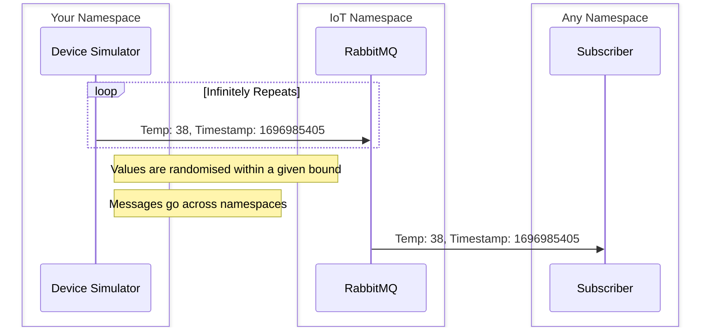

# Overview

### What's covered?:
- [Introduction](#introduction)
  - [What is a Device Simulator?](#what-is-a-device-simulator)
  - [Why would I want to use a Device Simulator?](#why-would-i-want-to-use-a-device-simulator)
- [Device Simulator Architecture](#device-simulator-architecture)
- [Creating a Device Simulator](#creating-a-device-simulator)
  - [Using the Shared Device Simulator Namespace](#using-the-shared-device-simulator-namespace)
  - [Using Your Own Namespace](#using-your-own-namespace)
    - [RabbitMQ Pre-requisites](#rabbitMQ-pre-requisites)
    - [Kubernetes Namespace Pre-requisites](#kubernetes-namespace-pre-requisites)
  - [Creating a Flink Deployment](#creating-a-flink-deployment)
- [How do we know it worked?](#how-do-we-know-it-worked)

## Introduction

### What is a Device Simulator?
A Device Simulator is a way of simulating traffic over MQTT to a particular queue. That data is randomly generated, and
conforms to a given schema.

In practice, a Device Simulator is a Flink Deployment that runs in our Lab2 cluster (the only option for now),
which randomly generates the data and sends it to our RabbitMQ on a particular queue.

### Why would I want to use a Device Simulator?
Having a simple message generator has quite a few applications:
- Testing the flow of your system
- Stress test your system that consumes MQTT messages
- Removes the need to physically deploy a device for data processing testing

## Device Simulator Architecture

## Creating a Device Simulator

### Using the Shared Device Simulator Namespace

Great! Please jump ahead to [Creating a Flink Deployment](#creating-a-flink-deployment), there is no extra setup you 
need to perform!

### Using Your Own Namespace

This is quite a bit more involved, if you run into any issues please reach out to either DevRel or the Services Team 
(`#wcm-org-agora-services`).

#### RabbitMQ Pre-requisites
Please reach out to the Services team (via Slack - `#wcm-org-agora-services`)
and ask them to create a RabbitMQ user in your namespace ([reference PR](https://github.com/wp-wcm/city/pull/9239/files)) 
for a given tenant.

Before we can send messages to a queue in RabbitMQ we first need to create that queue. The easiest way to do this is to 
use `iotactl` to create a device under the `test` tenant which will create a queue. You can take a look at the `iotactl`
[docs](../index.md) for further guidance.

#### Kubernetes Namespace Pre-requisites
There are a few things we need to create in our namespace as a one-off, this will only need to be done once per namespace:
- Create a Flink Service Account to run our Flink Deployment - [see this example BUILD file](https://github.com/wp-wcm/city/blob/main/infrastructure/k8s/common/device-simulator/flink_service_account/BUILD)
- Create an Authorization policy To access RabbitMQ in the IoT namespace - [see this example auth policy](https://github.com/wp-wcm/city/blob/main/infrastructure/k8s/common/device-simulator/device-simulator-auth-policy.yaml)

You will need to raise a PR for these to be merged and applied, however since this is under your own namespace you should be able to get approval from within your team.
You can always reach out to the Services team for some extra reassurance!

### Creating a Flink Deployment
To make creating a Flink Deployment as easy as possible, we have created a Bazel target which will generate the necessary YAML.
We have an example [here](https://github.com/wp-wcm/city/blob/main/infrastructure/k8s/common/device-simulator/java_rmq_demo/BUILD) that uses `device_sim_java()`
to generate the necessary YAML files for creating your Flink Deployment.

!!! Note

    This requires you to provide an existing Device's queue, i.e. from a Device that has been created via the `iotactl` tool or `IoTA UI` 

For now this requires you to provide an image (you can see how we create our [example Java RMQ image](https://github.com/wp-wcm/city/blob/main/ns/device-simulator/poc_test_rmq/BUILD) 
for reference), in the future we will create a generic image that users can pass a message format to.

### How do we know it worked?
Using observability tools, when they are available in the cluster, we should be able to see the messages. If you are 
publishing to the `.logs` queue of your device, then you should also be able to view the messages in 
[Sockeye](https://minimal-service-sample-serverless-lambda.agora-lab.w3n.io/). 