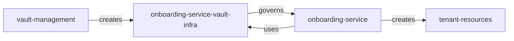

# [WIP] Vault management for the onboarding service 



`vault-management` creates vault resources for the onboarding service itself, 
the structure it creates is needed for the service to be able to create tenant-scoped secrets.

For now, it is meant to run manually.

### Usage example:

Below is the example usage for the dev cluster, it requires vault cli for initial login.
Pulumi will guide you through the steps, but please name the stacks `dev`, `stg` or `prod`.
Feel free to set your own passphrase as this stack is idempotent and does not really require a state.

```bash
export VAULT_ADDR=https://dev.vault.tmc-stargate.com
vault login -method=oidc -path=gac
unset VAULT_TOKEN
export VAULT_TOKEN=$(vault token lookup -format json | jq -r .data.id)
pulumi up --refresh
```

Vaults:

| env            | url                                |
|----------------|------------------------------------|
| Non-Production | https://dev.vault.tmc-stargate.com |
| Production	    | https://vault.tmc-stargate.com     |