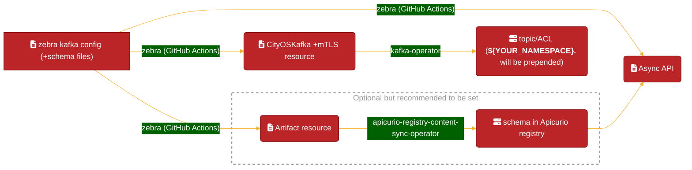

# Quickstart

## Setting up Kafka configuration

The following YAML will configure Kafka to use:
- a topic with one partition and data replicated to two machines in the Kafka cluster
- an ACL allowing a principal full access (read, write, describe) to the topic
- an ACL allowing the same principal access to all consumer groups starting with `kafka-quickstart.`


If you are using [the city monorepo](https://github.com/wp-wcm/city), go to [For the city monorepo users](#for-the-city-monorepo-users) section so that you can configure in a simpler manner and update [the AsyncAPI](https://developer.woven-city.toyota/catalog/default/api/agora-kafka-async-api/definition)
Otherwise, go to [For External repo user](#for-external-repo-user) section.

---
### For the city monorepo users

Zebra is the tool to abstract your config. Details are in [zebra](https://developer.woven-city.toyota/docs/default/Component/zebra-service)

The configuration flow powered by zebra is as follows:



As you see in this image, all you have to do is to configure the zebra kafka yaml and Bazel build setting.


#### Prerequisites

- Using FluxCD and enabling `cluster-vars` ConfigMap substitution to enable `${cluster_domain}` substitution. Our sample can be seen [here](https://github.com/wp-wcm/city/blob/e4b80e57c48a3b0cbbedfeb7a7b2cbe20adc632a/infrastructure/k8s/environments/dev2/clusters/worker1-east/flux-system/kustomizations/services/kafka-monitor.yaml#L14-L17)
- If not, please replace `${cluster_domain}` with the target domain manually (e.g. in Dev2: `agora-dev.w3n.io`)

#### Declaring your Kafka settings

Kafka's config generation allows for a variety of settings that are then expanded into the full YAMLs that the Kafka system expects.

In a folder in `/ns/example-service`, create the following `kafka-config-values.yaml` that contains the values to pass to the Kafka configuration generation.

You can check the yaml schema in https://github.com/wp-wcm/city/blob/main/ns/kafka_ytt/kafka_template_schema.yaml

Here are the examples:

=== "w/o schema registry"
  `ns/example-service/kafka-config-values.yaml`
  ```yaml
  #@data/values
  ---
  cityoskafkas:
  - namespace: example-service
    topics:
    - name: topic1  #! this will result in example-service.topic1
      partitions: 1
      replicationFactor: 2 
    consumerGroups:
    - group1 #! this will result in example-service.group1
    readAccessPrincipals:
    - User:CN=apicurio.${cluster_domain},OU=CityOS
    writeAccessPrincipals:
    - User:CN=apicurio.${cluster_domain},OU=CityOS
  ```


=== "w/ schema registry (w/o PII)"
  `ns/example-service/kafka-config-values.yaml`
  ```yaml
  #@ load("@ytt:data", "data")
  #@data/values
  ---
  cityoskafkas:
  - namespace: example-service
    topics:
    - name: topic1  #! this will result in example-service.topic1
      partitions: 1
      replicationFactor: 2 
      readAccessPrincipals:
      - User:CN=apicurio.${cluster_domain},OU=CityOS
      writeAccessPrincipals:
      - User:CN=apicurio.${cluster_domain},OU=CityOS
      
      #! Filling `messages` is optional but you can specify this when you want to generate Apicurio `Artifact` resource, which will register the schema to our Apicurio registry
      messages:
        - key:
            description: "GreetingID"
            type: string
            enum: [ "Greeting[0-9]" ]
          value:
            description: "Avro record for Greeting entity"
            type: avro
            schema:
              version: 1  #! <===== When updating schema content, don't forget to update this version as well.
              name: Greeting
              labels:
                - avro
                - kafka
              #! specify the schema file
              content: #@ data.read("greeting.avsc")
    #! Note: this is mandatory for consumers
    consumerGroups:
    - group1 #! this will result in example-service.group1
  ```

=== "w/ schema registry (w/ PII)"
  `ns/example-service/kafka-config-values.yaml`
  ```yaml
  #@ load("@ytt:data", "data")
  #@data/values
  ---
  cityoskafkas:
  - namespace: example-service
    topics:
    - name: topic1  #! this will result in example-service.topic1
      partitions: 1
      replicationFactor: 2 
      private: true #! This means this topic has PII. The ACL will be automatically configured.
      #! Filling `messages` is optional but you can specify this when you want to generate Apicurio `Artifact` resource, which will register the schema to our Apicurio registry
      messages:
        - key:
            description: "GreetingID"
            type: string
            enum: [ "Greeting[0-9]" ]
          value:
            description: "Avro record for Greeting entity"
            type: avro
            schema:
              version: 1  #! <===== When updating schema content, don't forget to update this version as well.
              name: Greeting
              labels:
                - avro
                - kafka
              #! specify the schema file
              content: #@ data.read("greeting.avsc")
    consumerGroups:
    - group1 #! this will result in example-service.group1
  ```


When specifying `messages` field, make sure to place the schema file `greeting.avsc` in the same directory.
The `.avsc` extension indicates the Avro format, which is a data serialization system well-suited for Kafka. It boasts an efficient binary format, supports various programming languages, and allows for data description using a sophisticated schema language.
As of December 18th, 2023, [Kafka Personal Information Filterer | Agora Developer Portal](https://developer.woven-city.toyota/docs/default/Component/kafka-pii-filterer/#kafka-personal-information-filterer) exclusively supports the Avro format. However, if using the kafka-pii-filterer is unnecessary, JSON or Protobuf formats are also acceptable.
When using the Avro format, the `fields.doc` property is optional but SHOULD be filled in so that anyone can understand your message content.
If the item is PII, `x-woven-infotype` MUST be specified conforming to [TN-0055 Data Privacy Annotations - Google Docs](https://docs.google.com/document/d/1qxOgzbV6Q_elZgbA-zD5nw4LSSD3JGpDu00ReSsheYQ/edit).


- `ns/example-service/greeting.avsc`

```
 {
  "type": "record",
  "name": "Greeting",
  "fields": [
    {
      "name": "Message",
      "type": "string",
      "doc": "Hello-[ID] will be set. [ID] is auto-incremented",
      "default": "Hello-0"
    },
    {
      "name": "Time",
      "type": "long",
      "doc": "the timestamp of the message",
      "default": 0
    },
    {
      "name": "Sender",
      "type": "string",
      "doc": "the person who sent the message",
      "x-woven-infotype": "PERSON_NAME",
      "default": "Api Curio"
    }
  ]
}
```


Even if you use the schema in the local directory and don't fetch the schema from Apicurio, this is recommended for the several reasons such as:

1. We can check the message schema easily at [Agora Kafka AsyncAPI document](https://developer.woven-city.toyota/catalog/default/api/agora-kafka-async-api/definition)
2. When you want to evolve the schema, the schema registry will make the process easy . 

Please check [the documentation on Apicurio registry](https://developer.woven-city.toyota/docs/default/Component/apicurio-service) for more information.

And then a `BUILD` file that instantiates the rule, specifies the values file, and declares the desired output.

!!! tip
    You can recognize zebra-generated files easily by prepending `z-` to the filename.

- `ns/example-service/BUILD`

```starlark
load("//ns/kafka_ytt:kafka_ytt.bzl", "kafka_ytt_build")

values_files = [
    "kafka-config-values.yaml",
    "greeting.avsc",  # this is necessary when `messages` field is filled
]

kafka_ytt_build(
    name = "kafka_config",
    copy_to_source = True,
    output = "z-kafka-config.yaml",
    values_files = values_files,
)

# (Optional) This filegroup is for generating AsyncAPI yaml (ns/kafka-docs/api/kafka-async-api.yaml)
filegroup(
    name = "values_files",
    srcs = values_files,
    visibility = ["//visibility:public"],
)
```

Then, execute the run target

```shell
bazel run //ns/example-service:kafka_config.copy
```

and the resulting `z-kafka-config.yaml` will be generated and copied to the folder containing the BUILD file.

```yaml
apiVersion: kafkagroup.woven-city.global/v1alpha3
kind: CityOsKafka
metadata:
  name: example-service
  namespace: example-service
spec:
  topics:
  - name: topic1
    partitions: 1
    replicationFactor: 2
    cleanupPolicy: delete
    retentionPeriod: 1w
    maxMessageSize: 1MB
  acls:
  - resource:
      resourceName: topic1
      resourcePattern: literal
      resourceType: topic
    policies:
    - principal:
      - User:example-service-user
      operation:
      - read
      - describe
      permission: allow
  - resource:
      resourceName: topic1
      resourcePattern: literal
      resourceType: topic
    policies:
    - principal:
      - User:example-service-user
      operation:
      - write
      - describe
      permission: allow
  - resource:
      resourceName: group1
      resourcePattern: literal
      resourceType: group
    policies:
    - principal:
      - User:example-service-user
      operation:
      - read
      - describe
      permission: allow
---
apiVersion: cert-manager.io/v1
kind: Certificate
metadata:
  name: kafka-client-certs
  namespace: example-service
spec:
  duration: 2160h
  renewBefore: 360h
  commonName: example-service.${cluster_domain}
  subject:
    organizationalUnits:
    - CityOS
  dnsNames:
  - example-service.${cluster_domain}
  usages:
  - client auth
  privateKey:
    rotationPolicy: Always
    algorithm: RSA
    size: 2048
  secretName: kafka-client-certs
  issuerRef:
    group: awspca.cert-manager.io
    kind: AWSPCAClusterIssuer
    name: aws-pca-cluster-issuer
---
apiVersion: networking.istio.io/v1alpha3
kind: DestinationRule
metadata:
  name: kafka-mtls
  namespace: example-service
spec:
  host: kafka.generated
  exportTo:
  - .
  trafficPolicy:
    tls:
      mode: MUTUAL
      clientCertificate: /etc/kafka-certs/tls.crt
      privateKey: /etc/kafka-certs/tls.key
      caCertificates: /etc/kafka-cacert/kafka-ca-cert.pem
---
apiVersion: v1
data:
  # Amazon RootCA certificate: https://www.amazontrust.com/repository/SFSRootCAG2.pem
  kafka-ca-cert.pem: LS0tLS1CRUdJTiBDRVJUSUZJQ0FURS0tLS0tCk1JSUQ3ekNDQXRlZ0F3SUJBZ0lCQURBTkJna3Foa2lHOXcwQkFRc0ZBRENCbURFTE1Ba0dBMVVFQmhNQ1ZWTXgKRURBT0JnTlZCQWdUQjBGeWFYcHZibUV4RXpBUkJnTlZCQWNUQ2xOamIzUjBjMlJoYkdVeEpUQWpCZ05WQkFvVApIRk4wWVhKbWFXVnNaQ0JVWldOb2JtOXNiMmRwWlhNc0lFbHVZeTR4T3pBNUJnTlZCQU1UTWxOMFlYSm1hV1ZzClpDQlRaWEoyYVdObGN5QlNiMjkwSUVObGNuUnBabWxqWVhSbElFRjFkR2h2Y21sMGVTQXRJRWN5TUI0WERUQTUKTURrd01UQXdNREF3TUZvWERUTTNNVEl6TVRJek5UazFPVm93Z1pneEN6QUpCZ05WQkFZVEFsVlRNUkF3RGdZRApWUVFJRXdkQmNtbDZiMjVoTVJNd0VRWURWUVFIRXdwVFkyOTBkSE5rWVd4bE1TVXdJd1lEVlFRS0V4eFRkR0Z5ClptbGxiR1FnVkdWamFHNXZiRzluYVdWekxDQkpibU11TVRzd09RWURWUVFERXpKVGRHRnlabWxsYkdRZ1UyVnkKZG1salpYTWdVbTl2ZENCRFpYSjBhV1pwWTJGMFpTQkJkWFJvYjNKcGRIa2dMU0JITWpDQ0FTSXdEUVlKS29aSQpodmNOQVFFQkJRQURnZ0VQQURDQ0FRb0NnZ0VCQU5VTU9zUXErVTdpOWI0WmwxK09pRk94SHovTHo1OGdFMjBwCk9zZ1BmVHozYTNZNFk5azJZS2liWGx3QWdMSXZXWC8yaC9rbFE0Ym5hUnRTbXBEaGNlUFlMUTFPYi9iSVNkbTIKOHhwV3JpdTJkQlRyei9zbTR4cTZIWll1YWp0WWxJbEhWdjhsb0pOd1U0UGFoSFFVdzJlZUJHZzYzNDVBV2gxSwpUczlEa1R2blZ0WUFjTXRTN250OXJqcm52REg1UmZiQ1lNOFRXUUlyZ013MFI5KzUzcEJsYlFMUExKR21wdWZlCmhSaEpmR1pPb3pwdHFiWHVOQzY2RFFPNE05OUg2N0ZyalNYWm04NkIwVVZHTXBad2g5NENEa2xEaGJac2M3dGsKNm1GQnJNblVWTitITDhjaXNpYk1uMWxVYUovOHZpb3Z4RlVjZFVCZ0Y0VUNWVG1MZndVQ0F3RUFBYU5DTUVBdwpEd1lEVlIwVEFRSC9CQVV3QXdFQi96QU9CZ05WSFE4QkFmOEVCQU1DQVFZd0hRWURWUjBPQkJZRUZKeGZBTitxCkFkY3dLemlJb3JodFNwenlFWkdETUEwR0NTcUdTSWIzRFFFQkN3VUFBNElCQVFCTE5xYUVkMm5kT3htZlp5TUkKYnc1aHlmMkUzRi9ZTm9ITjJCdEJMWjlnM2NjYWFOblJib2JoaUNQUEU5NUR6K0kwc3dTZEh5blZ2L2hleU5YQgp2ZTZTYnpKMDhwR0NMNzJDUW5xdEtyY2dmVTI4ZWxVU3doWHF2ZmRxbFM1c2RKL1BITFR5eFFHamhkQnlQcTF6CnF3dWJkUXh0UmJlT2xLeVdON1dnMEk4VlJ3N2o2SVBkai8zdlFRRjN6Q2VwWW9VejhqY0k3M0hQZHdiZXlCa2QKaUVEUGZVWWQveDdINGM3L0k5dkcrbzFWVHFrQzUwY1JSajcwL2IxN0tTYTdxV0ZpTnlpMkxTcjJFSVpreVhDbgowcTIzS1hCNTZqemFZeVdmL1dpM01PeHcrM1dLdDIxZ1o3SWV5TG5wMktodkFvdG5EVTBtVjNIYUlQekJTbENOCnNTaTYKLS0tLS1FTkQgQ0VSVElGSUNBVEUtLS0tLQo=
kind: Secret
metadata:
  name: kafka-ca-cert
  namespace: example-service
type: Opaque
---
# `Artifact` is generated when `messages` field is filled
# This will generate Apicurio `Artifact` resource and the schema will be registered at [our Apicurio registry](https://apicurio.cityos-dev.woven-planet.tech/ui/artifacts).
apiVersion: artifact.apicur.io/v1alpha1
kind: Artifact
metadata:
  name: example-service-topic1
  namespace: example-service
spec:
  version: "1"
  artifactId: example-service.data
  name: Greeting
  description: Avro record for Greeting entity
  type: AVRO
  labels:
  - avro
  - kafka
  - private
  content: |
    {
      "type": "record",
      "name": "Greeting",
      "fields": [
        {
          "name": "Message",
          "type": "string",
          "doc": "Hello-<ID> will be set. <ID> is auto-incremented"
        },
        {
          "name": "Time",
          "type": "long",
          "doc": "the timestamp of the message"
        },
        {
          "name": "Sender",
          "type": "string",
          "doc": "the person who sent the message",
          "x-woven-infotype": "PERSON_NAME",
          "default": "Api Curio"
        }
      ]
    }
```


(This is optional because this AsyncAPI might be replaced by the DataHub) then, you can update [ns/kafka-docs/api/BUILD](https://github.com/wp-wcm/city/blob/main/ns/kafka-docs/api/BUILD) to add your file to show your topics in [Agora Kafka Async API](https://developer.woven-city.toyota/catalog/default/api/agora-kafka-async-api) if you want as follows:

```starlark
load("//ns/kafka-docs/api:kafka_async_api_ytt.bzl", "kafka_async_api_ytt_build")

kafka_async_api_ytt_build(
    name = "asyncapi",
    copy_to_source = True,
    output = "z-kafka-async-api.yaml",
    # add your kafka-config-values.yaml and the schema files to this list
    values_files = [
        ...
        "//ns/example-service:values_files",  <================ ADD THIS LINE!
    ],
)
```

This AsyncAPI document is updated by running the following command:

```shell
bazel run //ns/kafka-docs/api:asyncapi.copy
```

In this tutorial, we have run `bazel run <target>.copy` by hand but this is not a necessary operation because GitHub Action will run the command instead of us!  


---
### For external repo user

Sorry, please create them by hand for now (June, 2023). We plan to support zebra for external repo users.

```yaml
---
kind: Namespace
apiVersion: v1
metadata:
  name: kafka-quickstart
  labels:
    name: kafka-quickstart
    istio.io/rev: default
---
apiVersion: kafkagroup.woven-city.global/v1alpha3
kind: CityOsKafka
metadata:
  name: kafka-quickstart
  namespace: example-service
spec:
  topics:
  - name: "topic1"  ## this will result in kafka-quickstart.topic1
    partitions: 1
    replicationFactor: 2
  acls:
  - resource:
      resourceName: "topic1"  ## this will result in kafka-quickstart.topic1
      resourcePattern: literal
      resourceType: topic
    policies:
    - principal:
      - User:CN=kafka-quickstart.${cluster_domain},OU=CityOS
      operation:
      - read
      - write
      - describe
      permission: allow
  - resource:
      resourceName: "group1"  ## this will result in kafka-quickstart.group1
      resourcePattern: literal
      resourceType: group
    policies:
    - principal:
      - User:CN=kafka-quickstart.${cluster_domain},OU=CityOS
      operation:
      - read
      - write
      - describe
      permission: allow
---
apiVersion: cert-manager.io/v1
kind: Certificate
metadata:
  name: kafka-client-certs
  namespace: example-service
spec:
  duration: 2160h
  renewBefore: 360h
  commonName: kafka-quickstart.${cluster_domain}
  subject:
    organizationalUnits:
    - CityOS
  dnsNames:
  - kafka-quickstart.${cluster_domain}
  usages:
  - client auth
  privateKey:
    rotationPolicy: Always
    algorithm: RSA
    size: 2048
  secretName: kafka-client-certs
  issuerRef:
    group: awspca.cert-manager.io
    kind: AWSPCAClusterIssuer
    name: aws-pca-cluster-issuer
---
apiVersion: networking.istio.io/v1alpha3
kind: DestinationRule
metadata:
  name: kafka-mtls
  namespace: example-service
spec:
  host: kafka.generated
  exportTo:
  - .
  trafficPolicy:
    tls:
      mode: MUTUAL
      clientCertificate: /etc/kafka-certs/tls.crt
      privateKey: /etc/kafka-certs/tls.key
      caCertificates: /etc/kafka-cacert/kafka-ca-cert.pem
---
apiVersion: v1
data:
  # Amazon RootCA certificate: https://www.amazontrust.com/repository/SFSRootCAG2.pem
  kafka-ca-cert.pem: LS0tLS1CRUdJTiBDRVJUSUZJQ0FURS0tLS0tCk1JSUQ3ekNDQXRlZ0F3SUJBZ0lCQURBTkJna3Foa2lHOXcwQkFRc0ZBRENCbURFTE1Ba0dBMVVFQmhNQ1ZWTXgKRURBT0JnTlZCQWdUQjBGeWFYcHZibUV4RXpBUkJnTlZCQWNUQ2xOamIzUjBjMlJoYkdVeEpUQWpCZ05WQkFvVApIRk4wWVhKbWFXVnNaQ0JVWldOb2JtOXNiMmRwWlhNc0lFbHVZeTR4T3pBNUJnTlZCQU1UTWxOMFlYSm1hV1ZzClpDQlRaWEoyYVdObGN5QlNiMjkwSUVObGNuUnBabWxqWVhSbElFRjFkR2h2Y21sMGVTQXRJRWN5TUI0WERUQTUKTURrd01UQXdNREF3TUZvWERUTTNNVEl6TVRJek5UazFPVm93Z1pneEN6QUpCZ05WQkFZVEFsVlRNUkF3RGdZRApWUVFJRXdkQmNtbDZiMjVoTVJNd0VRWURWUVFIRXdwVFkyOTBkSE5rWVd4bE1TVXdJd1lEVlFRS0V4eFRkR0Z5ClptbGxiR1FnVkdWamFHNXZiRzluYVdWekxDQkpibU11TVRzd09RWURWUVFERXpKVGRHRnlabWxsYkdRZ1UyVnkKZG1salpYTWdVbTl2ZENCRFpYSjBhV1pwWTJGMFpTQkJkWFJvYjNKcGRIa2dMU0JITWpDQ0FTSXdEUVlKS29aSQpodmNOQVFFQkJRQURnZ0VQQURDQ0FRb0NnZ0VCQU5VTU9zUXErVTdpOWI0WmwxK09pRk94SHovTHo1OGdFMjBwCk9zZ1BmVHozYTNZNFk5azJZS2liWGx3QWdMSXZXWC8yaC9rbFE0Ym5hUnRTbXBEaGNlUFlMUTFPYi9iSVNkbTIKOHhwV3JpdTJkQlRyei9zbTR4cTZIWll1YWp0WWxJbEhWdjhsb0pOd1U0UGFoSFFVdzJlZUJHZzYzNDVBV2gxSwpUczlEa1R2blZ0WUFjTXRTN250OXJqcm52REg1UmZiQ1lNOFRXUUlyZ013MFI5KzUzcEJsYlFMUExKR21wdWZlCmhSaEpmR1pPb3pwdHFiWHVOQzY2RFFPNE05OUg2N0ZyalNYWm04NkIwVVZHTXBad2g5NENEa2xEaGJac2M3dGsKNm1GQnJNblVWTitITDhjaXNpYk1uMWxVYUovOHZpb3Z4RlVjZFVCZ0Y0VUNWVG1MZndVQ0F3RUFBYU5DTUVBdwpEd1lEVlIwVEFRSC9CQVV3QXdFQi96QU9CZ05WSFE4QkFmOEVCQU1DQVFZd0hRWURWUjBPQkJZRUZKeGZBTitxCkFkY3dLemlJb3JodFNwenlFWkdETUEwR0NTcUdTSWIzRFFFQkN3VUFBNElCQVFCTE5xYUVkMm5kT3htZlp5TUkKYnc1aHlmMkUzRi9ZTm9ITjJCdEJMWjlnM2NjYWFOblJib2JoaUNQUEU5NUR6K0kwc3dTZEh5blZ2L2hleU5YQgp2ZTZTYnpKMDhwR0NMNzJDUW5xdEtyY2dmVTI4ZWxVU3doWHF2ZmRxbFM1c2RKL1BITFR5eFFHamhkQnlQcTF6CnF3dWJkUXh0UmJlT2xLeVdON1dnMEk4VlJ3N2o2SVBkai8zdlFRRjN6Q2VwWW9VejhqY0k3M0hQZHdiZXlCa2QKaUVEUGZVWWQveDdINGM3L0k5dkcrbzFWVHFrQzUwY1JSajcwL2IxN0tTYTdxV0ZpTnlpMkxTcjJFSVpreVhDbgowcTIzS1hCNTZqemFZeVdmL1dpM01PeHcrM1dLdDIxZ1o3SWV5TG5wMktodkFvdG5EVTBtVjNIYUlQekJTbENOCnNTaTYKLS0tLS1FTkQgQ0VSVElGSUNBVEUtLS0tLQo=
kind: Secret
metadata:
  name: kafka-ca-cert
  namespace: example-service
type: Opaque
---
# Artifact is necessary when you want to use Apicurio schema registry
# This will generate Apicurio `Artifact` resource and the schema will be registered at [our Apicurio registry](https://apicurio.cityos-dev.woven-planet.tech/ui/artifacts).
apiVersion: artifact.apicur.io/v1alpha1
kind: Artifact
metadata:
  name: example-service-topic1
  namespace: example-service
spec:
  version: "1"
  artifactId: example-service.data
  name: Greeting
  description: Avro record for Greeting entity
  type: AVRO
  labels:
    - avro
    - kafka
    - private
  content: |
    {
      "type": "record",
      "name": "Greeting",
      "fields": [
        {
          "name": "Message",
          "type": "string",
          "doc": "Hello-<ID> will be set. <ID> is auto-incremented"
        },
        {
          "name": "Time",
          "type": "long",
          "doc": "the timestamp of the message"
        },
        {
          "name": "Sender",
          "type": "string",
          "doc": "the person who sent the message",
          "x-woven-infotype": "PERSON_NAME",
          "default": "Api Curio"
        }
      ]
    }
```

---
## Deployment

You can create `Deployment` as follows:

```yaml
---
apiVersion: apps/v1
kind: Deployment
metadata:
  name: kafka-quickstart
  namespace: example-service
  labels:
    app: kafka-quickstart
spec:
  replicas: 1
  selector:
    matchLabels:
      app: kafka-quickstart
  template:
    metadata:
      labels:
        app: kafka-quickstart
        
      # The annotation is automatically added by the Kafka operator's mutating webhook if `CityOsKafka` is in the same namespace, so it is not necessary to include it. However, it is written here for clarity.
      annotations:
        # Add these annotations to mount the certificates from the secrets in the sidecar.
        # `secretName` must match `secretName` on the namespace's Certificate.
        sidecar.istio.io/userVolume: |-
          [
            {"name": "certs", "secret": {"secretName": "kafka-client-certs"}},
            {"name": "cacert", "secret": {"secretName": "kafka-ca-cert"}}
          ]
        # Paths in volume mounts must match those in the DestinationRule.
        sidecar.istio.io/userVolumeMount: |-
          [
            {"name": "certs", "mountPath":"/etc/kafka-certs", "readonly":true},
            {"name": "cacert", "mountPath":"/etc/kafka-cacert", "readonly":true}
          ]
    spec:
      containers:
      - name: kafka-quickstart
        image: kafka-quickstart:0.0.1
```

and connect to Kafka in your application code!


```js
  const { Kafka } = require('kafkajs');
  const kafka = new Kafka({
    brokers: ["kafka.default:9094"],
  })
  const producer = kafka.producer()
  const consumer = kafka.consumer({ groupId: 'kafka-quickstart.group1' })  // need to start with 'kafka-quickstart.'
  await producer.connect()
  await consumer.connect()
  
  // Consumer
  await consumer.subscribe({ topic: 'kafka-quickstart.topic1' })
  consumer.run({
    eachMessage: async ({ topic, partition, message }) => {
      console.log(message.value)
    }
  })

  // Producer
  await producer.send({
    topic: 'kafka-quickstart.topic1',
    messages: [
      { value: "test" },
    ],
  })

```
