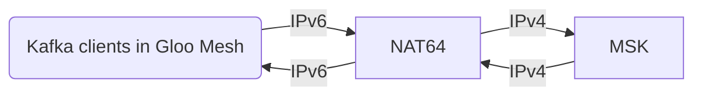

# Kafka Client Configuration for Next-gen environment (Lab2/Dev2, IPv6)

As of July 2023, the Amazon Managed Streaming for Apache Kafka (MSK) is deployed in worker1-east Lab2 environment.
MSK does not support IPv6 for now but the GlooMesh forces the IPv6 communication for now.
Details are in [MSK Kafka IPv6 TLS origination issue](https://wovencity.monday.com/docs/4679027138).

As a workaround for this, the private NAT64 gateway is deployed. The simple communication flow is as follows:

To make kafka-clients talk in IPv6 manner, check the following based on the language you use. (The sample codes in [kafka-client-samples](https://github.tri-ad.tech/kohei-watanabe/kafka-client-samples) )

- [x] Java
    - Needs to set the environment variable `JAVA_OPTS` as `-Djava.net.preferIPv6Addresses=true`
- [x] Golang
- [x] Node.js
    - The Node.js version must be 17.0.0 or above
        - [Node.js finally prefers IPv6 addresses over IPv4 in its latest release : r/ipv6](https://www.reddit.com/r/ipv6/comments/qbr8jc/nodejs_finally_prefers_ipv6_addresses_over_ipv4/)
- [x] Rust
- [x] Python

If your application has some issues, please reach out to the Agora Orchestration Team (`@agora-data-orchestration`) via the
[Agora AMA Chanel](https://woven-by-toyota.slack.com/archives/C02CVJLTMJ7).
