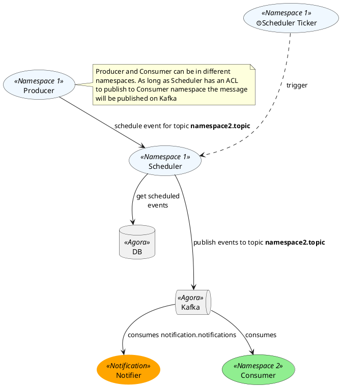
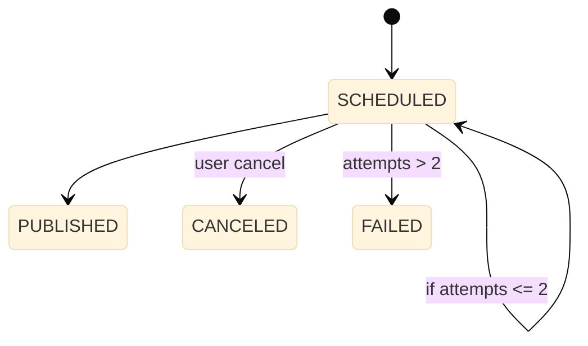

# [DEPRECATED] Get started

!!!Warning 
    Scheduler is currently on a sunset path and will be removed soon!

In order to keep the event bus secure each team willing to use a scheduler will need to have a deployment in its own namespace, ideally the one with the services using the scheduler API. This is to avoid that a service without permissions to publish on a specific Kafka topic uses a "core" Scheduler to bypass the ACLs.

Below, an overview of the interaction between the Scheduler system and the services in its namespace with the event bus. For sake of clarity we are using the **calendar** namespace.



## Quickstart

!!! Installation
    If your scheduler is not deployed in the destination namespace, please check the [section](#deploy-scheduler-to-a-namespace) below and complete those steps first.

The example below is a complete main using the scheduler client that wraps the [stub generated automatically](../internal/lib_generated#generate-code-from-open-api-definition) from the Open API definition, specifically for Go. It's possible to generate other language specific stubs from the YAML file linked below or use the REST API with your own implementation. The advantage of using this client is that all the logic to prepare the payloads for the calls is already implemented in the `NewSchedulableEvent` and `Schedule` functions.

!!!Warning
    While generating your own client from the Open API or using the REST API remember that marshalling and right encoding are not handled automatically and some fields like `payload` might require base64 encoding of the marshalled `byte[]` (see how it's done in the [Test with a Client](#test-with-a-client) section).

[:fontawesome-brands-golang: Example](https://github.tri-ad.tech/cityos-platform/scheduler-test/blob/main/main.go) · 
[:fontawesome-brands-golang: Client](https://github.tri-ad.tech/cityos-platform/scheduler/blob/main/scheduler.go) · 
[:octicons-file-code-24: API YAML](https://github.com/wp-wcm/city/blob/main/ns/scheduler/api/api.yaml) 

```go
package main

import (
	"context"
	"log"
	"os"
	"time"

	client "github.tri-ad.tech/cityos-platform/scheduler"
)

func main() {

	log.SetPrefix("[MAIN] ")

    data := map[string]interface{}
    data["total"] = 100

    n := &notification.Notification{
    	Recipient: &notification.Recipient{
    		ID:       "2089ad58-857e-4b31-a647-b78432c129d2", // CityOS User ID from Keycloak
    		Provider: notification.Email,
    	},
    	Data: data,
    	Ref: &notification.TemplateRef{
    		ID:         "bill.txt"
    	},
    }

	scheduler := client.NewSchedulerClient(os.Getenv("SCHEDULER_HOST"))
	evt, err := client.NewSchedulableEvent(nil, os.Getenv("DESTINATION_TOPIC"),
		time.Now().Add(10*time.Minute),
		"Asia/Tokyo",
		n,
	)

	if err != nil {
		panic(err)
	}
	log.Println("Event created:", evt.Id)

	if err := scheduler.Schedule(context.Background(), evt); err != nil {
		panic(err)
	}

	// Let's wait to see the progress update
	time.Sleep(10 * time.Second)

	eStatus, err := scheduler.EventStatusById(context.Background(), evt.Id)
	if err != nil {
		panic(err)
	}
	log.Println(eStatus.Id, ":", *eStatus.Status)
	log.Println("Goodbye!")
}
```  

Of course, in order to schedule a different payload we'll need to replace the notification struct with any other structure the consumers listening to the destination topic are able to parse and a map populated to match the template referenced in the `Ref` field. 
Read more in the dedicated [section](../notification/providers) of the notifier documentation.

## Deploy Scheduler to a namespace

In order to add the scheduler make a new PR in your repository (be sure it's configured to reconcile using FluxCD) and add a <your-namespace> folder if not present yet. This folder might contain other YAML files for other service already initializing a *namespace*, *kafka certificates* and *entries* and the *kustomization*, therefore before pasting the files from the [template scheduler folder](https://github.com/wp-wcm/city/tree/main/infrastructure/k8s/learning/scheduler) make sure they won't overlap and conflict.

!!! Warning
    The template files contain a standard `scheduler` namespace, remember to change it to your namespace in all the YAML and set the common name to <namespace>.woven-city.global. More about namespace in the related [Technical Note](https://docs.google.com/document/d/141KGuu2LfGM1gUEzV9izPNxBxmBvm8-EVsFGqerF3p8/edit#heading=h.5qm13wuvtiz9).

Now you should have something like

```shell
infra/
     k8s/
         <cluster>/
                <namespace>/ 
                        _namespace.yaml
                        ca.yaml # the file with Kafka CA pulic certificate
                        cert.yaml # the namespace related scheduler certificate
                        kafka-entries.yaml
                        kustomization.yaml
                        postgresql.yaml
                        scheduler.yaml
                        service.yaml
```

Once a PR contaning these changes will be merged the scheduler service will be added to the selected namespace together with a dedicated postgres database instance.

!!! Note
    If a postgresql instance is already present in the namespace, change the scheduler db YAML and append the entry to the `kustomization.yaml`.
  
### Configure Kafka ACL to access a specific topic

Once the infrastructure part is set, we'll need to configure the correct ACL to allow the scheduler to send a message to a specific topic in another namespace. This is needed because Kafka restricts inter namespaces access so that a scheduler in `namespace1` cannot publish a message to `namespace2-topic` unless explicitly allowed. Follow the instructions on the [guide](../../kafka-operator) to self service topics on Kafka.

At this point you should be able to schedule events and see them delivered to the consumer group listening on the specified topic.
  

### Test with a client

Once the service is all set, we can try to test using a client. This is an example using REST API without any wrapper or client-side autogenerated code:

=== "Go"
    ```go
    package main

    import (
    "fmt"
    "strings"
    "net/http"
    "io/ioutil"
    )

    func main() {

        data := map[string]interface{}
        data["total"] = 100

        n := &notification.Notification{
            ID: "b78432c129d2-2089ad58-857e-4b31-a647", // the notification ID.
            Recipient: &notification.Recipient{
                ID:       "2089ad58-857e-4b31-a647-b78432c129d2", // CityOS User ID from Keycloak
                Provider: notification.Email,
            },
            Data: data,
            Ref: &notification.TemplateRef{
                ID:         "bill.txt"
            },
        }

        url := "<scheduler-url>/events"
        method := "POST"

        bytes,_:=json.Marshal(n)
        b64Payload := b64.StdEncoding.EncodeToString(bytes)

        payload := strings.NewReader(fmt.Sprintf(`{
            "id": "8b82e04b-7764-430b-bc49-0393235f8927", // the event ID
            "scheduledAt": "2022-03-09T17:43:00Z",
            "timezone":"Asia/Tokyo",
            "payload": "%v",
            "destinationTopic": "notification.notifications"
        }`, b64Payload)

        client := &http.Client {
        }
        req, err := http.NewRequest(method, url, payload)

        if err != nil {
            fmt.Println(err)
            return
        }
        req.Header.Add("Content-Type", "application/json")

        res, err := client.Do(req)
        if err != nil {
            fmt.Println(err)
            return
        }
        defer res.Body.Close()

        body, err := ioutil.ReadAll(res.Body)
        if err != nil {
            fmt.Println(err)
            return
        }
        fmt.Println(string(body))
    }
    ```
=== "JS"
    ```js
    var request = require('request');
    var options = {
    'method': 'POST',
    'url': 'localhost:80/events',
    'headers': {
        'Content-Type': 'application/json'
    },

    const pts = {"Greetings":"Hello there!"}

    body: JSON.stringify({
        "id": "8b82e04b-7764-430b-bc49-0393235f8927",
        "scheduledAt": "2022-03-09T17:43:00Z",
        "timezone": "Asia/Tokyo",
        "payload": btoa(JSON.stringify(pts)), // base64 encoding of the byte[]
        "destinationTopic": "mynamespace-mytopic"
    })

    };
    request(options, function (error, response) {
    if (error) throw new Error(error);
    console.log(response.body);
    });

    ```
=== "Kubectl"
    
    Assuming you have `kubectl` privileges

    ```shell
    kubectl exec -n scheduler scheduler-deploy-<:tag> -c curler -- curl --location --request POST 'localhost:80/events' \

    --header 'Content-Type: application/json' \

    --data-raw '{
        "id": "7642e04b-7764-430b-bc49-0393235f8948",
        "scheduledAt": "2022-03-09T17:43:00Z",
        "timezone":"Asia/Tokyo",
        "payload": "eyJpZCI...n19",
        "destinationTopic": "notification.notifications"
    }'
    ```
!!! Hint
    To create a valid test payload please refer to the [playground snippet](https://go.dev/play/p/MP2n5MHUAZO); in general for each language you'll need to Marshal your structure and convert the `byte[]` to base64 before calling the REST API.

### EventStatus State machine

A scheduled event can be in 4 different statuses as displayed below. 



To avoid race conditions and inconsistencies the service using scheduler will need to use different ID to reschedule an event canceled or failed because it's not allowed to switch between these statuses or back to scheduled as this could cause multiple publishing or some deadlock.

!!!Note
    The `PUBLISHED` status doesn't correspond to an event being published to the outside world, like in the case of Notifications, but to being published to the Event Bus.

## Recurring Events
A recurring event is an event that repeats as defined by a schedule. A schedule is defined by a start date, an end date, and a recurrence rule pattern. For example, sending an email every weekday at 10 am for a year is a recurring event. Scheduler supports creating, reading, updating, and canceling recurring events.

### Create a recurring event
Creating a recurring event is similar to creating an event, by specifying a recurrence rule, scheduled at, and ends at.
```shell
curl --location --request POST 'http://localhost:80/events' \--header 'Content-Type: application/json' \
--data-raw '{
  "id": "318849b6-39b9-47fb-8b23-4fd43089f03f",
  "scheduledAt": "2025-04-15T10:00:00",
  "timezone": "Asia/Tokyo",
  "payload": "aGVsbG8gd29ybGQK",
  "destinationTopic": "a-destination-topic",
  "endsAt": "2025-04-15T10:30:00",
  "recurrence": "RRULE:FREQ=DAILY;COUNT=10\nEXDATE;VALUE=DATE-TIME:20250423T010000Z\nRDATE;VALUE=DATE-TIME:20250430T010000Z"
}'
```
Note that the recurrence rule pattern specifies the recurrence pattern where RRULE, RDATE, and EXDATE properties must be specified as defined by [RFC 5545](https://datatracker.ietf.org/doc/html/rfc5545).

### Read a recurring event
The recurring event status can be read as below:
```shell
curl --location --request GET 'http://localhost:80/events/318849b6-39b9-47fb-8b23-4fd43089f03f/status'
```

### Read instances associated with a recurring event
The individual instances associated with a recurring event can be retrieved as below:
```shell
curl --location --request GET 'http://localhost:80/events/318849b6-39b9-47fb-8b23-4fd43089f03f/instances'
```
The event Id for individual instances follows the format:

```shell
[Recurring Event ID]_[Individual event's occurrence timestamp as defined by RFC5545]
```

### Update recurring event
Updating a recurring event can be one of three cases as follows:

#### Update a single instance in a recurring event
When a specific instance associated with a recurring event needs to be updated, the client application would first retrieve that instance and then update it by sending PUT request to the instance.
```shell
curl --location --request PUT 'http://localhost:80/events/318849b6-39b9-47fb-8b23-4fd43089f03f_20250424T010000Z' \
--header 'Content-Type: application/json' \
--data-raw '{"destinationTopic":"new-topic-for-24th","endsAt":"2025-04-24T10:30:00","id":"318849b6-39b9-47fb-8b23-4fd43089f03f_20250424T010000Z","occurrence":8,"payload":"aGVsbG8gd29ybGQK","recurrenceId":"318849b6-39b9-47fb-8b23-4fd43089f03f","scheduledAt":"2025-04-24T10:00:00","timezone":"Asia/Tokyo","retry":0,"status":"SCHEDULED"}'
```

The scheduler wouldn't persist all individual instances associated with the recurring event. Instead, it persists only the recurring event and exception events. An exception event is an instance of a recurring event, that deviates from the recurring event for one or more properties. When a single instance of a recurring event is updated, an exception event is created for that instance.

#### Update a recurring event following a specific date
When the recurring event needs to be updated following a specific date, this is a two-step process.
In step 1, the original recurring event should be updated to trim the number of instances by sending PUT request to the recurring event instance.
```shell
curl --location --request PUT 'http://localhost:80/events/318849b6-39b9-47fb-8b23-4fd43089f03f' \
--header 'Content-Type: application/json' \
--data-raw '{"destinationTopic":"a-destination-topic","endsAt":"2025-04-15T10:30:00","id":"318849b6-39b9-47fb-8b23-4fd43089f03f","payload":"aGVsbG8gd29ybGQK","recurrence":"RRULE:FREQ=DAILY;COUNT=5","scheduledAt":"2025-04-15T10:00:00","timezone":"Asia/Tokyo","retry":0,"status":"SCHEDULED"}'
```

In step 2, create a new recurring event with all the data the same as the original event, except for the required changes
```shell
curl --location --request POST 'http://localhost:80/events' \--header 'Content-Type: application/json' \
--data-raw '{
  "id": "318849b6-39b9-47fb-8b23-4fd43089f03a",
  "scheduledAt": "2025-04-20T10:00:00",
  "timezone": "Asia/Tokyo",
  "payload": "aGVsbG8gd29ybGQK",
  "destinationTopic": "a-different-topic-from-20205-04-20",
  "endsAt": "2025-04-20T10:30:00",
  "recurrence": "RRULE:FREQ=DAILY;COUNT=5\nEXDATE;VALUE=DATE-TIME:20250423T010000Z\nRDATE;VALUE=DATE-TIME:20250430T010000Z"
}'
```

Note that when the recurrence or scheduledAt is updated, all the exception events whose original occurrences are no longer part of the updated recurring event will be deleted.

#### Update all events in a recurring event
All the events in a recurring event can be updated by sending a PUT request to the recurring event.
```shell
curl --location --request PUT 'http://localhost:80/events/318849b6-39b9-47fb-8b23-4fd43089f03a' \
--header 'Content-Type: application/json' \
--data-raw '{"destinationTopic":"send-to-a-different-topic","endsAt":"2025-04-20T10:30:00","id":"318849b6-39b9-47fb-8b23-4fd43089f03a","payload":"aGVsbG8gd29ybGQK","recurrence":"RRULE:FREQ=DAILY;COUNT=5\nEXDATE;VALUE=DATE-TIME:20250423T010000Z\nRDATE;VALUE=DATE-TIME:20250430T010000Z","scheduledAt":"2025-04-20T10:00:00","timezone":"Asia/Tokyo","retry":0,"status":"SCHEDULED"}'
```

### Cancel a recurring event
Similar to updating a recurring event, canceling a recurring event can be one of the cases as follows:

#### Cancel a single instance associated with a recurring event
To cancel a single instance associated with a recurring event, send a PATCH request to the instance.
```shell
curl --location --request PATCH 'http://localhost:80/events/318849b6-39b9-47fb-8b23-4fd43089f03f_20250416T010000Z/cancel'
```

#### Cancel a recurring event following a specific date
To cancel events associated with a recurring event following a specific date, trim the recurring event by sending a PUT request to the recurring event.
```shell
curl --location --request PUT 'http://localhost:80/events/318849b6-39b9-47fb-8b23-4fd43089f03f' \
--header 'Content-Type: application/json' \
--data-raw '{"destinationTopic":"a-destination-topic","endsAt":"2025-04-15T10:30:00","id":"318849b6-39b9-47fb-8b23-4fd43089f03f","payload":"aGVsbG8gd29ybGQK","recurrence":"RRULE:FREQ=DAILY;COUNT=3","scheduledAt":"2025-04-15T10:00:00","timezone":"Asia/Tokyo","retry":0,"status":"SCHEDULED"}'
```

#### Cancel all events in a recurring event
To cancel a recurring event, send a PATCH request to the recurring event.
```shell
curl --location --request PATCH 'http://localhost:80/events/318849b6-39b9-47fb-8b23-4fd43089f03f/cancel'
```


For more details about recurring events implementation and calendar-specific use cases, please refer [go/tn-0136](https://docs.google.com/document/d/1ZlqGknkQykA6ThHoMfc6SEpYxqIqmNGma33aBfP1_lU/edit#).
