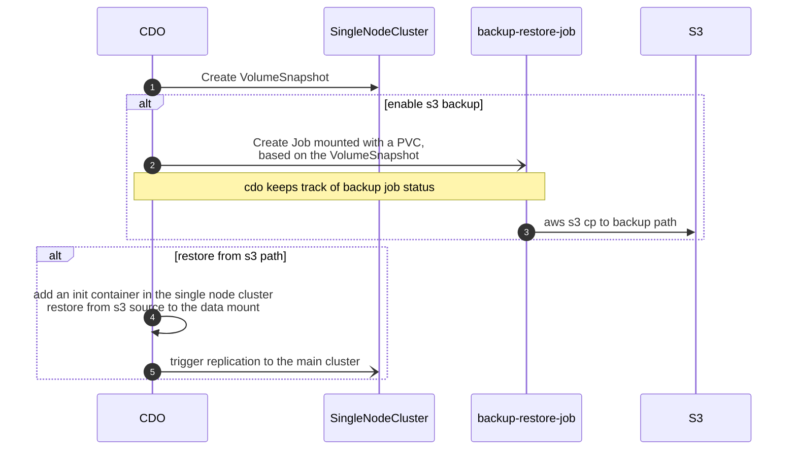

```mermaid
sequenceDiagram
    autonumber
    participant cdo as CDO
    participant s as SingleNodeCluster
    participant j as backup-restore-job
    participant s3 as S3

    %% rect rgb(191, 223, 255)
    cdo->>s: Create VolumeSnapshot
    alt enable s3 backup
    cdo-)j: Create Job mounted with a PVC,<br> based on the VolumeSnapshot
    Note over cdo,j: cdo keeps track of backup job status
    j->>s3: aws s3 cp to backup path
    %% end
    end

    alt restore from s3 path
    %% rect rgb(191, 223, 255)
    cdo->>cdo: add an init container in the single node cluster<br>restore from s3 source to the data mount
    cdo-)s: trigger replication to the main cluster
    %% end
    end
```
