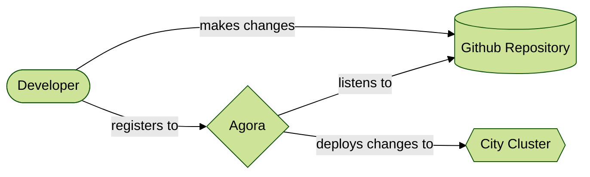

# Welcome

This tutorial is meant to help you learn how you, a developer on a service
team, can get your code to deploy onto the Agora platform. By going through
this tutorial you should be able to learn about the following

* How Agora platforms developers and their code
* How to deploy an example application provided [here](https://github.com/wp-wcm/city/tree/main/ns/tutorial/agora-deployment-101/clock)
* How to set up your Kubernetes manifests for your application
* How to set up your application via the service mesh
* How to set up your code to be automatically updated via Agora's automation
  tools

## Pre-requisites

All steps are presuming you are following along from the base of the
[source](https://github.com/wp-wcm/city/tree/main/ns/tutorial/agora-deployment-101). You are free to use the files here as you wish
but for some commands you might need to modify your commands.

!!! Note
    **Recommended**

    To understand this tutorial better, it might be helpful to refer to the
    **Minikube-101 Tutorial** for details on how to use Kubernetes to set up
    containers and to deploy them in a Kubernetes cluster. This tutorial does
    not require you to complete Minikube-101 to be able to follow this one.

## Introduction to Agora

Agora is a platform that allows developers to focus on the thing they care
about most of all: their application. For most developers, trying to worry
about the following adds additional complexity and time:

* Security
  * Having to keep our code safe, and to prevent unauthorized access
* Discoverability
  * How does someone find out about our application? How do they reach it?
* Observability
  * How do we know if our code is working? What do we do to see traffic to our
    application?
* Availability
  * How do we make sure our application is available? What happens when we
    update our application?
* Privacy
  * How do we handle private or sensitive data?
* Interoperability
  * How do we communicate with other services or applications?

Agora helps us as a developer by trying to make these things as painless and
easy as possible. Agora accomplishes this by doing a lot of operational logic
behind the scenes that help us, without us having to ask for it. This allows
up to focus on our code and improving it.

## How it works

From the perspective of a service developer, Agora works by the following
high level flow:

* A Developer generates a [container image](https://www.docker.com/resources/what-container/)
  of their application. This application can be just about anything from a web
  server to a machine learning engine.
* When the image is ready to be put out to the cloud, a developer will ask to
  be made a **tenant** of Agora.
* As a tenant, Agora will then listen for any changes you make to your code.
  Agora will collect these changes and make sure that anything you update is
  sent to the cloud
* Then, you can start to set up your desired state for your application,
  declared programmatically via manifests you retain control of.
