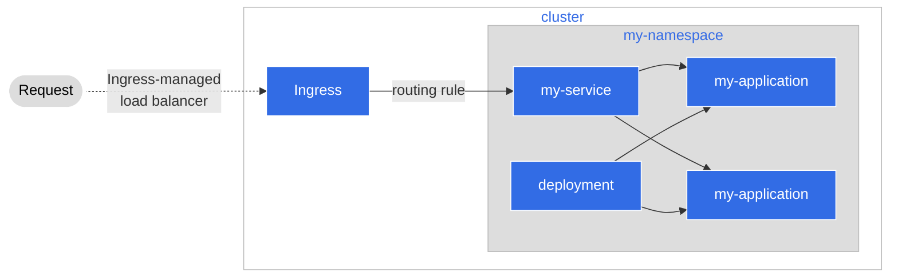

# Step 1: Setting up the Application

First, we'll go over the steps on how to set up the application that we'll be
using for onboarding to Agora

## The application we are using

For this tutorial, the Agora team has built and pushed an application to
Artifactory. We will use this application to demonstrate how one deploys an
image to Agora. The application is a simple clock with 2 primary APIs:

* Getting the current time per the server where the application is hosted
  (in our context, Japan)
* Getting the current time per the provided
  [IANA Time Zone](https://en.wikipedia.org/wiki/List_of_tz_database_time_zones)

This is all provided for us right now; later we will learn how we can modify
this code and change it, but for now this works just fine so let's use it.

## Kubernetes

For our deployment to the cloud we are going to use Kubernetes to help us.
Kubernetes will set up our service, our deployment, and our namespace to hold
our resources for our application.

### Why Kubernetes

In brief, [Kubernetes](https://kubernetes.io/docs/concepts/overview/what-is-kubernetes/)
is a container orchestration tool that is used to help us manage our
application in a variety of ways such as:

* Service Discovery
* Storage Management and Orchestration
* Automate application rollout/rollback
* Configuration Management
* "Self-healing" where, if our application fails it can be brought back up

Kubernetes helps us as developers focus more on our application and maximizing
our time with it, allowing us to spend more time on developing and updating our
code and less time worrying about how to get it up and running in your
production environment.

### What we are deploying

Kubernetes allows us to deploy various resources to a cluster in a cloud
environment. For our application we only need three:

* Deployment
  * A resource that tells Kubernetes what application to run, how many copies
    to run, and configuration for it
* Service
  * A way to collect and abstract multiple instances of our application to be
    hosted under one common name
* Namespace
  * A way to organize our resources in a logical manner. Anything labeled with
    our namespace can be easily tracked and searched, as well as group our
    application and its resources under a common space



## Deploying our Application

Our deployment is done in Agora via YAML formatted files also known as
**Manifests**. With these manifests, we can declare our application and the
infrastructure we desire around it. This allows us to just tell Agora how we
want our application to run, and leave the work of the actual deployment to
Agora itself.

### Setting up the Namespace

The first thing we'll set up is our **Namespace** declaration. Let's take a look
at the manifest we have. For this tutorial, under our project root, we have a
directory named `kubernetes` that stores all our manifests. Let's examine
`_namespace.yaml` file

```yaml
# This file creates a Namespace (https://kubernetes.io/docs/concepts/overview/working-with-objects/namespaces/)
# A namespace is a way to organize your resources in Kubernetes
apiVersion: v1
kind: Namespace
metadata:
  # You should change this to a name that makes sense for you
  name: my-namespace
  # We'll add two labels to the metadata
  # Make sure to change 'my-namespace' in both places to the name you're using
  labels:
    name: my-namespace
    istio.io/rev: default
```

!!! Note
    **What are those labels?**

    Our `_namespace.yaml` file has two labels: `name` and something
    called `istio.io`. The name label is similar to a namespace: its there for
    us to organize and identify files for us in meaningful way. The other label
    is for something known as **Istio** which is an abstraction tool we use for
    something known as a **service-mesh**. We will go over these in _Step 2_
    but for now, we don't need to worry about this.

First we'll change `my-namespace` to reflect the namespace we would like our
application to live in. This allows us to make a namespace that makes sense for
us and is meaningful. Something simple should work for this like our project
name, our team name, or what the application does (robots, money, etc).

### Setting up the Service

Next, let's take a look at the `service.yaml` manifest:

```yaml
# This file creates a Service (https://kubernetes.io/docs/concepts/services-networking/service/)
# Services are abstractions that can help expose sets of pods under a single service name
apiVersion: v1
kind: Service
metadata:
  name: my-service
  # This metadata field should match what you put in the namespace YAML file
  namespace: my-namespace
spec:
  # This specifies that we would like the Service to work like a Load Balancer for us. When we have multiple copies of
  # our application, we can then use load balancing techniques (round-robin by default) to distribute workloads
  type: LoadBalancer
  # This is known as a Label Selector (https://kubernetes.io/docs/concepts/overview/working-with-objects/labels/#label-selectors) which helps
  # to organize your resources further. For now, we can just name this to reflect the same name we have in our 'metadata' field in this file
  selector:
    app: my-service
  # Here, we can tell Kubernetes to open up a specified port for the service to listen for incoming traffic on.
  # As a beginner tip, you can make this reflect the same port you have in your deployment YAML file to make sure
  # everything is routed in a similar manner. Because Isito has certain requirements, our port's 'name' can only
  # start with 'http' or 'tcp' so please be mindful of this if you change the name.
  ports:
    - port: 8080
      name: http
      protocol: TCP
```

Let's replace `my-service` with a name that makes sense both at `name` and
`app`; we want to do this because Kubernetes will use these names to help us
configure our service with our pods and make sure everything can communicate
correctly.

### Setting up the Deployment

Finally, let's take a look at our deployment manifest, `deployment.yaml`

```yaml
# This file creates a Deployment (https://kubernetes.io/docs/concepts/workloads/controllers/deployment/)
# Deployments are one of many workload resources you can use to deploy your application to a cluster
apiVersion: apps/v1
kind: Deployment
metadata:
  labels:
    # This label should match what you put in the service YAML file
    app: my-service
  name: my-deployment
  # This label should match what you put in the namespace YAML file
  namespace: my-namespace
spec:
  # This sets how many copies of your application you want, for now we can leave this at one
  replicas: 1
  selector:
    # This is known as a Label Selector (https://kubernetes.io/docs/concepts/overview/working-with-objects/labels/#label-selectors) which helps
    # to organize your resources further. For now, we can just name this to reflect the same name we have in our service YAML file
    matchLabels:
      app: my-service
  template:
    metadata:
      labels:
        app: my-service
    spec:
      containers:
        # This is the application we want to deploy. Kubernetes will fetch the application from the Artifactory and then put it inside a container for us
        - image: docker.artifactory-ha.tri-ad.tech/wcm-cityos/tutorials/agora-deployment-101:main-afb3a12f-3520
          name: my-image
          # Here, we can tell Kubernetes to open up any specified ports that the application uses
          # For our example image the API is listening at port 8080, so we'll open it up for traffic
          ports:
            - containerPort: 8080
              name: http
              protocol: TCP
          # These are known as Liveness Probes (https://kubernetes.io/docs/tasks/configure-pod-container/configure-liveness-readiness-startup-probes/)
          # Kubernetes can use these to know when your container is healthy, when it needs to be temporarily shut down, or when it needs to be replaced
          # This is a 'liveness' probe: when the pod is not responding to this probe, Kubernetes determines that there is something wrong and will terminate
          # the pod and create a new one
          livenessProbe:
            httpGet:
              path: /live
              port: 8080
            periodSeconds: 30
          # This is known as a 'readiness' probe. Sometimes an application pod can be busy with requests and might not
          # be able to serve new traffic temporarily. When this probe fails. Kubernetes will temporarily stop sending traffic
          # to the pod until this probe succeeds again
          readinessProbe:
            httpGet:
              path: /ready
              port: 8080
            periodSeconds: 10
          # This is known as a 'startup' probe. Startup probes can help slower containers from being falsely defined as 'unready' by Kubernetes
          # This probe when defined in your manifest will be checked first and only when it succeeds will Kubernetes start liveness and readiness probes
          # For our example, our liveness endpoint will work just fine, so we can re-use the same endpoint here
          startupProbe:
            httpGet:
              path: /live
              port: 8080
          # You can set the environment for your container here. For our example, we have a HOST and a PORT environment variable to read
          env:
            - name: HOST
              value: "0.0.0.0"
            - name: PORT
              value: "8080"
```

For this to work correctly we should do a few things:

* We should replace all instances of `my-service` with the name we put in our
  `service.yaml` manifest. This will allow Kubernetes to set up all the
   configuration correctly
* We should replace all instances of `my-namespace` with the name we put in our
  `_namespace.yaml` manifest for the same reasons
* We should replace `my-deployment` with a name that makes sense for us or
  something we can identify easily ("my-clock-service-deployment" for example)

## Next Steps

At this point we should have our manifests ready to go that will help us deploy
our application to Kubernetes. The next step is working with Agora's tools that
help us deploy these files. The first one of these we'll go over is the
**Service Mesh** and how Agora will help us deploy via a tool called
**CityService**
