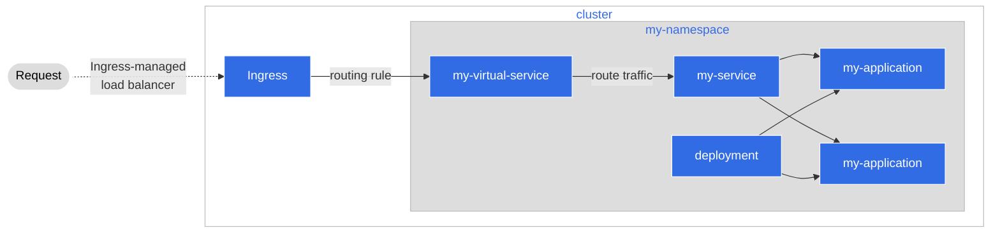

# Step 2: Integrate with Agora and the Service Mesh (Istio)

In this section we'll go over the use of the Service Mesh, why we want to use
it, and how we can use Agora to deploy our service to the cluster and make use
of it.

## What is a Service Mesh

A service mesh is an abstraction that helps applications separate logic that is
related to infrastructure from logic that is related to their application's
operation. Prior to the ideas that brought up a service mesh, applications
would have various code that had to handle the following scenarios:

* How to discover other services inside the cluster
* How to authenticate traffic
* How to provide observability metrics, like log messages for example

All pods were doing the same exact pattern to the point that a software pattern
was born: **sidecars**. A Sidecar is a container like your application, that only
handles the logic situations above, while your application is allowed to just
manage the main operational logic.


With a Sidecar we can now have applications focus more on their operational
logic and less about peripheral tasks that can be handled by the dedicated code
in the sidecar. From here we were able to expand out to a concept of a
**Service Mesh**

The tool we use for our Service Mesh is [**Istio**](https://istio.io/). With Istio,
we can handle and abstract the deployment of these sidecars and have them
managed in a declarative and abstract way.

### How Istio Works


When we deploy to Agora, via our manifests, Istio will generate a sidecar for
us automatically. This sidecar is used to manage all traffic in and out of our
service application, allowing Istio to manage certain things without us needing
to tell it to such as:

* Traffic Routing
  * The sidecar Istio makes will enable the application to be discovered per
   our manifest declarations
* Authentication
  * Istio can authenticate for us with mTLS authentication. It does this by
    way of generating a x509 certificate for each application inside the mesh
    and then having the certificate on hand inside the sidecar it generates
* Observability
  * Istio can help us with logging metrics and traces of our application
    that we can visualize

## How to Use the Service Mesh

### Enable Istio for our Application

In Agora, Istio is already provided for us. From our perspective we only
need to declare to Istio that we would like it to help hook our application
into the mesh. Refer back to our existing `_namespace.yaml` file:

```yaml
# This file creates a Namespace (https://kubernetes.io/docs/concepts/overview/working-with-objects/namespaces/)
# A namespace is a way to organize your resources in Kubernetes
# For a namespace we only need to provide a name under the 'metadata' portion of our manifest
# You should label this in a way that makes sense for you
apiVersion: v1
kind: Namespace
metadata:
  name: my-namespace
  # We'll add two labels to the metadata
  # Make sure to change 'my-namespace' in both places to the name you're using
  labels:
    name: my-namespace
    istio.io/rev: default
```

The `labels` part of our manifest tells Istio that we would like it to watch
resources in this namespace. From then on, any resource we deploy to the
namespace, such as our application, Istio will automatically create a sidecar
for us without us having to do anything

### Direct Traffic via a Virtual Service

In Istio, we can handle traffic routing with a resource known as a
[**Virtual Service**](https://istio.io/latest/docs/reference/config/networking/virtual-service/).
Using a Virtual Service, we can declare the URL of our application, and where
said requests can go inside the system.



!!! Note

    For this tutorial, we'll be using a Virtual Service in a way that seems to
    mimic our Service. You might ask then "what is the point?" but keep in mind
    that we can do a few things more with a Virtual Service. With a Virtual
    Service, we can have muiltiple services split via URL paths, have certain
    paths be redirected for authorization before being allowed through, set up
    services for a blue-green/canary deployment, and much more. You can do
    _some_ of these things with a Service, but you cannot do _all_ of them, and
    some would be harder to implement.

To create our Virtual Service we can make a YAML akin to the following

```yaml
apiVersion: networking.istio.io/v1beta1
kind: VirtualService
metadata:
  # This should reflect the same name we put in our 'namespace.yaml'
  namespace: my-namespace
  name: my-virtual-service
spec:
  hosts:
    # This is telling Istio the host URL. What this will do is tell Istio
    # that we would like our service exposed to traffic from the 'outside world'.
    # This will allow us to hit our application from outside the cluster.
    # We should replace 'my-namespace' with the name in our 'namespace.yaml'
    - my-namespace.cityos-dev.woven-planet.tech
  gateways:
    # This tells Istio that we have an ingress gateway for traffic so just use
    # that, and it's configuration for traffic
    - city-ingress/ingressgateway
  # This is a match rule for Istio. In Istio you can route traffic in many
  # ways, but our application just needs a simple setup. We can ask Istio to route any traffic
  # coming from `my-namespace.cityos-dev.woven-planet.tech` to our service, which will then handle the request.
  # Istio can then route the traffic to the Kubernetes service we set up, using the Fully Qualified Domain Name (FQDN)
  # of the service inside the cluster, along with the listening port we have set up per our `service.yaml` manifest
  http:
    - match:
        - uri:
            prefix: /
      route:
        - destination:
            port:
              number: 8080
            host: my-service.my-namespace.svc.cluster.local
```

## The Agora CityService

Luckily for us, we don't need to do the Virtual Service ourselves. With Agora,
we can use a simpler manifest to get the same effect: [**CityService**](https://developer.woven-city.toyota/docs/default/component/city-service-operator-service).
CityService is a Custom Resource that Agora provides, that works similarly to a
Virtual Service with some additional configuration options you can use. For our
purposes we will take advantage of the Virtual Service that we can create via a
CityService

Some advantages of using the CityService are:

* You can make your Virtual Service in an easier manner; having to do certain
  manifests with Istio can be very error-prone due to how sensitive and exact
  your manifests need to be. CityService handles that complexity for you and
  makes it easier to declare what you need.
* You can make additional configurations via a CityService. On top of making
  Virtual Services, you can declare Service Entries, Authorization Policies,
  and other Custom Resources that are defined by Istio. Using the CityService
  these things are handled for you in one manifest rather than needing
  multiple manifests.

Under the project root, look under `service-mesh` and let' s look at `city-service.yaml`

```yaml
apiVersion: woven-city.global/v1alpha3
kind: CityService
metadata:
  name: my-city-service
  # This should reflect the same name we put in our 'namespace.yaml'
  namespace: my-namespace
spec:
  # This is the FQDN that we would put in a VirtualService manifest
  # Make sure to change 'my-namespace' to reflect the same name we put in our 'namespace.yaml'
  host: my-namespace.cityos-dev.woven-planet.tech
  paths:
    /time:
      # This should reflect the same name we put in our 'service.yaml'
      service: my-service
      auth: false
```

Compared to the Virtual Service definition above, we can perform the same
actions and declarations in a smaller manifest file. Because of this, we
will use this CityService manifest instead of trying to make a Virtual Service

## Next Steps

At this point we have the following:

* The manifests that deploy and set up our code via Kubernetes
* The manifests that set up our code to be hooked into the Agora Service Mesh
  via Istio and the CityService

In the next step we'll get to the actual deployment of our code, and how we
can make it so, whenever we want to make changes instead of having to
redeploy our manifests, Agora can do all the work for us.
