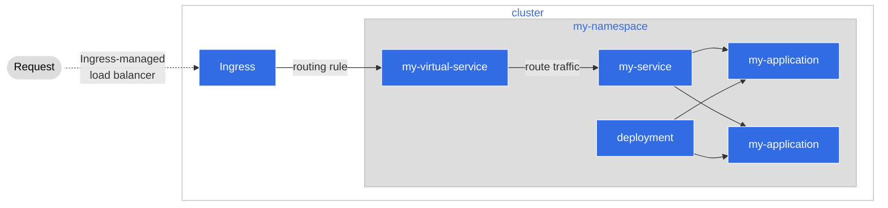

# Step 3: Deployment of our Application

In this step, we have our application files ready to go, so the next step is to
get them deployed for us in a way that can be automated by Agora. Here we'll
deploy our application, using the automated tools provided by Agora.

## How Agora Automates Deployment of Applications

### Benefits of Automation

In software development there are a few common problems that can occur,
especially when first starting to build in a cloud environment. It can be easy
to just "throw everything and see what sticks"; in the process of just getting
our application to a working state, we produce many manifests and resources.
However, this leads to a few key problems:

* **Tracking** 
  * Tracking changes becomes difficult, as we were likely putting so many
    manifests into our infrastructure, and very unlikely to be tracking every
    change, every file, etc.
* **Intent of files**
  * Figuring out the purpose of each file that does end up being needed becomes
    more difficult. What files do we actually need? Why did we need it? What
    purpose or problem does it solve? What happens if we don't have this file?
* **Updating and Deleting**
  * What happens when we remove a file? What if something breaks? By not
    tracking our manifests and keeping a record of them, we accidentally make
    our code and our application more 'brittle'; it's harder to make changes
    because there's a degree of uncertainty of what we actually need and what
    we don't. 
* **Recovery and Reproducibility** 
  * What happens if the worst happens? If the cluster shuts down, or we need to
    move to a different cloud architecture, how do we deploy quickly? Without a
    clear record or history of our infrastructure, this process becomes more 
    manual and potentially error-prone.

For preventing these situations Agora is trying to practice a principle known
as "infrastructure as code", or **IaC**. With IaC, our infrastructure is declared
in our code, in various formats with some tools that can understand these
manifests.

The benefits of using IaC are:

* Infrastructure is easier to keep track of, because there is a file in our
  repo that we can see, and we can see who makes changes, when they were made,
  and other historical data
* Infrastructure is reproducible, because now we have a file that can make the
  same infrastructure over and over again
* Infrastructure is easier to update, because there is a confidence in that
  changes we make are less risky, are more transparent due to being in our code
  , and can be rolled back if needed

Agora as part of this IaC philosophy is using a framework known as **GitOps**
where, the central rule is that **the git repository is the source of truth for
the application**. What this means is that our Git repository holds our
infrastructure manifests alongside our source code for our application. This
allows us to keep track of not only our application but how it's being deployed
to Agora.

### What is Flux

[**Flux**](https://fluxcd.io/) is a GitOps tool that is used by Agora. Flux is
a tool that can help us reconcile our applications state in the cluster with
our state in our Git repository. By allowing Flux certain accesses to our
repository, we can let Flux handle the state of our cluster in an GitOpts
manner that makes it easier to trace, secure, update, and manage Agora for not
just our team but for all application teams.

### How Flux works


Flux sits between our Git repository and the Kubernetes cluster. When we make
changes to our repository, Flux listens for those changes and then, takes
steps to ensure that what is in our repository is reflected in the Kubernetes
cluster. These changes can be various, from updates to our application, to
adding new infrastructure manifests. In Agora, Flux is used in conjunction with
pipelines per a typical software development lifecycle of making a pull
request, having it merged, and then CI/CD pipelines making changes that Flux
will then apply to the cluster without us having to intervene.

## Setting up our Application to be picked up by Flux

=== "If our code is in your own repo"

    For us to leverage Flux inside of our own repository we don't need to do
    much. What we need to do from our side is to become what is known as a
    Tenant. A **Tenant** is a way to tell Flux that there are files it needs to
    listen for changes on. For this step, we should ask for the Agora team to
    help us out. We can do this via a request to [**Agora's AMA on Slack**](https://woven-by-toyota.slack.com/archives/C02CVJLTMJ7)

=== "If our code is inside the Backend Team's repo"

    If our applicaiton code is inside the Backend Team's monorepo, the Backend
    team has their own proceedures for how to use Flux in conjunction with
    Agora. For more details please refer to the
    [**Backend Team's documentation**](https://github.tri-ad.tech/R-D-WCM/wcm-backend-monorepo/tree/main/docs/setup)

## Using Flux in our Application

Once we have ourselves setup as a tenant for Flux, we only need to do a few things
on our side to let Flux handle our deployment for us automatically.

### How to tell Flux what files to listen to

In Agora, Flux knows where to look for files to watch by a tool known as
[**Kustomize**](https://kustomize.io/). With Kustomize we can tell Flux that we
have manifest files that need to be reconciled so that the state of our
application in the Kubernetes cluster reflects what is in our Git repository

First let's take a look at how to use Kustomize. Under `automation` we have the
main file we want to use named `kustomization.yaml` which is a Custom Resource:
**Kustomization**

```yaml
apiVersion: kustomize.config.k8s.io/v1beta1
kind: Kustomization
# Here, we list the files that define our infrastructure
# Whenever we make a change to one of these files or add a new file to listen to,
# Flux will sync the Kubernetes cluster to reflect how our application deployment looks inside our repo.
# Flux will also listen for changes made to the cluster that don't reflect what is listed in our files.
# If there happens to be a change that's not listed here, Flux will "repair" the cluster deployment,
# using our declared deployment here.
resources:
  - ../kubernetes/_namespace.yaml
  - ../kubernetes/deployment.yaml
  - ../kubernetes/service.yaml
  - ../service-mesh/city-service.yaml
```

With this file, Flux will listen for any changes we make to our manifests, and
then automatically apply them to our Kubernetes cluster.

### How to automate new infrastructure

With our Kustomization file in place, whenever we need or want to add new
infrastructure, we just need to add a new entry to our Kustomization file. Flux
will then notice the change to our Kustomization and then apply the updates to
the cluster for us.

```yaml
apiVersion: kustomize.config.k8s.io/v1beta1
kind: Kustomization
# Here, we list the files that define our infrastructure
# Whenever we made a change to one of these files or add a new file to listen to,
# Flux will sync the Kubernetes cluster to reflect how our application deployment looks inside our repo
resources:
  - ../kubernetes/_namespace.yaml
  - ../kubernetes/deployment.yaml
  - ../kubernetes/service.yaml
  - ../service-mesh/city-service.yaml
  # If we had for example a secret we needed to deploy for our service, we
  # would create the manifest and add it here
  # - <path_to_file>/secret.yaml
```

## Optional: Try to deploy your service on a minikube cluster hosted on an EC2 Instance
This section is for **Agora Developers** who are using a local minikube cluster on their EC2 instance. To follow these steps it is required to follow this [README.md](https://github.com/wp-wcm/city/blob/main/infrastructure/k8s/local/README.md).

### Make manifest and apply to the cluster
```shell
$ cd infrastructure/k8s/local/agora-deployment-101
$ mkdir my-manifests
```
You have to make 5 manifests under this directory

my-manifests/kubernetes/_namespace.yaml
```yaml
apiVersion: v1
kind: Namespace
metadata:
  name: agora-deployment-101
  labels:
    name: agora-deployment-101
    istio.io/rev: default
```

my-manifests/kubernetes/deployment.yaml
```yaml
apiVersion: apps/v1
kind: Deployment
metadata:
  labels:
    app: my-clock
  name: my-clock-deployment
  namespace: agora-deployment-101
spec:
  replicas: 2
  selector:
    matchLabels:
      app: my-clock
  template:
    metadata:
      labels:
        app: my-clock
    spec:
      containers:
        - name: my-clock
          image: docker.artifactory-ha.tri-ad.tech/wcm-cityos/tutorials/agora-deployment-101:main-afb3a12f-3520
          ports:
            - containerPort: 8080
              name: http
              protocol: TCP
          env:
            - name: HOST
              value: "0.0.0.0"
            - name: PORT
              value: "8080"
          livenessProbe:
            httpGet:
              path: /health
              port: 8080
            periodSeconds: 30
          readinessProbe:
            httpGet:
              path: /health
              port: 8080
            periodSeconds: 10
          startupProbe:
            httpGet:
              path: /health
              port: 8080
            initialDelaySeconds: 5
```

my-manifests/kubernetes/service.yaml
```yaml
apiVersion: v1
kind: Service
metadata:
  name: my-clock
  namespace: agora-deployment-101
spec:
  selector:
    app: my-clock
  ports:
    - port: 8080
      name: http
      protocol: TCP
```

my-manifests/service-mesh/city-service.yaml
```yaml
apiVersion: woven-city.global/v1alpha3
kind: CityService
metadata:
  name: my-city-service
  namespace: agora-deployment-101
spec:
  paths:
    /:
      pathType: Prefix
      service: my-clock
      auth: false
```

my-manifests/kustomization.yaml
```yaml
apiVersion: kustomize.config.k8s.io/v1beta1
kind: Kustomization
resources:
- ./kubernetes/_namespace.yaml
- ./service-mesh/city-service.yaml
- ./kubernetes/deployment.yaml
- ./kubernetes/service.yaml
```

Flux can notice the change to our Kustomization by adding this to infrastructure/k8s/local/flux-system/kustomizations/services/kustomization.yaml
```yaml
resources:
  - ../../../agora-deployment-101/my-manifests
  # the path to kustomization file of your service
```

After we commit and push these changes to GitHub, Flux will start to apply the change to local cluster. You can check whether the applying finished by following command.

```shell
$ flux get kustomizations
NAME            REVISION                SUSPENDED       READY   MESSAGE
bootstrap       <branch_name>/<commit_id>      False           True    Applied revision: <branch_name>/<commit_id>
cert-manager    <branch_name>/<commit_id>      False           True    Applied revision: <branch_name>/<commit_id>
city-ingress    <branch_name>/<commit_id>      False           True    Applied revision: <branch_name>/<commit_id>
cityos-system   <branch_name>/<commit_id>      False           True    Applied revision: <branch_name>/<commit_id>
id              <branch_name>/<commit_id>      False           True    Applied revision: <branch_name>/<commit_id>
istio           <branch_name>/<commit_id>      False           True    Applied revision: <branch_name>/<commit_id>
observability   <branch_name>/<commit_id>      False           True    Applied revision: <branch_name>/<commit_id>
services        <branch_name>/<commit_id>      False           True    Applied revision: <branch_name>/<commit_id>
system          <branch_name>/<commit_id>      False           True    Applied revision: <branch_name>/<commit_id>
```

### How to Talk to the Virtual Service

We can check the setup of our virtual service by running the following command

```bash
$ kubectl get virtualservices -n agora-deployment-101
NAME                              GATEWAYS                                 HOSTS                                    AGE
egress-virtualservice             ["mesh","city-egress/egressgateway"]     ["pseudo.empty.managed.by.operator"]     17h
ingress-virtualservice            ["city-ingress/ingressgateway","mesh"]   ["agora-deployment-101.woven-city.local"]      17h
ingress-virtualservice-my-clock   ["city-ingress/ingressgateway","mesh"]   ["my-clock.agora-deployment-101","my-clock"]   17h
```

Here, we can see there are two virtual services hooked to our ingress. One is for the ingress itself, but the other is our clock's virtual service. If we can set up traffic to our ingress, the virtual service will re-route traffic to our service, which we'll set up next.



At first, we make tunnel between local and minikube.

```shell
$ minikube tunnel
Status:
        machine: minikube
        pid: 2052322
        route: <cluster-ip-range> -> <minikube-container-ip>
        minikube: Running
        services: [ingressgateway, my-clock]
```

Then, we get external IP address of ingressgateway and set a relationship between the hostname of virtual service and the external IP address to /etc/hosts.

```bash
$ kubectl get services -n city-ingress
NAME             TYPE           CLUSTER-IP      EXTERNAL-IP     PORT(S)                                      AGE
ingressgateway   ClusterIP   <cluster-ip>   <external-ip>   15021:30000/TCP,80:31304/TCP,443:32766/TCP   24h
$ sudo vi /etc/hosts
<external-ip> id.woven-city.local agora-deployment-101.woven-city.local
```

We can access the service by using curl.

```
$ curl -ki https://agora-deployment-101.woven-city.local/time
HTTP/2 200
content-type: text/plain; charset=utf-8
date: Wed, 14 Sep 2022 05:01:42 GMT
content-length: 37
x-envoy-upstream-service-time: 18
server: istio-envoy
```

## Congratulations

At this point you should have accomplished the following things:

* Learned a little about what Agora does for you as a service developer
* Learned about how to set up our deployment via Kubernetes Manifests
* Learned a little about Istio, a Service Mesh and what it does for you as a
  developer
* How to set up our application to be hooked into the service mesh via a
  CityService manifest
* How automation works in Agora and the benefits of using it
* How to take advantage of automation by using Kustomization files
