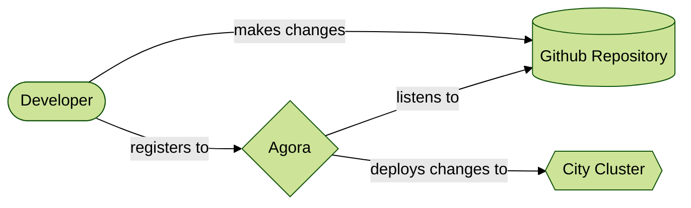

# Welcome

このチュートリアルは、サービスチームの開発者がどのようにコードをAgoraプラットフォームにデプロイするかを学ぶためのものです。このチュートリアルにより以下を学ぶことができます。

* Agoraプラットフォームにおける開発者とコードの扱い
* [こちら](https://github.tri-ad.tech/cityos-platform/cityos/tree/main/ns/tutorial/agora-deployment-101/clock)で提供されているサンプルアプリケーションのデプロイ方法
* アプリケーションの Kubernetes マニフェストのセットアップ方法
* サービスメッシュを利用したアプリケーションのセットアップ方法
* Agora の自動化ツールで自動的に更新されるようにコードをセットアップする方法

## Pre-requisites

すべての手順は、[source](https://github.tri-ad.tech/cityos-platform/cityos/tree/main/ns/tutorial/agora-deployment-101)のベースからたどっていることを前提としています。ここにあるファイルは自由にお使いいただけますが、一部のコマンドについては修正する必要があるかもしれません。

!!! Note
    **Recommended**

    このチュートリアルの理解をより深めたい場合は、コンテナを設定してKubernetesクラスターにデプロイする方法の詳細について記載されている**Minikube-101** を参照することをお勧めします。
    なお、このチュートリアルはMinikube-101を修了していなくても手順に沿って進めることができます。

## Introduction to Agora

Agoraは、開発者が最も関心のあること、つまりアプリケーション開発に集中することを可能にするプラットフォームです。一般的に、多くの開発者は以下のような面倒なことに時間を費やさなければなりません。

* Security
  * コードを安全に保ち、不正なアクセスを防ぐこと。
* Discoverability
  * どのようにして利用者はアプリケーションを見つけ出すことができるのでしょうか？　そしてどのようにしたらアクセスできるのでしょうか？
* Observability
  * コードが実行されているかどうかを確認するにはどうしたらよいでしょうか？　アプリケーションへのトラフィックを確認するにはどうしたらよいでしょうか？
* Availability
  * アプリケーションがいつでも利用可能にするにはどうすればよいでしょうか？アプリケーションを更新すると何が起こるでしょうか？
* Privacy
  * 個人情報や機密情報の取り扱いをどうすればよいでしょうか？
* Interoperability
  * 他のサービスやアプリケーションとの通信はどうするのでしょうか？

Agoraはこれらのことを可能な限り負担なく簡単にすることで、開発者である私たちをサポートしてくれます。Agoraは、私たちが要求しなくても裏で多くの作業を実施してこれらを実現しています。これにより私たちは開発に集中でき、コードを改善することができます。

## How it works

サービス開発者の観点からは、Agoraは以下のようなハイレベルなフローで機能しているように見えます。

* 開発者はアプリケーションの[コンテナイメージ](https://www.docker.com/resources/what-container/)を作成します。ここでいうアプリケーションは、ウェブサーバーから機械学習エンジンまであらゆるものを含みます。
* このイメージをクラウドに公開する準備が整ったら、開発者はアゴラの**テナント**として申請します。
* Agoraはあなたがコードに加えるすべての変更をリスニングします。
  Agoraはこれらの変更を収集し、あなたが更新したものはすべてクラウドにも適用されるようにします。
* その後、アプリケーションに必要なさまざまな状態を設定することができます。これらはアプリケーションの状態を規定するマニフェストを使用してプログラム的に宣言します。
