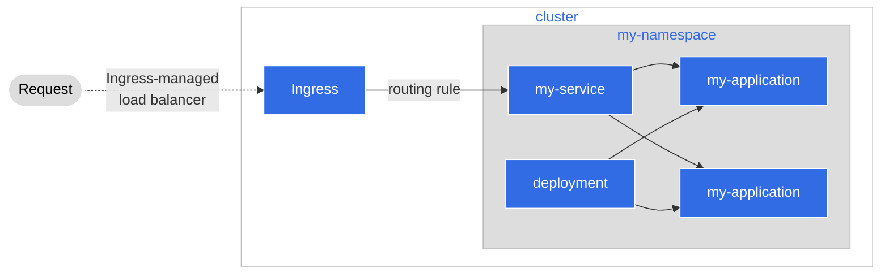

# Step 1: Setting up the Application

まず、Agoraへのオンボーディングに使用するアプリケーションを設定する手順を説明します。

## The application we are using

このチュートリアルのために、Agoraチームは一つのアプリケーションを作成し、Artifactoryにプッシュしています。このアプリケーションを使用して、Agoraへのイメージのデプロイ方法を紹介します。このアプリケーションはシンプルな「時計」で、2つのAPIを備えています。

* アプリケーションがホストされているサーバーごとの現在時刻の取得 (我々の場合はタイムゾーンは日本になります)
* 与えられた[IANA Time Zone](https://en.wikipedia.org/wiki/List_of_tz_database_time_zones)に基づいた現在時刻の取得
  

今私たちに提供されているのはこれだけです。 のちほどこのコードを修正する方法を学びますが、今はこれでうまく機能していますので、このまま利用しましょう。

## Kubernetes

クラウドへのデプロイには、Kubernetesを使用します。
Kubernetesは、アプリケーションのリソースを確保するために、サービス、デプロイメント、そしてネームスペースを設定します。

### Why Kubernetes

簡単に説明すると、 [Kubernetes](https://kubernetes.io/docs/concepts/overview/what-is-kubernetes/) はコンテナ・オーケストレーション・ツールであり、以下のような様々な方法でアプリケーションの管理を容易にするために使用されます：

* サービスディスカバリー
* ストレージ管理およびオーケストレーション
* アプリケーションのロールアウト/ロールバックの自動化
* 構成管理
* アプリケーションに障害が発生しても復旧できる「自己復旧」機能

Kubernetesは、開発者がアプリケーションに集中し、その時間を最大化できるようにサポートしてくれます。その結果、コードの開発や更新に多くの時間を割くことができ、本番環境で稼働させる方法について頭を悩ませる時間を減らすことができます。

### What we are deploying

Kubernetesを使うとクラウド環境のクラスタに様々なリソースをデプロイすることができます。私たちのアプリケーションでは、必要なのは3つだけです。

* Deployment
  * Kubernetesに対して、実行するアプリケーション、実行時のコピー数、構成などを指示するリソース。
* Service
  * アプリケーションの複数のインスタンスをまとめて抽象化し、共通の名前でホストするための方法。
* Namespace
  * リソースを論理的に整理する方法です。ネームスペースでラベル付けされたものは、簡単に追跡や検索ができ、
    アプリケーションとそのリソースを共通のスペースにまとめることもできます。



## Deploying our Application

デプロイは、Agora で**マニフェスト**として知られる YAML フォーマットのファイルを介して行われます。 これらのマニフェストを使用して、アプリケーションとその周辺のソフトウェアに必要なインフラを宣言することができます。これにより、どのようにアプリケーションを実行したいかを伝えるだけで、実際のデプロイ作業はAgora自身に任せることができます。

### Setting up the Namespace

まず最初に設定するのはネームスペースに関する宣言です。

それではマニュフェストを見てみましょう。このチュートリアルでは、プロジェクトルートの下にすべてのマニフェストを保存するための `Kubernetes` という名前のディレクトリがあります。`_namespace.yaml` ファイルを確認してみましょう。

```yaml
# This file creates a Namespace (https://kubernetes.io/docs/concepts/overview/working-with-objects/namespaces/)
# A namespace is a way to organize your resources in Kubernetes
apiVersion: v1
kind: Namespace
metadata:
  # You should change this to a name that makes sense for you
  name: my-namespace
  # We'll add two labels to the metadata
  # Make sure to change 'my-namespace' in both places to the name you're using
  labels:
    name: my-namespace
    istio.io/rev: default
```

!!! Note
    **What are those labels?**

    今回の `_namespace.yaml` ファイルには、2つのラベルがあります。 `name` と
    `istio.io`というものです。nameラベルはネームスペースのようなもので、
    理解しやすい方法でファイルを整理し、識別するために使用します。
    もう一つのラベルは**Istio**と呼ばれるもののために利用されます。
    これは**サービスメッシュ**と呼ばれる抽象化ツールです。
    これらは _Step 2_ にて説明しますが、今のところ気にする必要はありません。

まず、`my-namespace` を変更してこのアプリケーションで使用するネームスペースを反映させます。これによって、私たちにとって意味のあるネームスペースを作ることができます。ネームスペースは、プロジェクト名やチーム名、あるいはアプリケーションが行うこと（ロボット、決済など）のように、シンプルなものが適しています。

### Setting up the Service

次に、`service.yaml` のマニフェストを見てみましょう。

```yaml
# This file creates a Service (https://kubernetes.io/docs/concepts/services-networking/service/)
# Services are abstractions that can help expose sets of pods under a single service name
apiVersion: v1
kind: Service
metadata:
  name: my-service
  # This metadata field should match what you put in the namespace YAML file
  namespace: my-namespace
spec:
  # This specifies that we would like the Service to work like a Load Balancer for us. When we have multiple copies of
  # our application, we can then use load balancing techniques (round-robin by default) to distribute workloads
  type: LoadBalancer
  # This is known as a Label Selector (https://kubernetes.io/docs/concepts/overview/working-with-objects/labels/#label-selectors) which helps
  # to organize your resources further. For now, we can just name this to reflect the same name we have in our 'metadata' field in this file
  selector:
    app: my-service
  # Here, we can tell Kubernetes to open up a specified port for the service to listen for incoming traffic on.
  # As a beginner tip, you can make this reflect the same port you have in your deployment YAML file to make sure
  # everything is routed in a similar manner. Because Isito has certain requirements, our port's 'name' can only
  # start with 'http' or 'tcp' so please be mindful of this if you change the name.
  ports:
    - port: 8080
      name: http
      protocol: TCP
```

 `my-service` を `name` と`app`の両方で意味のある名前に置き換えてみましょう。これは、Kubernetes がこれらの名前を使用して、サービスをポッドで構成し、すべてが正しく通信できることを確認するためです。

### Setting up the Deployment

最後に、デプロイメント マニフェストである `deployment.yaml` を見てみましょう。

```yaml
# This file creates a Deployment (https://kubernetes.io/docs/concepts/workloads/controllers/deployment/)
# Deployments are one of many workload resources you can use to deploy your application to a cluster
apiVersion: apps/v1
kind: Deployment
metadata:
  labels:
    # This label should match what you put in the service YAML file
    app: my-service
  name: my-deployment
  # This label should match what you put in the namespace YAML file
  namespace: my-namespace
spec:
  # This sets how many copies of your application you want, for now we can leave this at one
  replicas: 1
  selector:
    # This is known as a Label Selector (https://kubernetes.io/docs/concepts/overview/working-with-objects/labels/#label-selectors) which helps
    # to organize your resources further. For now, we can just name this to reflect the same name we have in our service YAML file
    matchLabels:
      app: my-service
  template:
    metadata:
      labels:
        app: my-service
    spec:
      containers:
        # This is the application we want to deploy. Kubernetes will fetch the application from the Artifactory and then put it inside a container for us
        - image: docker.artifactory-ha.tri-ad.tech/wcm-cityos/tutorials/agora-deployment-101:main-afb3a12f-3520
          name: my-image
          # Here, we can tell Kubernetes to open up any specified ports that the application uses
          # For our example image the API is listening at port 8080, so we'll open it up for traffic
          ports:
            - containerPort: 8080
              name: http
              protocol: TCP
          # These are known as Liveness Probes (https://kubernetes.io/docs/tasks/configure-pod-container/configure-liveness-readiness-startup-probes/)
          # Kubernetes can use these to know when your container is healthy, when it needs to be temporarily shut down, or when it needs to be replaced
          # This is a 'liveness' probe: when the pod is not responding to this probe, Kubernetes determines that there is something wrong and will terminate
          # the pod and create a new one
          livenessProbe:
            httpGet:
              path: /live
              port: 8080
            periodSeconds: 30
          # This is known as a 'readiness' probe. Sometimes an application pod can be busy with requests and might not
          # be able to serve new traffic temporarily. When this probe fails. Kubernetes will temporarily stop sending traffic
          # to the pod until this probe succeeds again
          readinessProbe:
            httpGet:
              path: /ready
              port: 8080
            periodSeconds: 10
          # This is known as a 'startup' probe. Startup probes can help slower containers from being falsely defined as 'unready' by Kubernetes
          # This probe when defined in your manifest will be checked first and only when it succeeds will Kubernetes start liveness and readiness probes
          # For our example, our liveness endpoint will work just fine, so we can re-use the same endpoint here
          startupProbe:
            httpGet:
              path: /live
              port: 8080
          # You can set the environment for your container here. For our example, we have a HOST and a PORT environment variable to read
          env:
            - name: HOST
              value: "0.0.0.0"
            - name: PORT
              value: "8080"
```

これを正しく動作させるために、いくつかのことを行う必要があります。

* `my-service`のインスタンスをすべて`service.yaml` マニフェストで指定した名前に置き換える必要があります。これにより、Kubernetesがすべての設定を正しく行うことができます。
* 同じ理由で、`my-namespace`  のインスタンスをすべて `_namespace.yaml`マニフェストで指定した名前に置き換える必要があります。
* `my-deployment` を、自分にとって意味のある名前、または簡単に識別できる名前に置き換える必要があります（例えば、"my-clock-service-deployment" など）。

## Next Steps

この時点で、アプリケーションをKubernetesにデプロイするためのマニフェストが用意できたはずです。次のステップは、これらのファイルのデプロイを支援するAgoraツールを使うことです。最初に説明するのは、**サービスメッシュ** で、**CityService** と呼ばれるツールを使ってAgoraがどのようにデプロイを支援するかを説明します。
