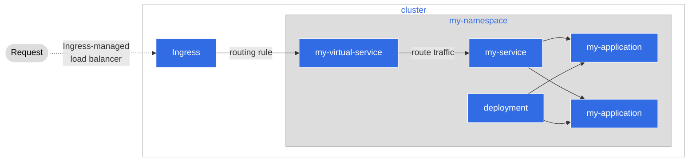

# Step 2: Integrate with Agora and the Service Mesh (Istio)

このセクションでは、Servcie Meshの使い方、つまりなぜServcie Meshを使いたいのか？そして、Agora を使ってサービスをクラスタにデプロイし、それを利用する方法について説明します。

## What is a Service Mesh

Servcie Meshは、アプリケーションがインフラに関連するロジックとアプリケーション運用に関連するロジックを分離するための抽象化です。Servcie Meshの考え方が確立される以前は、アプリケーションは以下に示すようなシナリオを処理するためのさまざまなコードが必要でした。

* クラスタ内の他のサービスを発見する方法
* トラフィックの認証を行う方法
* ログメッセージなどの監視可能なメトリクスを提供する方法

どのポッドも全く同じパターンで、**Sidecar**というソフトウェアパターンが生まれたほどです。 Sidecarは上記のロジックだけを処理するコンテナで、アプリケーションはメインのロジックの実装に専念すればよいのです。


Sidecarを使うことで、アプリケーションはそのビジネスロジックにフォーカスできるようになり、Sidecarで提供されるコードによって処理できる周辺タスクの実装は少なくなります。ここから、**Service Mesh**という概念に発展させることができたのです。

Service Meshに使用しているツールは [**Istio**](https://istio.io/)です。Istioを使えば、これらのSidecarのデプロイを処理し、宣言的かつ抽象的な方法で管理することができます。

### How Istio Works


Agoraにデプロイすると、マニフェストに従ってIstioが自動的にSidecarを作成してくれます。このSidecarは、私たちのサービスアプリケーションに出入りするすべてのトラフィックを管理するために使用され、私たちが指示しなくてもIstioが以下のようなことを管理できるようにするものです。

* Traffic Routing
  * Istioが作るSidecarは、私たちのマニフェストの宣言に従ってアプリケーションを発見可能にします。
* Authentication
  * IstioはmTLS認証で私たちのために認証してくれます。これはメッシュ内の各アプリケーションにx509証明書を発行し、その証明書を発行したSidecarに格納することで実現されます。
* Observability
  * Istioは、開発者が可視化可能なアプリケーションのログメトリクスとトレースを提供します。

## How to Use the Service Mesh

### Enable Istio for our Application

AgoraにはすでにIstioが提供されています。開発者はIstio に対して、私たちのアプリケーションがサービスメッシュを利用する作業をサポートしてほしいと宣言するだけで良いのです。 `_namespace.yaml` ファイルを見てみましょう。

```yaml
# This file creates a Namespace (https://kubernetes.io/docs/concepts/overview/working-with-objects/namespaces/)
# A namespace is a way to organize your resources in Kubernetes
# For a namespace we only need to provide a name under the 'metadata' portion of our manifest
# You should label this in a way that makes sense for you
apiVersion: v1
kind: Namespace
metadata:
  name: my-namespace
  # We'll add two labels to the metadata
  # Make sure to change 'my-namespace' in both places to the name you're using
  labels:
    name: my-namespace
    istio.io/rev: default
```

マニフェストの `labels` 部分は、Istioにネームスペース内のリソースを監視してほしいことを伝えています。これにより、アプリケーションなどのリソースをネームスペースにデプロイするとIstio が自動的にSidecarを作成してくれますので、私たちは何もする必要がありません。

### Direct Traffic via a Virtual Service

Istioでは、トラフィックのルーティングを処理するために、[**Virtual Service**](https://istio.io/latest/docs/reference/config/networking/virtual-service/)と呼ばれるリソースを使用します。
Virtual Serviceを使用すると、アプリケーションのURLと、システム内のリクエストの送信先を宣言することができます。



!!! Note
    このチュートリアルでは、Serviceを模倣するような形でVirtual Serviceを使用します。
    「何がここでのポイントなの？」と疑問に思うかもしれませんが、Virtual Serviceは
    追加でいくつかのことを行えるということを覚えておいてください。
    Virtual Serviceは、複数のサービスをURLパスを用いて分割したり、
    特定のパスの通信を通過させる前に認証にリダイレクトしたり、ブルーグリーン・カナリア
    デプロイを行えるようにサービスを設定したり、さまざまなことができます。
    これらのうち _一部_ のことはServiceでも実現できますが、 _全て_ はできませんし、
    いくつかは実装が複雑になってしまいます。

Virtual Serviceを作成するために、以下のようなYAMLを作成することができます。

```yaml
apiVersion: networking.istio.io/v1beta1
kind: VirtualService
metadata:
  # This should reflect the same name we put in our 'namespace.yaml'
  namespace: my-namespace
  name: my-virtual-service
spec:
  hosts:
    # This is telling Istio the host URL. What this will do is tell Istio
    # that we would like our service exposed to traffic from the 'outside world'.
    # This will allow us to hit our application from outside the cluster.
    # We should replace 'my-namespace' with the name in our 'namespace.yaml'
    - my-namespace.cityos-dev.woven-planet.tech
  gateways:
    # This tells Istio that we have an ingress gateway for traffic so just use
    # that, and it's configuration for traffic
    - city-ingress/ingressgateway
  # This is a match rule for Istio. In Istio you can route traffic in many
  # ways, but our application just needs a simple setup. We can ask Istio to route any traffic
  # coming from `my-namespace.cityos-dev.woven-planet.tech` to our service, which will then handle the request.
  # Istio can then route the traffic to the Kubernetes service we set up, using the Fully Qualified Domain Name (FQDN)
  # of the service inside the cluster, along with the listening port we have set up per our `service.yaml` manifest
  http:
    - match:
        - uri:
            prefix: /
      route:
        - destination:
            port:
              number: 8080
            host: my-service.my-namespace.svc.cluster.local
```

## The Agora CityService

幸いなことに、私たちは自分たちでVirtual Serviceを使う必要がありません。Agoraを使えば、よりシンプルなマニフェストを使用して、同じ効果を得ることができます。

[**CityService**](https://developer.woven-city.toyota/docs/default/component/city-service-operator-service)はAgoraが提供するCustom Resourceで、Virtual Serviceと同様に動作し、いくつかの追加された設定オプションが使用できます。ここでは、Virtual Serviceの利点を活用するために、CityServiceを用いてVirtual Serviceを作成してみましょう。

CityServiceを使用する利点は、以下の通りです。

* Virtual Service を簡単に作成することができます。Istio で特定のマニフェストを作成することは、マニフェストを厳密に記述する必要があるため、エラーが発生しやすくなります。 CityServiceはその複雑さを処理し、必要なものを簡単に記述することができます。
* CityServiceを経由して追加設定することができます。Virtual Servicesを作成するだけでなく、Service EntryやAuthorization Policiesなど、Istioで定義されたCustom Resourceを宣言することができます。CityServiceを使用すると、これらを宣言するために複数のマニフェストは必要なく、1つのマニフェストで処理することができます。

プロジェクトのルートで、`service-mesh`の項目を探し、`city-service.yaml`を見てみましょう。

```yaml
apiVersion: woven-city.global/v1alpha3
kind: CityService
metadata:
  name: my-city-service
  # This should reflect the same name we put in our 'namespace.yaml'
  namespace: my-namespace
spec:
  # This is the FQDN that we would put in a VirtualService manifest
  # Make sure to change 'my-namespace' to reflect the same name we put in our 'namespace.yaml'
  host: my-namespace.cityos-dev.woven-planet.tech
  paths:
    /time:
      # This should reflect the same name we put in our 'service.yaml'
      service: my-service
      auth: false
```

上記のVirtual Service定義と比較すると、より小さなマニフェストファイルで同じアクションと宣言を実行できます。このため、Virtual Serviceを作成するのでなく、これからはこのCityServiceマニフェストを使用することにします。

## Next Steps

ここまでで、以下のことができるようになりました。

* Kubernetes経由でコードをデプロイし、セットアップするマニフェストの記述。
* Istio と CityService を介して Agora Service Mesh にフックするコードをセットアップするマニフェストの記述。

次のステップでは、コードの実際のデプロイにとりかかります。そして、マニフェストを何度もデプロイする代わりに、変更を加えたい時にAgoraがすべての作業を支援してくれるようにする方法について説明します。
