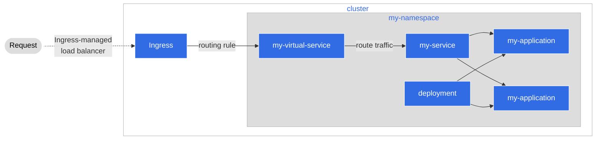

# Step 3: Deployment of our Application

ここまでで、アプリケーションファイルの準備ができました。次のステップでは、Agora で自動化できるようにデプロイすることです。ここでは、 Agora が提供する自動化ツールを使ってアプリケーションをデプロイします。

## How Agora Automates Deployment of Applications

### Benefits of Automation

ソフトウェア開発では、特にクラウド環境での構築を初めて行う場合、いくつかのよくある問題が発生することがあります。
アプリケーションを動作させるために数多くのマニフェストやリソースを作成するため、「それらを全部放り込んでどう動くか見てみる」ということをするのは簡単ですが、これにはいくつかの重要な問題点があります。

* **Tracking**
  * インフラストラクチャに非常に多くのマニフェストを投入してしまったので、すべての変更やファイルなどを追跡することが困難になってしまいます。
* **Intent of files**
  * そのため、最終的に必要となる各ファイルの目的を把握することが難しくなります。実際に必要なファイルは何なのか？なぜそれが必要だったのか？どのような目的や問題を解決するのか？このファイルがなかったらどうなるのか？
* **Updating and Deleting**
  * ファイルを削除するとどうなるのか？何かが壊れたら？マニフェストを追跡せず、その記録も保持しないことによって、私たちは誤ってコードとアプリケーションを更に「もろい」ものにしてしまいます。何が本当に必要で、何が必要でないのか、不確実性がありますので変更することはより困難です。
* **Recovery and Reproducibility**
  * 最悪の事態が発生した場合はどうしたらよいのでしょうか？クラスタがシャットダウンしたり、別のクラウドアーキテクチャに移行する必要がある場合、どのように迅速にデプロイすればいいのでしょうか？ インフラストラクチャの明確な記録や履歴がなければ、このプロセスはより手作業に近いものになり、ミスが発生する可能性があります。

このような事態を防ぐために、インフラストラクチャ・アズ・コード」、つまり**IaC**として知られる原則を実践しています。 IaCにおいては、インフラストラクチャは、マニフェストを理解できるツールを使ってコードとして宣言されます。

IaCを使うメリットは:

* インフラストラクチャは追跡しやすくなっており、リポジトリの中にあるファイルを見れば、誰がいつ変更したのかといった履歴データを見ることができます。
* 同じインフラストラクチャを何度でも作れるファイルができたので、インフラストラクチャは再現性があります。
* インフラストラクチャは気軽に更新できるので、信頼性があり、また、私たちが行う変更はリスクが低く、コードに含まれるため、より透明性があり、必要に応じてロールバックすることができます。

Agoraは、このIaC哲学の一環として、**GitOps**として知られるフレームワークを使用しており、その中心的なルールは、**gitリポジトリがアプリケーションの真実の源である**ということです。これは、インフラストラクチャのマニフェストを、アプリケーションのソースコードと一緒に保管しているということです。これにより、アプリケーションだけでなく、それがどのようにAgoraにデプロイされたかを追跡することができます。

### What is Flux

[**Flux**](https://fluxcd.io/) は、Agoraが使用しているGitOpsツールです。Fluxは、クラスタ内のアプリケーションの状態とGit リポジトリ内の状態を調整するためのツールです。Flux にリポジトリへの特定のアクセスを許可することで 、Flux にクラスタの状態を GitOpts で処理させることができ、私たちのチームだけでなく、すべてのアプリケーションチームのためにもAgora の追跡や安全性、更新、管理が容易になります。

### How Flux works


Fluxは、GitリポジトリとKubernetesクラスタの間に位置します。リポジトリに変更を加えると、Fluxはその変更をリスニングし、リポジトリにあるものがKubernetes クラスタに反映されるようにしています。これらの変更は、アプリケーションの更新から新しいインフラストラクチャのマニフェストの追加までさまざまなものがあります。Agoraでは、Fluxはパイプラインと組み合わせて、プルリクエストを行い、それをマージし、CI/CDパイプラインがFluxに変更を加えるという典型的なソフトウェア開発のライフサイクルで利用されます。そうすると、私たちの介入なしでFluxがクラスタに変更を適用します。

## Setting up our Application to be picked up by Flux

=== "If our code is in your own repo"

    Fluxを我々のリポジトリで活用する場合、多くのことを行う必要はありません。
    私たちが必要なのは、「テナント」と呼ばれるものになる、ということです。
    **テナント** は、Fluxに変更を監視する必要のあるファイルがあることを伝える方法です。
    テナントになるためには、Agoraチームにサポートを得てください。
    [**Agora's AMA on Slack**](https://woven-by-toyota.slack.com/archives/C02CVJLTMJ7)にてリクエストができます。

=== "If our code is inside the Backend Team's repo"

    アプリケーションのコードがBackend monorepoにある場合、
    バックエンドチームはFluxをAgoraと連携して使うための手順を整備していますので、
    詳細については[**Backend Team's documentation**](https://github.tri-ad.tech/R-D-WCM/wcm-backend-monorepo/tree/main/docs/setup) を参照してください。

## Using Flux in our Application

Fluxのテナントとしてセットアップしたら、あとはFluxにデプロイを自動的に処理させるためにこちら側でいくつかの作業を行うだけです。

### How to tell Flux what files to listen to

Agoraでは、Fluxは[**Kustomize**](https://kustomize.io/)と呼ばれるツールを使って、監視すべきファイルがどこにあるかを知っています。Kustomize を使用すると、Kubernetes クラスタのアプリケーションの状態が Git リポジトリにあるものと一致するようにマニフェストファイルを調整する必要があることを Flux に伝えることができます。

まずKustomizeの使い方を見てみましょう。 `automation` の下に、 カスタムリソース **Kustomization** である `kustomization.yaml` というメインファイルがあります。

```yaml
apiVersion: kustomize.config.k8s.io/v1beta1
kind: Kustomization
# Here, we list the files that define our infrastructure
# Whenever we make a change to one of these files or add a new file to listen to,
# Flux will sync the Kubernetes cluster to reflect how our application deployment looks inside our repo.
# Flux will also listen for changes made to the cluster that don't reflect what is listed in our files.
# If there happens to be a change that's not listed here, Flux will "repair" the cluster deployment,
# using our declared deployment here.
resources:
  - ../kubernetes/_namespace.yaml
  - ../kubernetes/deployment.yaml
  - ../kubernetes/service.yaml
  - ../service-mesh/city-service.yaml
```

このファイルにより、Fluxは私たちがマニフェストに加えた変更をリスニングし自動的にKubernetesクラスタに適用します。

### How to automate new infrastructure

Kustomization ファイルがあれば、あと必要なことは新しいインフラを追加する必要があるときにKustomization ファイルに新しいエントリを追加するだけです。Flux はKustomizationの変更に気づきクラスタにアップデートを適用します。

```yaml
apiVersion: kustomize.config.k8s.io/v1beta1
kind: Kustomization
# Here, we list the files that define our infrastructure
# Whenever we made a change to one of these files or add a new file to listen to,
# Flux will sync the Kubernetes cluster to reflect how our application deployment looks inside our repo
resources:
  - ../kubernetes/_namespace.yaml
  - ../kubernetes/deployment.yaml
  - ../kubernetes/service.yaml
  - ../service-mesh/city-service.yaml
  # If we had for example a secret we needed to deploy for our service, we
  # would create the manifest and add it here
  # - <path_to_file>/secret.yaml
```

## Optional: Try to deploy your service on a minikube cluster hosted on an EC2 Instance

このセクションは、EC2インスタンス上でローカルのminikubeクラスターを使用している**Agora開発者**のためのものです。この手順を実行するには、この[README.md](https://github.com/wp-wcm/city/blob/main/infrastructure/k8s/local/README.md) に従うことが必要です。

### Make manifest and apply to the cluster

```shell
$ cd infrastructure/k8s/local/agora-deployment-101
$ mkdir my-manifests
```

このディレクトリの下に5つのマニフェストを作成する必要があります。

my-manifests/kubernetes/_namespace.yaml
```yaml
apiVersion: v1
kind: Namespace
metadata:
  name: agora-deployment-101
  labels:
    name: agora-deployment-101
    istio.io/rev: default
```

my-manifests/kubernetes/deployment.yaml
```yaml
apiVersion: apps/v1
kind: Deployment
metadata:
  labels:
    app: my-clock
  name: my-clock-deployment
  namespace: agora-deployment-101
spec:
  replicas: 2
  selector:
    matchLabels:
      app: my-clock
  template:
    metadata:
      labels:
        app: my-clock
    spec:
      containers:
        - name: my-clock
          image: docker.artifactory-ha.tri-ad.tech/wcm-cityos/tutorials/agora-deployment-101:main-afb3a12f-3520
          ports:
            - containerPort: 8080
              name: http
              protocol: TCP
          env:
            - name: HOST
              value: "0.0.0.0"
            - name: PORT
              value: "8080"
          livenessProbe:
            httpGet:
              path: /health
              port: 8080
            periodSeconds: 30
          readinessProbe:
            httpGet:
              path: /health
              port: 8080
            periodSeconds: 10
          startupProbe:
            httpGet:
              path: /health
              port: 8080
            initialDelaySeconds: 5
```

my-manifests/kubernetes/service.yaml
```yaml
apiVersion: v1
kind: Service
metadata:
  name: my-clock
  namespace: agora-deployment-101
spec:
  type: LoadBalancer
  selector:
    app: my-clock
  ports:
    - port: 8080
      name: http
      protocol: TCP
```

my-manifests/service-mesh/city-service.yaml
```yaml
apiVersion: woven-city.global/v1alpha3
kind: CityService
metadata:
  name: my-city-service
  namespace: agora-deployment-101
spec:
  paths:
    /:
      pathType: Prefix
      service: my-clock
      auth: false
```

my-manifests/kustomization.yaml
```yaml
apiVersion: kustomize.config.k8s.io/v1beta1
kind: Kustomization
resources:
- ./kubernetes/_namespace.yaml
- ./service-mesh/city-service.yaml
- ./kubernetes/deployment.yaml
- ./kubernetes/service.yaml
```

この設定を infrastructure/k8s/local/flux-system/kustomizations/services/kustomization.yaml に追加することで、Flux は Kustomization に変更を通知することができます。
```yaml
resources:
  - ../../../agora-deployment-101/my-manifests
  # the path to kustomization file of your service
```

この変更をコミットしてGitHubにプッシュすると、Fluxはローカルクラスタに変更を適用し始めます。以下のコマンドを実行することで、適用が終了したかどうかを確認することができます。

```shell
$ flux get kustomizations
NAME            REVISION                SUSPENDED       READY   MESSAGE
bootstrap       <branch_name>/<commit_id>      False           True    Applied revision: <branch_name>/<commit_id>
cert-manager    <branch_name>/<commit_id>      False           True    Applied revision: <branch_name>/<commit_id>
city-ingress    <branch_name>/<commit_id>      False           True    Applied revision: <branch_name>/<commit_id>
cityos-system   <branch_name>/<commit_id>      False           True    Applied revision: <branch_name>/<commit_id>
id              <branch_name>/<commit_id>      False           True    Applied revision: <branch_name>/<commit_id>
istio           <branch_name>/<commit_id>      False           True    Applied revision: <branch_name>/<commit_id>
observability   <branch_name>/<commit_id>      False           True    Applied revision: <branch_name>/<commit_id>
services        <branch_name>/<commit_id>      False           True    Applied revision: <branch_name>/<commit_id>
system          <branch_name>/<commit_id>      False           True    Applied revision: <branch_name>/<commit_id>
```

### How to Talk to the Virtual Service

次のコマンドを実行することで、Virtual Serviceのセットアップを確認することができます。

```bash
$ kubectl get virtualservices -n agora-deployment-101
NAME                              GATEWAYS                                 HOSTS                                    AGE
egress-virtualservice             ["mesh","city-egress/egressgateway"]     ["pseudo.empty.managed.by.operator"]     17h
ingress-virtualservice            ["city-ingress/ingressgateway","mesh"]   ["agora-deployment-101.woven-city.local"]      17h
ingress-virtualservice-my-clock   ["city-ingress/ingressgateway","mesh"]   ["my-clock.agora-deployment-101","my-clock"]   17h
```

ここでは、2つのVirtual ServiceがIngressにフックされていることがわかります。1つはIngress自体で、もう1つはクロックのVirtual Serviceです。Ingressへのトラフィックを設定できれば、Virtual Serviceは次に設定する我々のサービスへトラフィックを再ルーティングしてくれます。



まず、ローカルとminikubeの間にトンネルを作ります。

```shell
$ minikube tunnel
Status:
        machine: minikube
        pid: 2052322
        route: <cluster-ip-range> -> <minikube-container-ip>
        minikube: Running
        services: [ingressgateway, my-clock]
```

そして、ingressgatewayの外部IPアドレスを取得し、/etc/hostsにVirtual Serviceのホスト名と外部IPアドレスの関係を設定します。

```bash
$ kubectl get services -n city-ingress
NAME             TYPE           CLUSTER-IP      EXTERNAL-IP     PORT(S)                                      AGE
ingressgateway   LoadBalancer   <cluster-ip>   <external-ip>   15021:30000/TCP,80:31304/TCP,443:32766/TCP   24h
$ sudo vi /etc/hosts
<external-ip> id.woven-city.local agora-deployment-101.woven-city.local
```

curlを使ってサービスにアクセスすることができます。

```
$ curl -ki https://agora-deployment-101.woven-city.local/time
HTTP/2 200
content-type: text/plain; charset=utf-8
date: Wed, 14 Sep 2022 05:01:42 GMT
content-length: 37
x-envoy-upstream-service-time: 18
server: istio-envoy
```

## Congratulations

この時点で、以下のことが達成されているはずです。

* サービス開発者としての立場から、Agoraが何をしてくれるのか、少し知ることができました。
* Kubernetes Manifestsを使ったデプロイの設定方法について学びました。
* IstioというService Meshについて少し学び、開発者としてそれが何をするのかを学びました。
* CityServiceマニフェストを介してサービスメッシュにフックされるように、アプリケーションをセットアップする方法。
* Agoraにおける自動化の仕組みと活用メリット。
* Kustomizationファイルを利用した自動化の活用方法を学びました。
