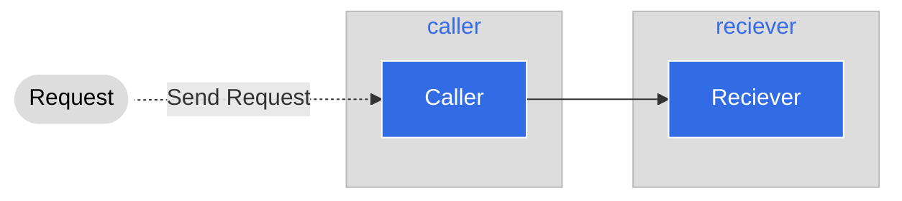

# Step 2: Deploying another Service

In this step we'll deploy a service to call the receiver. This is a caller
service, which takes the calls from the outside world and directs them to the
receiver.



## Deploying the caller service

The service works similarly to how we deployed our receiver service. First,
deploy the namespace

```
cd caller/kubernetes
kubectl apply -f _namespace.yaml
```

```
namespace/caller created
```

Next, deploy the service

```
kubectl apply -f service.yaml
```

```
service/caller-service created
```

Finally, deploy the application itself

```
kubectl apply -f deployment.yaml
```

```
deployment.apps/caller-deployment created
```


We can also verify that the deployment is ready via `kubectl`

```
kubectl get all -n caller
```

```
NAME                                     READY   STATUS    RESTARTS   AGE
pod/caller-deployment-54dd7dd5c4-rplvc   1/1     Running   0          2m46s

NAME                     TYPE        CLUSTER-IP   EXTERNAL-IP   PORT(S)    AGE
service/caller-service   ClusterIP   None         <none>        8080/TCP   6m29s

NAME                                READY   UP-TO-DATE   AVAILABLE   AGE
deployment.apps/caller-deployment   1/1     1            1           6m7s

NAME                                           DESIRED   CURRENT   READY   AGE
replicaset.apps/caller-deployment-54dd7dd5c4   1         1         1       2m46s
```

## Verify that the flow works

We can test and verify that the flow described above works by working with
`port-forward`. To set up our port-forward we can use the service

```
kubectl port-forward service/caller-service -n caller 8080:8080
```

Again, `port-forward` will **not** return because it's holding the tunnel open.

```
Forwarding from 127.0.0.1:8080 -> 8080
Forwarding from [::1]:8080 -> 8080
```

In a new terminal run the following. Again, you can replace `<name>` with a string

``` 
curl http://localhost:8080/hello/<name>
```

```
curl http://localhost:8080/hello/yshtola
{"message":"The receiver said: Hello there yshtola!"}
```

We can see that we got a response back from the caller service, that responded
with the response it got from the receiver service.
