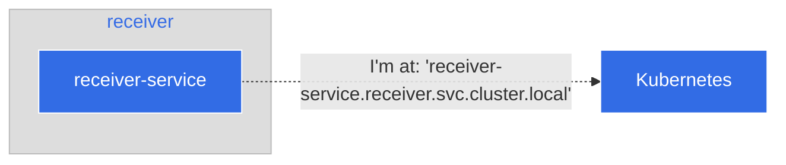
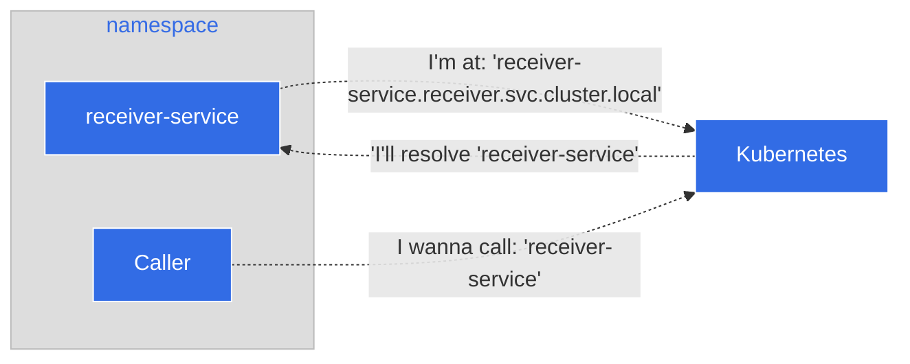

# Step 3: Understanding Namespaces

Now that we have established that we have our Caller and Receiver working
correctly, lets dive a little deeper into how they work

## How the Caller knows where to call Receiver

A Kubernetes namespace works inside a cluster to help with separating
resources, per the [documentation](https://kubernetes.io/docs/concepts/overview/working-with-objects/namespaces/#namespaces-and-dns):

> When you create a Service, it creates a corresponding DNS entry. This entry
> is of the form \<service-name\>.\<namespace-name\>.svc.cluster.local, which means
> that if a container only uses \<service-name\>, it will resolve to the service
> which is local to a namespace.

For our caller and our receiver, we created a Service deployment, because we
wanted to associate our application with a service IP address to allow it to be
easier to reach. Following the formula that Kubernetes follows, then to reach
the receiver the URL and the port would be

```
receiver-service.receiver.svc.cluster.local:8080
```

We can set this implicitly per our service manifest. Let's take a look at that
manifest really quickly. The receiver `Service` declares in its metadata to
Kubernetes its name and the namespace to deploy it. 

```yaml
---
apiVersion: v1
kind: Service
metadata:
  # The <service-name>
  name: receiver-service
  # The <namespace-name>
  namespace: receiver
```



Our caller knows this via its deployment manifest, which tells the caller the
Fully Qualified Domain Name (FQDN) where to call the receiver

```
---
apiVersion: apps/v1
kind: Deployment
metadata:
  labels:
    app: caller
  name: caller-deployment
  namespace: caller
spec:
  ...
  template:
    metadata:
      labels:
        app: caller
    spec:
      containers:
          ...
          env:
            - name: HOST
              value: "0.0.0.0"
            - name: PORT
              value: "8080"
            # This is the URL that is set in the Caller to let it talk to the Receiver
            - name: RECEIVER_URL
              value: "receiver-service.receiver.svc.cluster.local:8080"
```

## What happens if both Caller and Receiver are in the same namespace

Per the quote above, if caller and receiver were in the same namespace, then
you could easily call the receiver with the following URL and port:

```
receiver-service:8080
```

When both services are in the same namespace, Kubernetes will resolve the
address for you.



## Congratulations

At this point you have a better understanding of how to work with namespaces
and how they operate in Kubernetes. In this tutorial we've learned:

* What namespaces are
* How namespaces resolve service addresses
* A simple example of two services talking to each other across namespaces

**TODO: Add link to the policy (CITYPF-1734)**

For follow-up reading, please refer to Agora's Namespace Policies.
