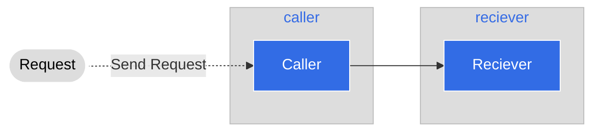

# Step 2: Deploying another Service

このステップでは、receiverを呼び出すためのサービスをデプロイします。これはcallerサービスと呼ばれ、外部からの呼び出しを受けてそれをreceiverに転送するサービスです。



## Deploying the caller service

このサービスは、私たちがreceiverサービスをでププロイしたときと同じように動作します。まずネームスペースをデプロイします。

```
cd caller/kubernetes
kubectl apply -f _namespace.yaml
```

```
namespace/caller created
```

次に、サービスをデプロイします。

```
kubectl apply -f service.yaml
```

```
service/caller-service created
```

最後に、アプリケーション本体をデプロイします。

```
kubectl apply -f deployment.yaml
```

```
deployment.apps/caller-deployment created
```

デプロイの準備ができたかどうかは、receiver同様`kubectl` を使って確認することができます。

```
kubectl get all -n caller
```

```
NAME                                     READY   STATUS    RESTARTS   AGE
pod/caller-deployment-54dd7dd5c4-rplvc   1/1     Running   0          2m46s

NAME                     TYPE        CLUSTER-IP   EXTERNAL-IP   PORT(S)    AGE
service/caller-service   ClusterIP   None         <none>        8080/TCP   6m29s

NAME                                READY   UP-TO-DATE   AVAILABLE   AGE
deployment.apps/caller-deployment   1/1     1            1           6m7s

NAME                                           DESIRED   CURRENT   READY   AGE
replicaset.apps/caller-deployment-54dd7dd5c4   1         1         1       2m46s
```

## Verify that the flow works

`port-forward`　を使用して、上記のフローが動作することをテストし、検証することができます。Port-forwardを設定するために、サービスを利用します。

```
kubectl port-forward service/caller-service -n caller 8080:8080
```

繰り返しになりますが、 `port-forward` はトンネルをオープンにしているため、**応答はありません**。

```
Forwarding from 127.0.0.1:8080 -> 8080
Forwarding from [::1]:8080 -> 8080
```

新しいターミナルで以下を実行します。ここでも  `<name>` を文字列に置き換えてください。

``` 
curl http://localhost:8080/hello/<name>
```

```
curl http://localhost:8080/hello/yshtola
{"message":"The receiver said: Hello there yshtola!"}
```

Callerサービスから応答が返され、receiverサービスから受け取ったレスポンスで、応答していることがわかります。
