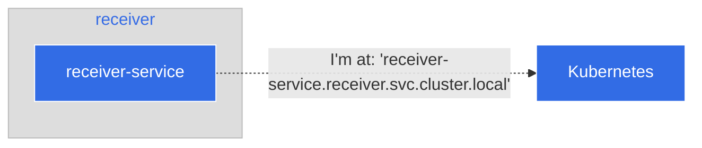
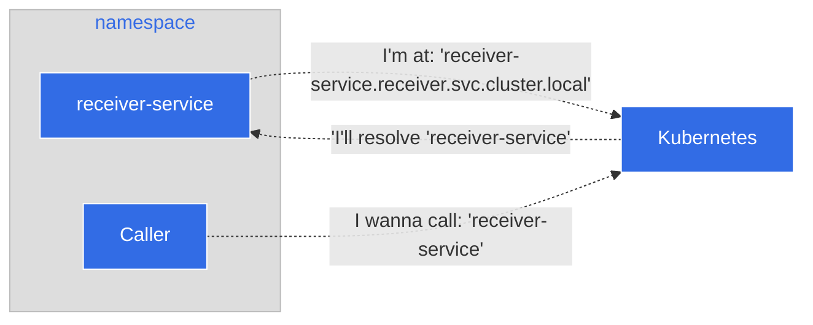

# Step 3: Understanding Namespaces

Callerとreceiverが正しく動作していることが確認できましたので、これらの動作についてもう少し掘り下げてみましょう。

## How the Caller knows where to call Receiver

 [この文書](https://kubernetes.io/docs/concepts/overview/working-with-objects/namespaces/#namespaces-and-dns)に記載されているように、Kubernetesのネームスペースはクラスタ内で動作しリソースの分離をサポートします。

> サービスを作成すると、それに対応するDNSエントリが作成されます。このエントリは \<service-name\>.\<namespace-name\>.svc.cluster.local という形式であるため、コンテナが \<service-name\> のみを使用する場合は、ネームスペース内のそのサービスに名前解決されることを意味します。

このアプリケーションのcallerとreceiverには、Serviceのデプロイメントを作成しました。アプリケーションをサービス IP アドレスに関連付け、簡単にアクセスできるようにするためです。Kubernetesの方式に従うと、receiverのURLとポートは次のようになります。

```
receiver-service.receiver.svc.cluster.local:8080
```

これはサービスマニフェストごとに自動的に設定することができます。早速、そのマニフェストを見てみましょう。receiverの `Service` は、そのメタデータをもとに Kubernetes に名前とデプロイするネームスペースを宣言します。

```yaml
---
apiVersion: v1
kind: Service
metadata:
  # The <service-name>
  name: receiver-service
  # The <namespace-name>
  namespace: receiver
```



callerはデプロイメントマニフェストを通じてこの情報を知り、callerに対してreceiverを呼び出すためのFully Qualified Domain Name (FQDN)を伝えます。

```
---
apiVersion: apps/v1
kind: Deployment
metadata:
  labels:
    app: caller
  name: caller-deployment
  namespace: caller
spec:
  ...
  template:
    metadata:
      labels:
        app: caller
    spec:
      containers:
          ...
          env:
            - name: HOST
              value: "0.0.0.0"
            - name: PORT
              value: "8080"
            # This is the URL that is set in the Caller to let it talk to the Receiver
            - name: RECEIVER_URL
              value: "receiver-service.receiver.svc.cluster.local:8080"
```

## What happens if both Caller and Receiver are in the same namespace

上記の引用にあるように、callerとreceiverが同じネームスペースにある場合、次のようなURLとポートで簡単にreceiverを呼び出すことができます。

```
receiver-service:8080
```

両方のサービスが同じネームスペースにある場合、Kubernetesは名前解決を行います。



## Congratulations

この時点で、ネームスペースを使用する方法と、Kubernetes でそれらがどのように動作するかについて、より深く理解することができました。このチュートリアルでは、以下のことを学びました。

* ネームスペースとは何なのか
* ネームスペースがサービスアドレスを解決する方法
* 二つのサービスがネームスペースを越えて通信する場合のシンプルな例

**TODO: Add link to the policy (CITYPF-1734)**

フォローアップとして、Agoraのネームスペースポリシーをご参照ください。
