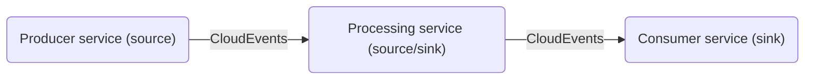

# References

This page contains reference commands and code samples that you may find helpful in creating the components for your service. Click on the component name to jump to the corresponding section:

* [**Service**](#service)
* [**Broker**](#broker)
* [**Source**](#source)

## Service

### Options

View all the options and command arguments using `--help` or `-h`.

```zsh
$ bazel run //ns/agoractl -- serverless create service-h
```

### Additional configuration options

Add additional configuration options with the `--with_additional_configuration` argument as shown below:

```zsh
$ bazel run //ns/agoractl -- serverless create service \
        --name=<YourService> \
        --namespace=<YourNamespace> \
        --application_at=/projects/<YourProjectFolder>/<YourService> \
        --application_language=<YourLanguage>
        --with_additional_configuration
```

This creates the file `additional-configuration.yaml` in the designated folder. 

You can see all the configuration options in the [service schema](https://github.com/wp-wcm/city/blob/main/ns/serverless/ytt/templates/serverless_service_schema.yaml) file. Below is an example for adding environment variables:

```yaml
#@data/values
#@overlay/match-child-defaults missing_ok=True
---
templateEnvironmentVariables:
- name: LOG_COLLECTOR_URL
    value: "STUB"
- name: LOG_COLLECTOR_HOST_HEADER
    value: "STUB" 
```

Other configuration examples:

- [Configure serverless scale bounds](https://github.com/wp-wcm/city/blob/f84dd8cb71559b6d98643a6fc11f675cbedb5182/ns/serverless/ytt/templates/serverless_service_schema.yaml#L27)
- [Prometheus config](https://github.com/wp-wcm/city/blob/f84dd8cb71559b6d98643a6fc11f675cbedb5182/infrastructure/k8s/common/serverless/log-collector/additional-configuration.yaml#L11-L14)

### Using your service as a source

You can send CloudEvents from your service to another component, effectively making your service act as a source. 



We can provide a `--sink` argument as shown below (assuming we are in the `infra/k8s/dev/<YourNamespace>/<YourServerlessProject>` folder)

```zsh
$ bazel run //ns/agoractl -- serverless create service\
    --name=<YourConsumerService> \
    --namespace=<YourNamespace> \
    --application_at=/projects/<YourProjectFolder>/<YourConsumerService> \
    --application_language=<YourLanguage>

$ bazel run //ns/agoractl -- serverless create service\
    --name=<YourProcessingService> \
    --namespace=<YourNamespace> \
    --application_at=/projects/<YourProjectFolder>/<YourProcessingService> \
    --application_language=<YourLanguage>
    --sink=//infra/k8s/dev/<YourNamespace>/<YourServerlessProject>/<ConsumerServiceFolder>:<ConsumerService>

$ bazel run //ns/agoractl -- serverless create service\
    --name=<YourProducerService> \
    --namespace=<YourNamespace> \
    --application_at=/projects/<YourProjectFolder>/<YourProducerService> \
    --application_language=<YourLanguage>
    --sink=//infra/k8s/dev/<YourNamespace>/<YourServerlessProject>/<ProcessingServiceFolder>:<ProcessingService> 
```

After the resources are created, your service application code can access the sink target with the environment variable `K_SINK`. 

For more information, see [Knative Docs: SinkBinding](https://knative.dev/docs/eventing/custom-event-source/sinkbinding/).

### Docker image and image update automation

- `--initial_image`: Use this argument to provide an initial image to the service before image automation. Otherwise, a default image sockeye will be used. Sockeye is a simple service with a web interface displaying all incoming events. 

For more information about Sockeye, go [here](https://github.com/n3wscott/sockeye).

    ```zsh
    $ bazel run //ns/agoractl -- serverless create service\
            --name=<YourService> \
            --namespace=<YourNamespace> \
            --application_at=/projects/<YourProjectFolder>/<YourService> \
            --application_language=<YourLanguage>
            --initial_image=docker.artifactory-ha.tri-ad.tech/wcm-cityos/<YourImagePath>
    ```

- `--image_update_automation_*`: Use these arguments to customize image update automation. If you are creating both application and manifests, Agoractl will automatically add the image updating reference for your service. However, if you are only creating manifests, then you need to provide the reference to your application automation target as follows:

    ```zsh
    --image_update_automation_reference=//projects/<YourProjectFolder>/<YourService>:automation
    ```  

### Creation mode

- `Both manifest and application code`: If you want the command to scaffold both manifest file and application code for you, use `--application_at` and `--application_language`.

    ```zsh
    $ bazel run //ns/agoractl -- serverless create service\
        --name=<YourService> \
        --namespace=<YourNamespace> \
        --application_at=/projects/<YourProjectFolder>/<YourService> \
        --application_language=<YourLanguage>
    ```

- `Manifest only`: For the script to generate only the k8s manifest, omit the `--application_at` and `--application_language`. 

    ```zsh
    $ bazel run //ns/agoractl -- serverless create service\
        --name=<YourService> \
        --namespace=<YourNamespace> \
        --image_update_automation_reference=//projects/<YourProjectFolder>/<YourService>:automation
    ```

- `Application only`: Specify `--application_only` along with `--application_at` and `--application_language`.

    ```zsh
    $ bazel run //ns/agoractl -- serverless create service\
        --name=<YourService> \
        --namespace=<YourNamespace> \
        --application_at=/projects/<YourProjectFolder>/<YourService> \
        --application_language=<YourLanguage>
        --application_only=true
    ```

### Accessing your service manually

You can access your serverless service via `curl` or even `web-browser` when using the Woven by Toyota VPN.

The link to your lambda will be in the following format:
```
https://<YourService>-<YourNamespace>-lambda.<ClusterDomain>
```

For an example, go [here](https://minimal-service-sample-serverless-lambda.cityos-dev.woven-planet.tech).


### Integrating Vault with your service

You can inject Vault secrets into your serverless service by adding ***annotations*** and ***service account*** to your manifest through the [additional configuration](#additional-configuration-options-1) file. 

For an example file, see [additional-configuration.yaml](https://github.com/wp-wcm/city/blob/main/infra/k8s/dev/agora-tenant/serverless-demo/slack-service-001/additional-configuration.yaml):

```yaml
#@data/values
#@overlay/match-child-defaults missing_ok=True
---
templateAnnotations:
    vault.hashicorp.com/agent-inject-containers: "user-container"
    vault.hashicorp.com/agent-inject: "true"
    vault.hashicorp.com/agent-init-first: "true"
    vault.hashicorp.com/namespace: "ns_dev/ns_wcm_infra/agora-tenant"
    vault.hashicorp.com/role: "slack-role"
    vault.hashicorp.com/auth-path: "auth/kubernetes-dev"
    vault.hashicorp.com/agent-inject-secret-slack-secret: "kv/serverless-tutorial"
    vault.hashicorp.com/agent-inject-template-slack-secret: |-
        {{ with secret "kv/serverless-tutorial" -}}
        export CHANNEL_ID="{{ .Data.data.channel_id }}"
        export SLACK_ACCESS_TOKEN="{{ .Data.data.slack_access_token }}"
        {{- end }}
templateServiceAccountName: "agora-tenant-slack-svc-sa"
``` 

After adding the additional configuration file, Zebra will automatically update your manifest file and add these annotations and the service account. 

To learn more about injecting secrets with Vault, refer to the [Developer Portal documentation](https://developer.woven-city.toyota/docs/default/component/vault-tutorial/en/02_deployment_with_vault/).

> _*Note: Make sure that your `vault-auth.yaml` file is under your tenant folder (`infrastructure/k8s/dev/flux-tenants/lps/namespaces/<tenant-namespace>/vault-auth.yaml`) for the necessary RBAC roles attached to your service account to connect to Vault. To see an example file, go [here](https://github.com/wp-wcm/city/blob/main/infrastructure/k8s/dev/flux-tenants/lps/namespaces/agora-tenant/vault-auth.yaml)._

## Broker

### Options

Display all the arguments for creating your broker using the help command below:

```zsh
$ bazel run //ns/agoractl -- serverless create broker -h
```

### Sinks

A broker has two types of sinks: `--sink` and `--sink_with_trigger`. The latter creates an additional file called `trigger-*-values.yaml`. 

```zsh
$ bazel run //ns/agoractl -- serverless create broker \
        --name=<YourBroker> \
        --namespace=<YourNamespace> \
        --sink=//infra/k8s/dev/<YourNamespace>/<YourServerlessProject>/<YourService1Folder>:<YourService1> \
        --sink_with_trigger=//infra/k8s/dev/<YourNamespace>/<YourServerlessProject>/<YourService2Folder>:<YourService2>
```

An example of `trigger-*-values.yaml` is shown below: 

```yaml
#@data/values
#@overlay/match-child-defaults missing_ok=True
---
filter:
    attributes:
        type: dev.filter.example
```

### Additional configuration options

Add additional configurationv options to your broker using the `--with_additional_configuration` argument:

```zsh
$ bazel run //ns/agoractl -- serverless create broker \
        --name=<YourBroker> \
        --namespace=<YourNamespace> \
        --sink=//infra/k8s/dev/<YourNamespace>/<YourServerlessProject>/<YourService1Folder>:<YourService1> \
        --sink_with_trigger=//infra/k8s/dev/<YourNamespace>/<YourServerlessProject>/<YourService2Folder>:<YourService2> \
        --with_additional_configuration
```

The above command creates an `additional-configuration.yaml` file in the designated folder. You can see all the configuration options in the [broker schema](https://github.com/wp-wcm/city/blob/main/ns/serverless/ytt/templates/serverless_broker_schema.yaml) file.


## Source

### Options

Display all the arguments for creating your source using the help command below:

```zsh
$ bazel run //ns/agoractl -- serverless create source -h
```

### Additional configuration options

Add additional configuration options to your source using `--with_additional_configuration` argument:

```zsh
$ bazel run //ns/agoractl -- serverless create source iota \
            --name=<YourSource> \
            --namespace=<YourNamespace> \
            --tenant=test \
            --topic="*.*.<YourTopic>" \
            --sink=//infra/k8s/dev/<YourNamespace>/<YourServerlessProject>/<YourBroker>:<YourBroker> \
            --with_additional_configuration
```


The above command creates an `additional-configuration.yaml` file in the designated folder. You can see all the configurations in the [source schema](https://github.com/wp-wcm/city/blob/main/ns/serverless/ytt/templates/serverless_rbmq_source_schema.yaml) file.

### Additional configuration options for binding

Add additional configuration options for your binding using the `--with_additional_configuration` argument below:

```zsh
$ bazel run //ns/agoractl -- serverless create source binding \
            --name=<YourSourceBinding> \
            --namespace=<YourNamespace> \
            --origin_kind=Deployment \
            --origin_name=app-deployment \
            --origin_namespace=<YourNamespace> \
            --sink=//infra/k8s/dev/<YourNamespace>/<YourServerlessProject>/<ServerlessComponentFolder>:<ServerlessComponent> \
            --with_additional_configuration
```

The above command creates an `additional-configuration.yaml` file in the designated folder. You can see all the configurations in the [sink binding schema](https://github.com/wp-wcm/city/blob/main/ns/serverless/ytt/templates/serverless_sink_binding_schema.yaml) file.

An example is shown below:

```yaml
#@data/values
#@overlay/match-child-defaults missing_ok=True
---
ceOverrides:
    extensions:
        extra: this is an extra attribute
        additional: 42
```

This sets the `K_CE_OVERRIDES` environment variable being on the `SINK` as follows:

```json
{ "extensions": { "extra": "this is an extra attribute", "additional": "42" } }
```

To learn more about CloudEvents Overrides, see the [Knative documentation](https://knative.dev/docs/eventing/custom-event-source/sinkbinding/reference/#cloudevent-overrides).

Another attribute that we can set in the configuration file is the `sinkURI`. When provided, it appends the `sinkURI` string to the `K_SINK` environment variable in the source.

```yaml
#@data/values
#@overlay/match-child-defaults missing_ok=True
---
sinkURI: "/extra/path"
```

This sets the `K_SINK` environment variable on the source as `http://<YourService>.<YourNamespace>.svc.cluster.local/extra/path`.
