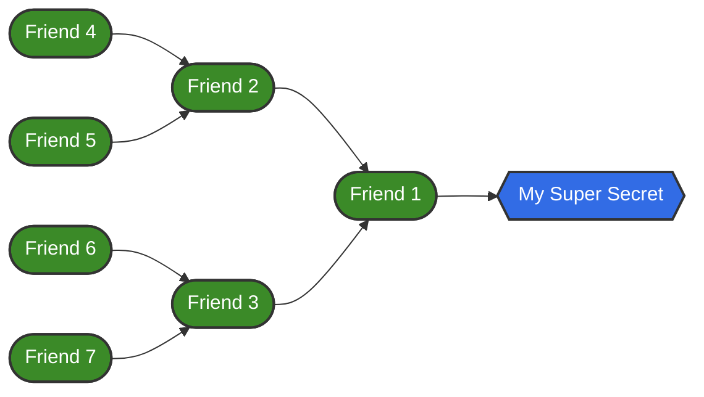

# Vault 101

Welcome to Vault 101. This tutorial hopes to provide the following

* A brief introduction of Vault and why you would want to use it
* A small example of an application deployment without Vault
* A small example of an application deployment with Vault

## Pre-requisites for this tutorial

For this tutorial, you need to have access to a kubernetes cluster with Vault
enabled. The Agora Team provides a development cluster for teams with Vault
already in place for use. Please feel free to reach out to the Agora Team
if there is any issues with access to a cluster

Some files in this tutorial are explained in better detail in our other
tutorial on Minikube: [Minikube 101](https://developer.woven-city.toyota/docs/default/component/minikube-tutorial)
Please feel free to go over the files in more detail there if you are curious,
but Minikube 101 is **not** required to complete this tutorial.

For all commands used in this tutorial it is presumed you have `kubectl`
installed on your machine. Please refer [**here**](https://kubernetes.io/docs/tasks/tools/#kubectl)
for your operating system's installation instructions.

For all commands in the tutorial, the presumption is that you are working from
the **project's root directory**. If you are on a different path or location
you should change any commands to reflect the relative paths.

```
ns/tutorial/vault-101
```

## What is Vault

[Vault](https://www.vaultproject.io/docs/what-is-vault) is an identity-based
secrets and encryption management system. Vault provides encryption services
that are gated by authentication and authorization methods. Secrets in Vault
are able to be securely stored and tightly controlled, as well as be audited.

## Why you should try using Vault

Vault is built to solve a problem known as "Secret Sprawl".



Conceptually, Secret Sprawl works a lot like the idea of a friend knowing a
secret. This friend then tells two friends the secret, who then tell two
friends, and so on. This can grow complex: what happens when a new secret is
out there? What happens when one of your friends needs to know both secrets?

The end result of this without any sort of structure in place are the following
consequences

* **Secrets are everywhere**
  * Secrets can potentially be known by many people, in a disjointed fashion
    where secrets are now everywhere, instead of a central location
* **Secrets are hard to audit**
  * Going off the friend analogy, once a secret is out there and without proper
    checking the secret could be potentially known to a lot of people, and it
    would be hard to find out who knows what, and if said person should even be
    allowed to know the secret
* **Secrets can be out there Plainly**
  * Without any sort of control on who knows what secret, there is no guarantee
    of safety, and secrets are that much easier to steal and use

Vault helps to alleviate this issue by doing the following for you

* **All secrets are in one place**
  * Having one place to store all your secrets helps reduce your attack surface
    and allows you to harden your system around only the places that need it
* **Access controls on who gets to see what secrets**
  * By use of Roles and Policies (explained later in this tutorial), Vault
    allows you to explicitly state "User A is allowed to read Secrets A,B,C".
    This access can be modified and even revoked where necessary
