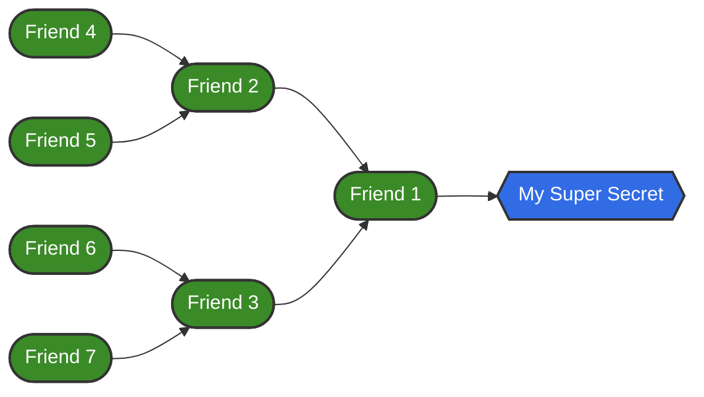

# Vault 101

Vault 101へようこそ。このチュートリアルでは、以下の内容を紹介したいと思います。

* Vaultの簡単な紹介と、Vaultを使用する理由
* Vault を使用しないアプリケーション デプロイの簡単な例
* Vault を使用したアプリケーション デプロイの簡単な例

## Pre-requisites for this tutorial

このチュートリアルでは、Vaultが有効になっているkubernetesクラスタにアクセスできる必要があります。Agoraチームでは、すでにVaultを利用しているチームのために、開発(DEV)クラスタを提供しています。もし、クラスタへのアクセスに問題がある場合は、遠慮なくAgoraチームにご連絡ください。

このチュートリアルの一部のファイルは、別のチュートリアル [Minikube 101](https://developer.woven-city.toyota/docs/default/component/minikube-tutorial)でより詳細に説明されています。
このチュートリアルを完了するためにMinikube 101は必須**ではありません**が、興味があればそちらも確認してください。

このチュートリアルで使用するすべてのコマンドは、`kubectl` がインストールされていることを前提にしています。インストール方法は [**こちら**](https://kubernetes.io/docs/tasks/tools/#kubectl)をご覧ください。

このチュートリアルのすべてのコマンドは、**プロジェクトのルートディレクトリ**で作業していることを前提にしています。もし、別のパスやロケーションにいる場合は、相対パスを反映するようにコマンドを変更する必要があります。

```
ns/tutorial/vault-101
```

## What is Vault

[Vault](https://www.vaultproject.io/docs/what-is-vault)は、identityベースのSecretsと暗号化管理のシステムです。Vaultは、認証と認可の方法によって制御される暗号化サービスを提供します。VaultにあるSecretsは、安全に保管され、厳重に管理されるだけでなく、監査することも可能です。

## Why you should try using Vault

Vaultは、"Secret Sprawl"と呼ばれる問題を解決するために開発されました。



概念的には、Secret Sprawlは、友人がある秘密を知っているという考え方に類似した機能です。その友人が2人の友人にその秘密を話し、その友人も2人の友人にその秘密を話すといった具合です。これは複雑になる可能性があります：新しい秘密ができたらどうなるでしょうか？また、友人の一人が両方の秘密を知る必要があるときはどうなるでしょう？

何の仕組みもなく、このままでは、次のような結果を迎えることになります。

* **Secrets are everywhere**
  * 秘密は多くの人に知られる可能性があり、秘密は一箇所に集約されるのではなく、今や、どこにでもあるような分散した形で存在します。
* **Secrets are hard to audit**
  * 友達に例えると、一度秘密が外に出てしまうと、適切なチェックなしではその秘密は多くの人に知られる可能性があり、誰が何を知っているのか、その人がその秘密を知ることを許されるのかどうかを調べるのは難しいでしょう。
* **Secrets can be out there Plainly**
  * 誰がどのような秘密を知っているかを管理することができなければ、安全の保証はなく、秘密は盗まれやすく、利用されやすくなります。

Vaultはこの問題を解決するために、以下のことを行います。

* **All secrets are in one place**
  * すべての機密情報を格納する場所を1つにすることで、攻撃対象領域を減らし、必要な場所だけにシステムをハード化することができます。
* **Access controls on who gets to see what secrets**
  * Vaultでは、Roles and Policies（このチュートリアルの後半で説明）を使用することで、「ユーザーAはSecrets A,B,Cを読むことができる」と明示的に指定することが可能です。
    このアクセス権は、必要に応じて変更したり、無効にしたりすることができます。
