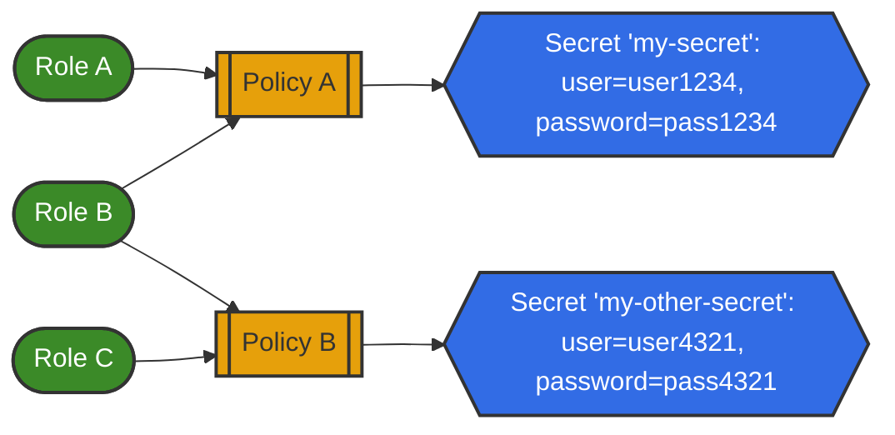

# Hashicorp Vault in Agora

These documents describe in detail the setup of Hashicorp Vault from the Agora Team's point of view, as well as how you, a service developer, can get started using Vault for your application deployments.

## What Is Vault

[Hashicorp Vault](https://www.vaultproject.io/) is an identity-based secrets and encryption management system.
Vault provides encryption services that are gated by authentication and authorization methods.
Secrets in Vault are able to be securely stored and tightly controlled, as well as be audited.

Vault does this primarily through tokens and then associating a token with policy.
Policies are rules that define the access and actions a client can have per API paths.
Vault handles the validation and authorization of clients (users, machines, or apps), then provides access to secrets based on the client's policy.

The Agora Team hopes to use Vault to help alleviate or lessen the following issues

* Secret Sprawl
  * Secrets as applications get larger and more complex will increase.
    By having a central location for secrets to be stored, the attack surface is reduced and exposure to secrets can be more readily controlled
* Access Controls for Sensitive Data
  * Secrets in Vault are encrypted at rest, and access can be controlled via a few different controls that Vault provides, such as leases, or the ability to revoke single secrets if not entire trees of secrets
* Dynamic Secret Generation
  * Vault provides a way to generate secrets dynamically, such as user credentials, for a variety of well-known tools such as Postgres and S3.

### Overall Architecture

### Vault Components

#### Authentication Engines

Vault is designed to be flexible in how people authenticate with it through [Authentication Engines](https://developer.hashicorp.com/vault/docs/auth).
It has OAuth, JWT, Kubernetes, AWS, and many other types of authentication it can be integrated into.
Agora currently supports two types of Authentication Engines:

* Leveraging our EKS Clusters and using [Kubernetes Authentication](https://developer.hashicorp.com/vault/docs/auth/kubernetes) through Kubernetes Service Accounts
* [JWT/OIDC Authentication](https://developer.hashicorp.com/vault/docs/auth/jwt) with Kubernetes are the underlying backer

!!! Note
    In the Gen3 Environment (Speedway) Vault users **MUST** use the JWT
    Authentication Engine

The additional benefits of this are:

* Tokens that are used are 'short-lived'
  * Starting in 1.21, Kubernetes will no longer make the Service Account token long-lived.
    Vault can still work with this: it typically encourages short-lived tokens as a security mechanism.
* The ability to revoke tokens if necessary
  * For malicious actors or misbehaving/compromised systems, the revocation of access to Vault can be handled either by changing the policy or the access to the policy.
    It could also be revoked by simple removal of the offending ServiceAccount in the cluster as well.
    The ability to revoke access quickly is another security benefit.

#### Secrets Engines

Vault is built with a variety of [Secret Engines](https://developer.hashicorp.com/vault/docs/secrets).
A secret engine is a component that is used to store, generate, or encrypt data. Secret engines are built to be flexible, and are separated by function.
Some engines are capable of additional capabilities that can be used in furtherance of secret management.
A non-exhaustive list of engines includes:

* KVS
  * A simple Key/Value Store engine
* Database engines
  * MongoDB
  * PostgreSQL
  * Cassandra
  * Couchbase
* AWS/Azure/Google Cloud
* RabbitMQ

**One should not conflate a secret engine with an authentication engine.**
Authentication engines are the mechanism Vault uses to identify users and set policies to users.
Secret engines are used to handle the actual secrets themselves.

#### Policies and Roles

Vault controls the flow of secrets access by the following mechanisms:

* A **Policy** is a file that states access to a given secret per its path in Vault. In Vault, all secrets are stored and accessed as API paths
  * Policies are tied directly to the secrets they are allowed to read.
  * Policies can be set to multiple paths being handled by multiple authorization engines.
  * Policies are allowed to be 'wildcarded' and can be set to `/*` for example, to inform Vault the policy authorizes access to all secrets under `/` in this example.
    By contrast, policies can also be fine-grained to state that a policy authorizes access to a specific secret on a specific path
* A **Role** has a policy, or policies attached to it
  * A role can be assigned to an individual or individuals.
    An individual that has RoleA in the graph above, is assigned PolicyA
  * Roles are configurable via [authentication engines](#authentication-engines).

#### Namespaces

Namespaces in Vault work similarly to namespaces in Kubernetes: they are primarily used to set administrative boundaries in Vault, and restrict access for teams to modify, add, and destroy secrets.

Namespace access is restricted by Azure AD (AAD) and set for each individual namespace.

### Roles and Responsibilities

Every team will be a **Vault Administrator** for their own namespace.
The Vault Administrator is responsible for:

* Set up of Vault Secret Engines and management of the secrets stored in their Vault
* Set up of Vault Authentication Engines and establishing Roles for each Authentication Engine
* Establishment of Vault Policies and tying them to Roles

For more information on these components please refer to the individual sections in [How To Set Up Vault](vault_setup.md).

## Current Versions Of Vault

Currently, the Agora Team is hosted on the EnTec Team's Vault instance.
The purpose of this is leverage company tech and apply DRY principles.

Currently, the version of Vault is based on the running version the EnTec Team is using.

| Resource         | Version           |
|------------------|-------------------|
| EnTec Vault      | 1.17.1 Enterprise |
| Vault Helm Chart | 0.25.0            |
