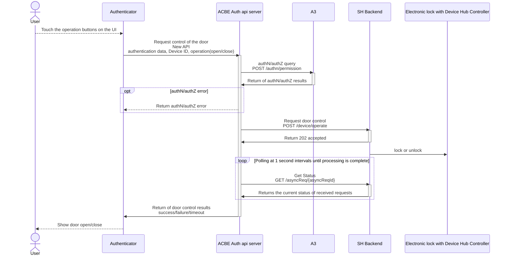
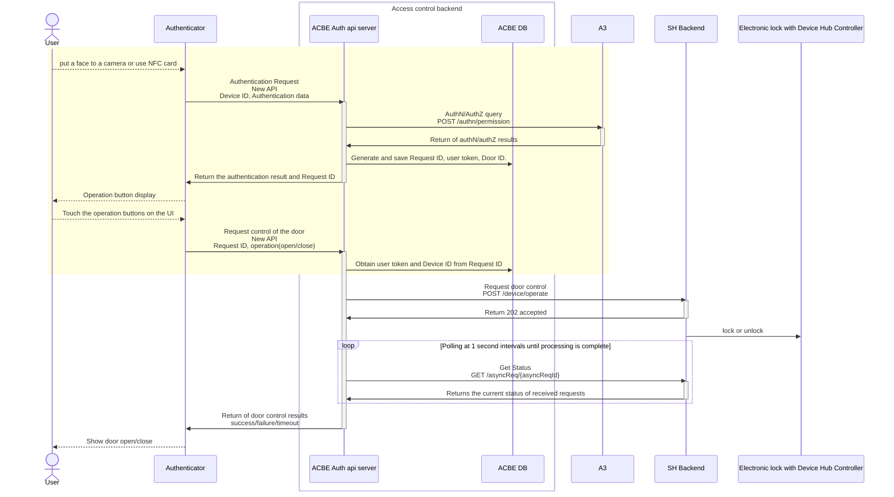
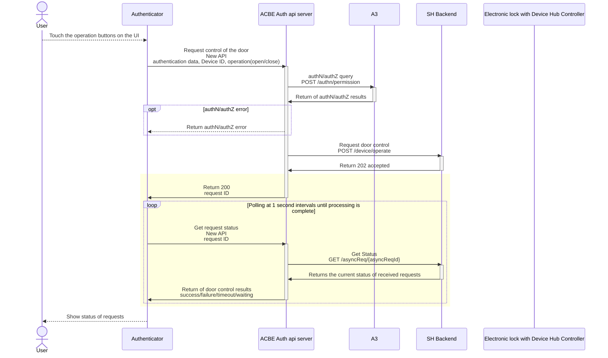

# ADR-BE-0003 Smart Home Linkage

| Status  | Last Updated |
| ------- | ------------ |
| Drafted | 2024-01-26   |

## Context and Problem Statement

At a meeting with the Smart Home team held in Q3 2023, It was decided to implement Poc phase 1 of Smart Home linked door control in mid-February 2024.
In line with this, it is necessary to design a communication sequence that takes into account the specifications of the Smart Home side.

This ADR describes the sequence between the Authenticator and the Access Control Backend, which reflects the content of previous meetings.

### Assumptions

- [System configuration diagram](https://www.figma.com/file/T0H41djRWelPhaF6zyHTSD/Access-Control---Smart-Home-door-lock-integration?type=whiteboard&node-id=1-546&t=WOGkFKLerIgz37ID-0)
- Door opening/locking is performed by touching the control buttons displayed on the Authenticator's UI.
  
## Considered Options

### Sequence 1

- Authentication, authorization, and door control with a single API
- The API response takes until the door control is completed or the SH side times out (about 30 seconds?)
- Operation button touch is the trigger, so the operation button must always be displayed on the UI.

### Sequence 2

- Split the request of Authenticator in Sequence 1 into authentication authorization and door control.
- When the authentication authorization request is successful, ACBE issues and returns a request ID, and the door control API identifies the device ID based on that ID.
- Authenticator can only display operation buttons to those who have passed authentication authorization.

※The yellow background is the difference from sequence1

### Sequence 3

- Asynchronize Sequence 1 API
- Unnecessary if blocking until timeout on control failure in sequence 1 is not a problem.

---

## Decision Outcome

We chose sequence 2.
This is because it is possible to respond to any undecided specifications, such as whether or not authentication authorization is required when locking the door, and the display of the control buttons.

---

## Reference

- [Review minutes](https://confluence.tri-ad.tech/pages/viewpage.action?pageId=740268220)

---

## Note

- 2024-01-26 : Drafted, Originator: Kenji Motoki
