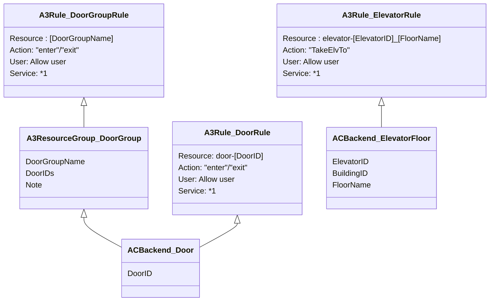

# ADR-INTG-0009 Managing Door and Door Group information or Elevator information and Elevator floor information

| Status  | Last Updated |
| ------- | ------------ |
| Drafted | 2023-10-04   |

## Context and Problem Statement

- Determine the service that manages the Door information and Door Group, or Elevator information and Elevator floor information.

---

## Considered Options

- Access Control Backend is managed Door and Door Group, Elevator and Elevator Floor information.
- Door Group information is managed only by A3 as resource group information.

You can see the discussion on [this confluence page](https://confluence.tri-ad.tech/pages/viewpage.action?pageId=447048138).

---

## Decision Outcome

- Door Group information is managed only by A3 as resource group information.

### Reason

- Door Group/Elevator Floor grouping information is retained as a resource group to which the same authorization rules apply.
- If the same group information is managed twice by Access Control Backend and A3, changes to both will be required when the information is changed.

## About the information stored by ACBackend and A3

- The following figure shows the data stored by ACBackend and A3.

*1 The value differs depending on the environment.  
Gen1 dev: access-control-external  
Gen3 (Speedway) dev/prod: ac-access-control

- AC Backend queries A3 for authorization information of a door with the resource name `door-[DoorID]` and action `enter` or `exit`, and A3 returns authorization information according to door rules, and DoorGroup rules to which the door belongs.
- AC Backend queries A3 for authorization information of a floor with the resource name `elevator-[ElevatorID]_[FloorName]` and action `TakeElvTo`. Groupings of elevators are not saved in A3.
- See [data_design](../../data_design/README.md) about ACBackend's data specification.

---

## Note

- 2024-10-17 : Fix resource name format and service name, update description about querying.
- 2023-10-04 : Drafted, Originator: Tomohiro Bessyo
