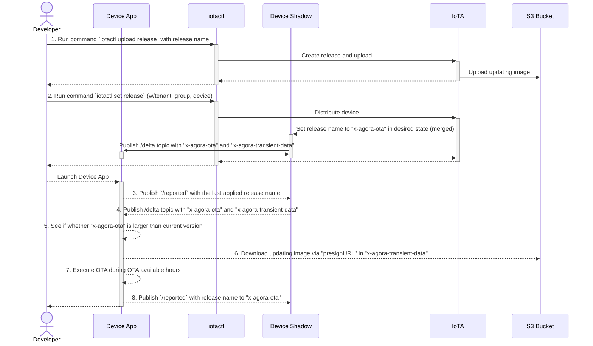

# ADR-INTG-0010 OTA Basic Sequence

| Status   | Last Updated |
| -------- | ------------ |
| Approved | 2023-12-21   |

## Context and Problem Statement

- Determine how implement Device Apps OTA and define its basic sequence.

### Conditions

- Can distribute a updating package only for desired device(s) to see updating works fine.

---

## Considered Options

1. Use [IoTA OTA feature](https://developer.woven-city.toyota/docs/default/Component/iota-service/Concepts/OTA/cli_tutorial/).
2. Implement it ourself from scratch.

---

## Decision Outcome

1. **Use IoTA OTA feature.**

### Reason

- It looks cover necessary features and IoTA team can handle our further requirements.
- Can reduce a lot of time to implement.
- IoTA team talks with the security team to keep the system enough secure to pass the security assessment.

### Basic Sequence

This basic sequence is the one on the early stage of development.

- Note that uploading image and distributing releases via `iotactl` will be replaced with some UIs(Agora Admin UI or A/C Management UI).
- This focuses only about the integration with IoTA service and device apps, actual behavior of applying updating image on device Apps is omitted in the diagram.



#### Pre-requirements

- Use latest `iotactl` executable file.

#### Details

1. Run command `iotactl upload release` with release name

    ```bash
    $ iotactl upload release --tenant ac-access-control-host --group gate-nfc --release gate-nfc_relsease_1.0.0.5 --file-upload "C:\OTA\NFCCAPP_1.0.5.0_Test.zip"

    Successfully upload file(C:\OTA\NFCCAPP_1.0.5.0_Test.zip) to release(gate-nfc_relsease_1.0.0.5)
    ```

2. Run command `iotactl set release` (w/group, device)

   - Distribute the release to only `nfc-test-00002` in this example.
   - The release name of this example is `gate-nfc_release_1.0.0.5`. This name is just for an example and not for our production operation. We need to determine the naming convention of the release name which is common among all device apps later.

    ```bash
    $ iotactl set release devices nfc-test-00002 --release gate-nfc_relsease_1.0.0.5 --group gate-nfc
    Releasing the version test_nfccapp_relsease_1.0.0.5 to devices in "ac-access-control-host:gate-nfc"
    ================================================

    > Failed Devices <

    Device Name                     Provisioned                     Error
    ===========                     ===========                     ===========

    ================================================

    > Success Devices <

    Device Name                     Provisioned
    ===========                     ===========
    nfc-test-00002                  true

    ```

    - This triggers updating Device Shadow `desired` state - `x-agora-ota.releaseId` value with the release name (merged).
    - When the `x-agora-ota.releaseId` value of `desired` state is different with the `reported` one, `x-agora-ota` and `x-agora-transient-data` are published on the target device's `/delta` topic.
    - `x-agora-transient-data` is a bit special field, it's visible only on `/delta` topic, not visible on Agora Admin UI - device shadow or [GET /shadow IoTA API](https://developer.woven-city.toyota/catalog/default/api/iota-api/definition#/default/GetShadowGroupDevices).

3. Publish `/reported` with the last applied release name. (Device App to Device Shadow)

    - Storing a last applied release name into some text files(.json, .xml etc) may bring an inconsistency between the real executable file's version and stored version in text files.
    - Therefore, a last applied release name **SHOULD NOT** be stored into text files etc. The name **SHOULD** be built from a group name, a device name and an application files's metadata(version etc).

4. Publish `/delta` topic with `x-agora-ota` and `x-agora-transient-data` (Device Shadow to Device App)

    - As described in 2. `x-agora-transient-data` is visible only on `/delta` topic when `x-agora-ota`'s desired value and its reported value are different.

    ```json
    { 
      "x-agora-ota": {
        "releaseId": "test_nfccapp_relsease_1.0.0.5"
      },
      "x-agora-transient-data": {
        "presignURL": "https://agora-dev-iot-ota.s3.ap-northeast-1.amazonaws.com/ac-access-control-host/gate-nfc/gate-nfc_relsease_1.0.0.5?X-Amz-Algorithm=AWS4-HMAC-SHA256&X-Amz-Checksum-Mode=ENABLED&X-Amz-Credential=...longlongURL..."
      }
    }
    ```

5. See if whether `x-agora-ota` is larger than current version

    - Need to parse the release name in `x-agora-ota` to extract a version info.

6. Download a updating image via `presignURL` in `x-agora-transient-data`

    - Download the updating image via `presignURL`.
    - If the presignURL is expired, GET returns an error like below.

    ```xml
    <Error>
      <Code>AccessDenied</Code>
      <Message>Request has expired</Message>
      <X-Amz-Expires>600</X-Amz-Expires>
      <Expires>2023-12-18T04:37:37Z</Expires>
      <ServerTime>2023-12-19T09:34:12Z</ServerTime>
      <RequestId>********</RequestId>
      <HostId>************</HostId>
    </Error>
    ```

    - To refresh an expired presigned URL, publish `/reported` again(same as step 3.).  It refreshes `presignURL` ~~but the time between publishing `/reported` and receiving `/delta` might takes 10-20 seconds on refreshing presignURL.~~ (This behavior was fixed by IoTA team. It was rooted by serverless features' cold-start warmup time, but IoTA team changed it with a pod.)

7. Execute OTA during OTA available hours.

8. Publish `/reported` with the applied release name in "x-agora-ota".

    - To avoid unnecessary `/delta` publishing, set a last applied release name to `x-agora-ota` of `/reported` state.

## Consequences

- A release name in `x-agora-ota.releaseId` is just a string, it does not provide information whether a new release's version is greater than current one or not. To do that, we need to define the rule of `releaseId` so that we can extract version etc from the string. Tech memot : Including cases of rollback, release to partial devices etc.
- Need to define detailed OTA sequence for each device applications later. These docs should be placed on each device application's repository.
- FYI : [Feedbacks from A/C team to IoTA](https://docs.google.com/document/d/1lcN4lqY7Qa66OWG1bD8WPgT2SwIGEoiUMQvQSvRI2bU/edit#heading=h.w3avbv7gww0d). You can see more detailed QA especially about UI on thi doc.

---

## Note

- 2023-12-21 : Approved
- 2023-12-19 : Drafted, Originator: Kohta Natori
