# Car Gate Backend Sequences

- [Car Gate Backend Sequences](#car-gate-backend-sequences)
  - [Common sequences](#common-sequences)
    - [Alive monitoring of Amano Server](#alive-monitoring-of-amano-server)
    - [`GET` car gate registration information list](#get-car-gate-registration-information-list)
    - [`GET` car gate registration information](#get-car-gate-registration-information)
  - [Facility Booking integration sequences](#facility-booking-integration-sequences)
    - [`POST/PUT/DELETE` car gate information from Facility Booking](#postputdelete-car-gate-information-from-facility-booking)
    - [Notification from Amano server](#notification-from-amano-server)
  - [Security guard operation sequences](#security-guard-operation-sequences)
    - [Register (`POST`) residents'/workers' car gate registration information](#register-post-residentsworkers-car-gate-registration-information)
    - [Update (`PUT/DELETE`) residents'/workers' car gate registration information](#update-putdelete-residentsworkers-car-gate-registration-information)
    - [Get a list of user's registration information](#get-a-list-of-users-registration-information)
    - [`POST/PUT/DELETE` temporary company visitors' car gate registration information](#postputdelete-temporary-company-visitors-car-gate-registration-information)
    - [`POST/PUT/DELETE` e-palette car gate registration information](#postputdelete-e-palette-car-gate-registration-information)
    - [TBD: `GET` car gate log](#tbd-get-car-gate-log)
  - [Synchronize records with Amano Server](#synchronize-records-with-amano-server)

`Car Gate DB` may consist of a couple of different database systems.

## Common sequences

### Alive monitoring of Amano Server

Car Gate Backend monitors liveness of Amano Server.

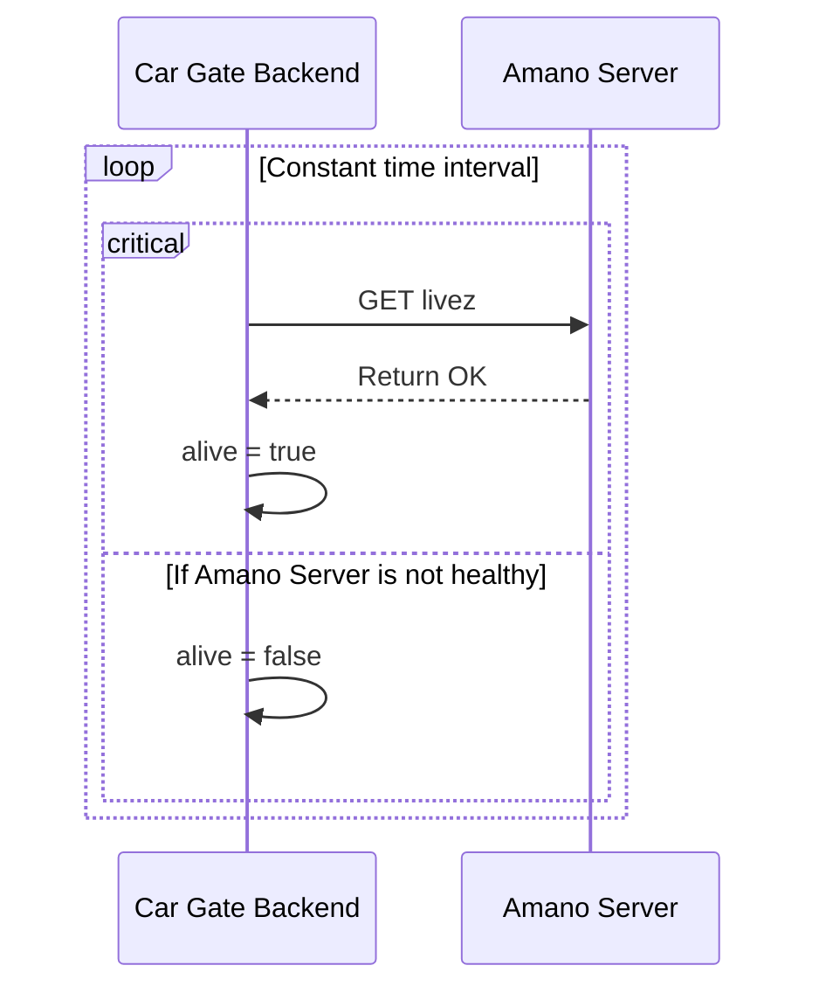

### `GET` car gate registration information list

Car Gate Backend returns registration information.
The frontend retrieves the necessary information (nfc idms, woven id etc.) by querying them in advance.
The backend also provides gateway endpoint to query external information like BURR.

WHY?:

- Though the UI requires additional information on the users and NFC cars, we don't want to duplicate control of such information.
- We've not decided how we integrate information from outside services into car gate registration information. As a temporary solution, we placed importance on consistent implementation.

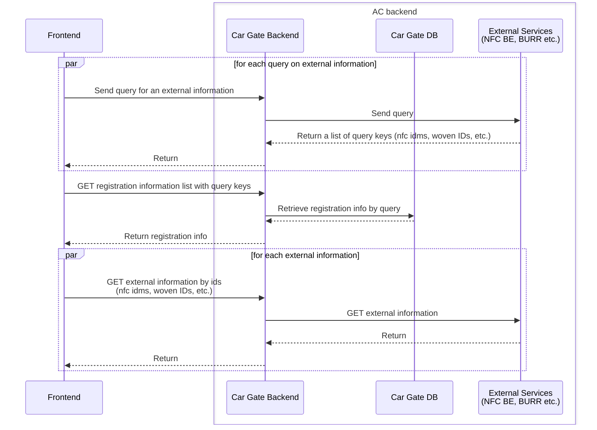

### `GET` car gate registration information

Car Gate Backend returns registration information directly.

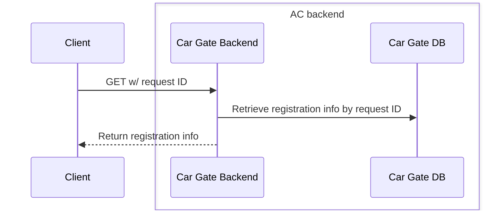

## Facility Booking integration sequences

### `POST/PUT/DELETE` car gate information from Facility Booking

Car Gate Backend handles the registration request with a single request ID.

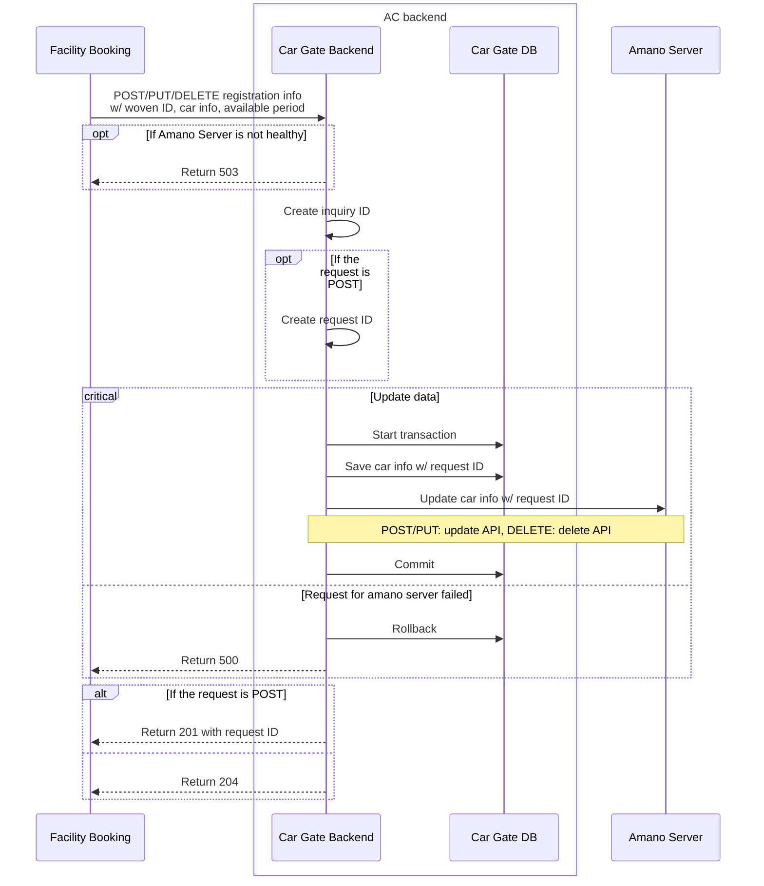

### Notification from Amano server

Car Gate Backend records notifications and propagate them to other services if needed.
The backend returns DB error to Amano Server if it fails to record a log.
The backend doesn't return error if any propagation fails.

Notification target: e-palette, (Facility Booking)

TODO: Determine how the backend retry notification propagation.

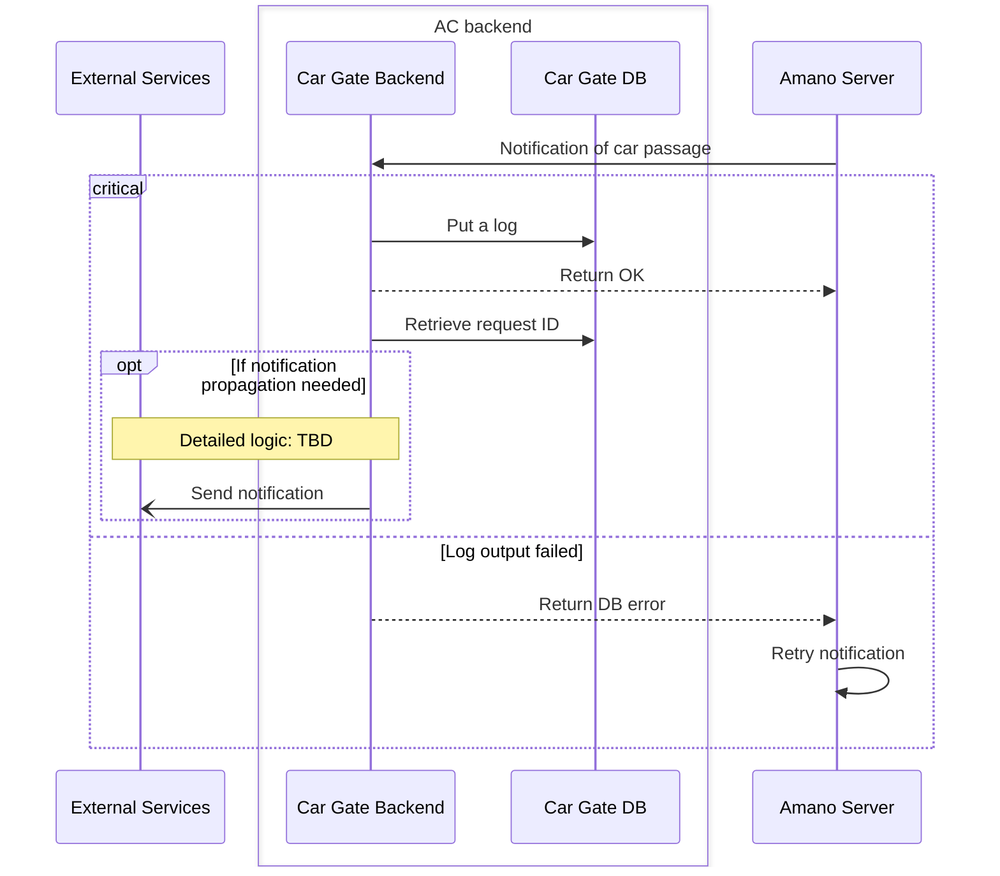

## Security guard operation sequences

### Register (`POST`) residents'/workers' car gate registration information

Considering the possibility of users registering multiple car numbers and NFC cards, the backend generates a request ID for each registration item.
The backend stores the information along with the users' woven ID.

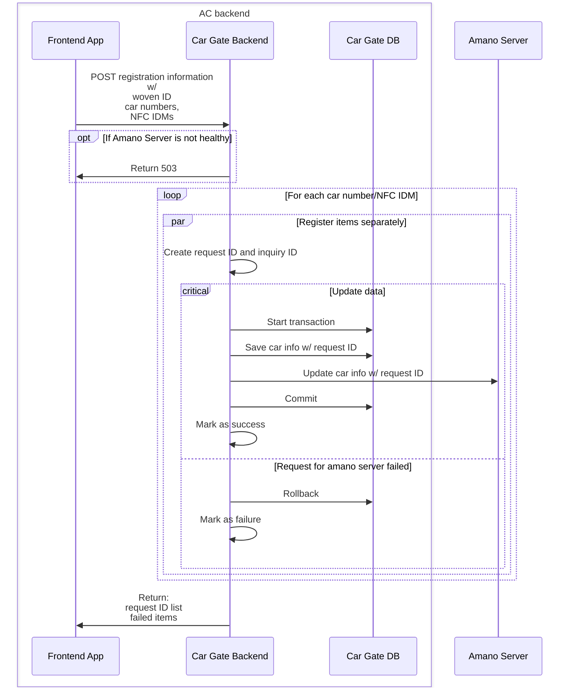

### Update (`PUT/DELETE`) residents'/workers' car gate registration information

Same as [the sequence for Facility Booking](#postputdelete-car-gate-information-from-facility-booking).

### Get a list of user's registration information

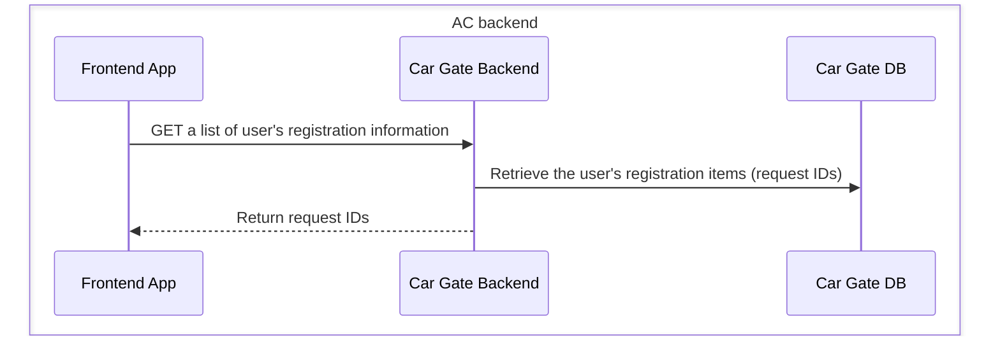

### `POST/PUT/DELETE` temporary company visitors' car gate registration information

Almost the same sequences as the ones for Facility Booking, but the APIs also accept an IDM for a shared card.

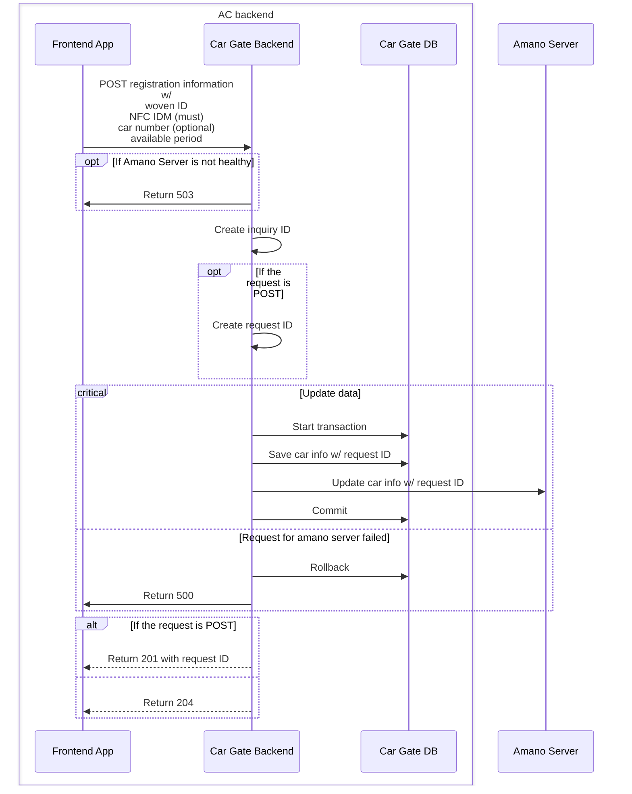

### `POST/PUT/DELETE` e-palette car gate registration information

Almost the same sequences as the ones for Facility Booking, but the APIs require e-palette ID and WCN instead of car numbers.

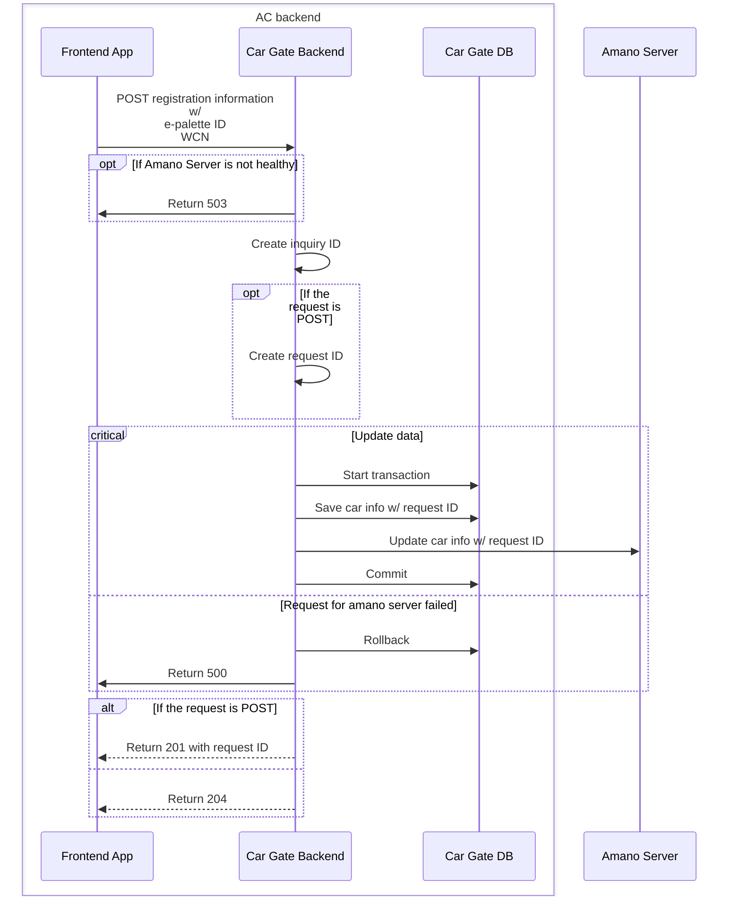

### TBD: `GET` car gate log

Car Gate Backend returns stored logs.

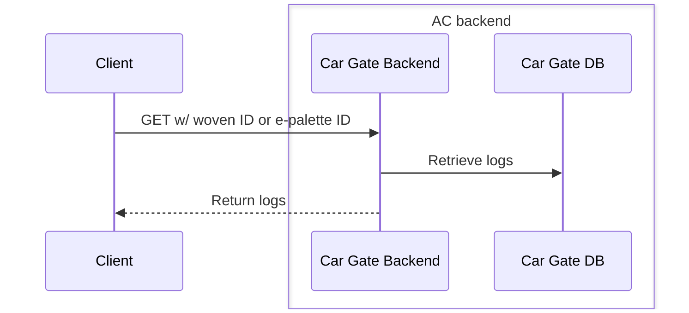

## Synchronize records with Amano Server

The job is defined as [an Agora serverless function](https://developer.woven-city.toyota/docs/default/component/serverless-tutorial/).  
The job synchronizes registration information with Amano Server.  
The result of this operation is sent to Car Gate BE.  
The job is NOT used on a periodic basis.

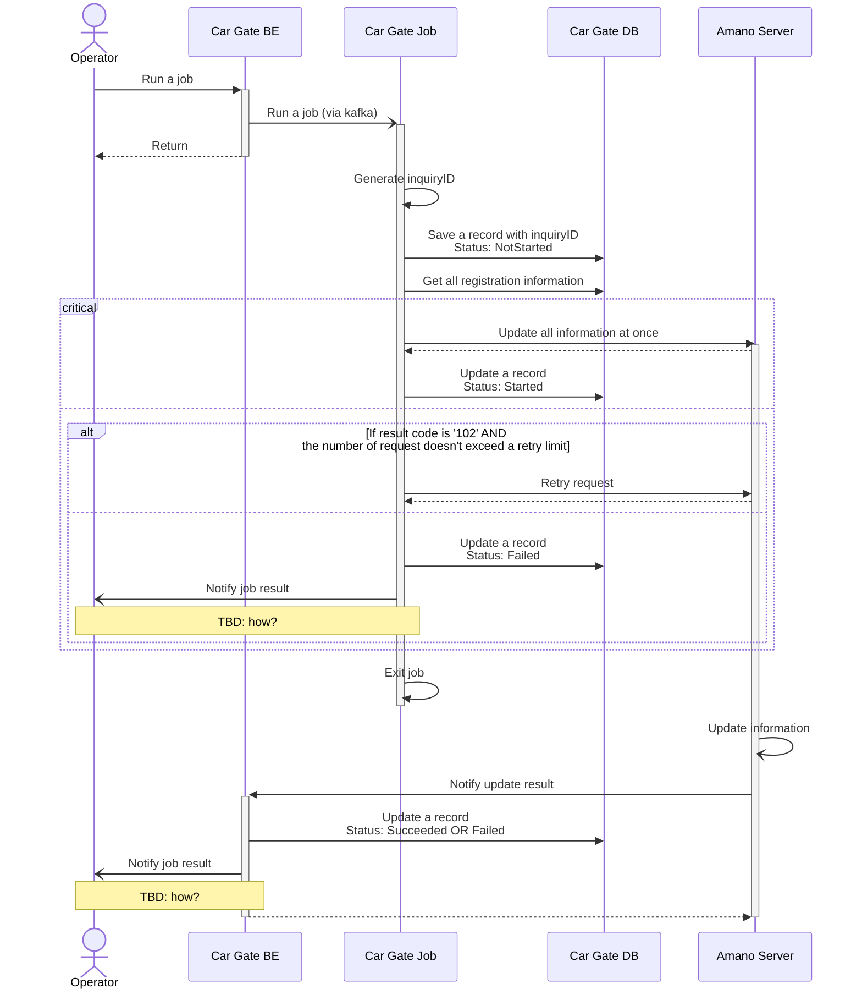
